# 12 Codebase And Model Workflow Reference

このドキュメントは、`plasma_surrogate` の全体構造、学習・推論・評価のワークフロー、各モデルのネットワーク構造と使いどころを、第三者が最初に把握するための参照資料である。

実験結果の読み取りは [`../reports/benchmarkrun_ext0520_27_54_past78/benchmark_report_27_54_past78.md`](../reports/benchmarkrun_ext0520_27_54_past78/benchmark_report_27_54_past78.md) を参照する。本書では、結果の時系列ではなく、現行コードで利用できるモデル群と実行契約を説明する。

## 1. 本コードの目的

本コードは、プラズマ場シミュレーションの結果を代理モデルで高速に再現し、条件変更や幾何変更に対する推論、比較、最適化を行うための基盤パッケージである。

重要なのは、単一モデルの精度だけではない。データ変換、学習、checkpoint、推論、評価、benchmark、report を同じ契約でつなぎ、新しい手法を追加しても既存の runner や評価処理が膨らまないことが、本コードの本来の価値である。

## 2. 全体レイヤー

| レイヤー | 主な責務 | 代表パス | 第三者が見るポイント |
| --- | --- | --- | --- |
| CLI | コマンド入口、YAML読込、サブコマンド分岐 | `src/plasma_surrogate/cli/main.py` | 何を実行できるか |
| Core contract | target、input mode、model spec、artifact契約 | `src/plasma_surrogate/core/` | モデルや評価が共有する真の仕様 |
| Dataset / feature | csv_npz読込、座標/幾何/SDF特徴量 | `src/plasma_surrogate/core/dataset_io.py`, `src/plasma_surrogate/train/spatial_features.py` | 入力がどの形でモデルへ渡るか |
| Train dispatch | model name から学習レーンを解決 | `src/plasma_surrogate/train/model_adapters.py`, `src/plasma_surrogate/train/model_dispatch.py` | 新規モデル追加時の入口 |
| Model factory | モデル本体の生成 | `src/plasma_surrogate/models/factory.py` | model id と実装クラスの対応 |
| Trainer | loss、optimizer、device、checkpoint保存 | `src/plasma_surrogate/train/torch_trainer.py` | モデル共通の学習実行 |
| Checkpoint | family別の保存/復元 | `src/plasma_surrogate/models/checkpoint_*.py` | 推論時に同じモデルを復元できるか |
| Inference | checkpointから推論engineを構築 | `src/plasma_surrogate/infer/engine.py` | 条件/幾何を渡してQoIを返す流れ |
| Optimize | 条件/幾何探索 | `src/plasma_surrogate/infer/optimize.py` | 推論結果から最良条件を探す |
| Eval / benchmark | 指標集計、leaderboard、空間評価 | `src/plasma_surrogate/eval/`, `src/plasma_surrogate/benchmark/` | モデル横並び比較 |
| Reports | 結果を第三者向けに整理 | `reports/` | 実験の説明と再現に使う |

## 3. End-To-End Workflow

```mermaid
flowchart LR
    A[Raw simulation outputs] --> B[csv_npz conversion]
    B --> C[index.csv / index_27 / index_54 / index_78]
    C --> D[Benchmark YAML]
    D --> E[Benchmark runner]
    E --> F[Runtime context]
    F --> G[ModelAdapter]
    G --> H[model_dispatch]
    H --> I[Model factory]
    I --> J[Torch trainer]
    J --> K[Checkpoint serializer]
    K --> L[Inference engine]
    L --> M[Metrics builder]
    M --> N[leaderboard.csv]
    M --> O[spatial summaries]
    N --> P[Report]
    O --> P
```

この流れの中で、モデル固有処理を広げてよい場所は主に `models/`, `models/factory.py`, `train/model_adapters.py`, family別 checkpoint serializer である。`benchmark/runner.py` や `infer/engine.py` にモデル固有の分岐を増やし続けると、第三者が変更範囲を追いにくくなる。

## 4. Truth Source

| 項目 | Truth source | 理由 |
| --- | --- | --- |
| モデル名と能力 | `src/plasma_surrogate/core/model_specs.py` | input mode、adapter mode、構造入力要否を一元管理する |
| family分類 | `src/plasma_surrogate/core/model_families.py` | train/build/checkpoint の分岐をfamily単位にする |
| 学習レーン | `src/plasma_surrogate/train/model_adapters.py` | 新規モデルを既存レーンへ載せる |
| モデル構築 | `src/plasma_surrogate/models/factory.py` | public model id と実装クラスを対応させる |
| 保存/復元 | `src/plasma_surrogate/models/checkpoint_*.py` | 推論時の互換性を守る |
| 推論QoI | `src/plasma_surrogate/infer/engine.py` | `uniformity`, physics diagnostics, boundary QoI を作る |
| 最適化探索空間 | `src/plasma_surrogate/infer/optimize.py` | condition/geometry bounds の検証と探索 |
| 評価列 | `src/plasma_surrogate/eval/metrics_builder.py` | leaderboard の列を増やしすぎない |

## 5. 学習ワークフロー

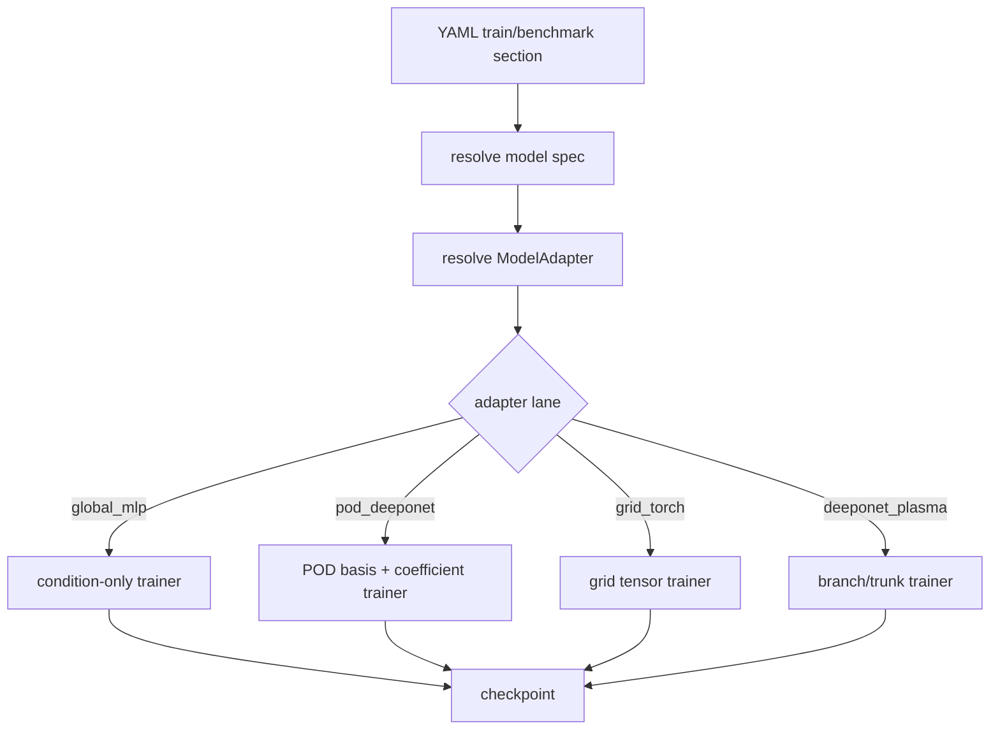

学習時に守るべき契約は次の通りである。

| 契約 | 内容 |
| --- | --- |
| target契約 | `dataset.targets[]` と `output_layout.vars` を基準にする。`ne/ni/Te/phi` をコードに固定しない。 |
| input mode契約 | `table_only` は条件表だけ、`table_plus_structure` は条件表 + geometry/coord/SDF feature を使う。 |
| adapter契約 | モデルを直接 runner に分岐させず、近い family の adapter lane へ載せる。 |
| checkpoint契約 | 推論に必要な scaler、feature metadata、model cfg、weights を保存する。 |
| selection契約 | 単一targetではなく `best_val_allvars_balance` で対象変数全体のバランスを見る。 |

## 6. 推論・最適化ワークフロー

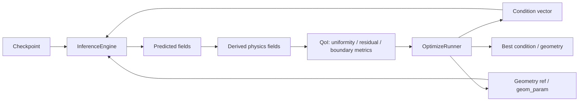

推論時の最適化は、モデル重みを変える処理ではない。学習済み checkpoint を固定し、探索空間内の条件値や幾何パラメータを変えながら、`InferenceEngine` が返す QoI を最小化または比較する。

| 最適化対象 | 例 | 対応モデル | 注意 |
| --- | --- | --- | --- |
| 条件値 | `PP0`, `Td`, `gamma` など | 全モデル | `table_only` でも可能 |
| 幾何パラメータ | `part.<id>.tx`, `part.<id>.scale_x`, `gap.<name>`, `offset.x` | `table_plus_structure` モデル | `provider_mode=parametric_parts` が必要 |
| 評価位置/格子 | query coordinate, grid resolution | Coord MLP / DeepONet系で概念的に扱いやすい | 現行optimizerの主探索変数ではなく、推論入力の設計対象 |
| 目的関数 | `uniformity`, boundary QoI, physics residual | 全モデル | 現行 `OptimizeRunner` は `uniformity` 中心 |
| 物理妥当性 | 負値率、Poisson残差、境界残差 | 全モデル | 主目的に足す場合は指標を増やしすぎない |

## 7. ネットワーク図の読み方

以下の図は、実装の全層を厳密に描くものではなく、第三者がモデルの役割分担を理解するための概念図である。

| 記号 | 意味 |
| --- | --- |
| `cond` | ケース条件表。例: `PP0`, `Td`, `gamma` |
| `grid pack` | `x`, `y`, `mask_plasma`, `distance_signed`, `distance_any` などの空間特徴 |
| `descriptor` | 幾何や構造を低次元化した特徴量 |
| `POD basis` | training split から作った低次元基底 |
| `field` | 出力場。例: `ne`, `ni`, `Te`, `phi` |

## 8. モデル区分

本コードのモデル名には `deeponet`, `operator`, `unet`, `pod` などが混在しているため、名前だけで分類すると誤解しやすい。第三者向けには、まず次の4分類で見るとよい。

| 大分類 | モデル | 入力 | 学習しているもの | 推論時の主な使いどころ |
| --- | --- | --- | --- | --- |
| MLP基準線 | `global_mlp` | 条件表のみ | 条件から固定grid場への直接回帰 | 軽量sanity check、条件探索の基準 |
| Coord MLP系 | `coord_mlp_fourier`, `coord_mlp_siren`, `coord_mlp_pod_residual` | 条件表 + 座標 + SDF/空間特徴 | 座標ごとの連続場。POD residualは大域POD + 局所残差 | 格子外補間、局所/境界QoI、SDF特徴の検証 |
| CNN/U-Net系 | `unet`, `unetpp`, `unetpp_attn`, `unet_operator_v2` | 条件をbroadcastしたgrid + 空間特徴channel | 画像/grid変換としての局所空間構造 | 境界近傍、局所構造、CNN系比較 |
| Neural Operator系 | `fno`, `ffno`, `u_no`, `cno`, `cno_operator_unet`, `deeponet_pod`, `deeponet_plasma_pod`, `geom_deeponet_pod`, `deeponet_plasma`, `geom_deeponet_siren` | 条件、幾何、grid feature、POD基底、query座標など | 条件や幾何から場を生成する写像 | 大域場予測、QoI最適化、operator構造比較 |

Neural Operator系は、さらに以下に分けて説明する。

| サブ分類 | モデル | 何がOperator的か |
| --- | --- | --- |
| Spectral Operator | `fno`, `ffno` | Fourier空間で場全体の写像を学習する |
| CNN/Operator Hybrid | `u_no`, `cno`, `cno_operator_unet` | CNNの局所処理とoperator的なmulti-scale写像を組み合わせる |
| POD係数型 Operator | `deeponet_pod`, `deeponet_plasma_pod`, `geom_deeponet_pod` | 条件/幾何からPOD係数を予測し、固定POD基底で場を作る |
| Branch-Trunk型 Operator | `deeponet_plasma`, `geom_deeponet_siren` | Branchが条件、Trunkが座標/幾何を読み、query点の値を生成する |

特に `deeponet_pod` は典型的なBranch-Trunk型DeepONetではない。実装上はPOD基底を固定trunkのように使うPOD係数型Operatorであり、POD + MLP係数回帰に近い。逆に `deeponet_plasma` と `geom_deeponet_siren` は、Branch-Trunk型として条件側と座標側を分けて学習する。

## 9. モデル別ネットワークと使いどころ

### 9.1 Global MLP

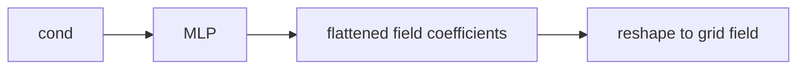

| 項目 | 内容 |
| --- | --- |
| 実装 | `src/plasma_surrogate/models/mlp/global_mlp.py` |
| 入力 | 条件表のみ |
| 長所 | 軽い。構造入力なしでどこまで説明できるかの基準線になる。 |
| 短所 | 幾何差や局所構造を直接扱えない。 |
| 使いどころ | sanity check、table-onlyで十分かの判断、過学習検出。 |
| 推論時の最適化対象 | 条件値のみ。幾何パラメータ探索には使わない。 |

### 9.2 POD-DeepONet / Plasma POD-DeepONet / Geom POD-DeepONet

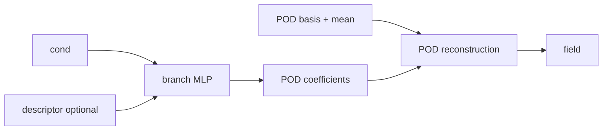

| モデル | 実装 | 使いどころ |
| --- | --- | --- |
| `deeponet_pod` | `src/plasma_surrogate/models/deeponet/pod_deeponet_torch.py` | 低データで強い主力基準 |
| `deeponet_plasma_pod` | 同上 | Plasma用途のデフォルト候補として名前を明確化したい場合 |
| `geom_deeponet_pod` | 同上 + descriptor adapter | 幾何descriptorを使う設計比較 |

| 項目 | 内容 |
| --- | --- |
| 長所 | 低データで安定しやすい。推論が軽い。POD基底により場全体の大域構造を保ちやすい。 |
| 短所 | POD基底外の局所変形や鋭い境界誤差は残ることがある。descriptor設計に依存する。 |
| 推論時の最適化対象 | `deeponet_pod` / `deeponet_plasma_pod` は条件値中心。`geom_deeponet_pod` は条件値 + 幾何descriptor由来の幾何パラメータが候補。 |
| 実務判断 | 最初に試す主力。高精度・軽量・説明しやすさのバランスがよい。 |

### 9.3 Coord MLP Fourier / Coord MLP SIREN

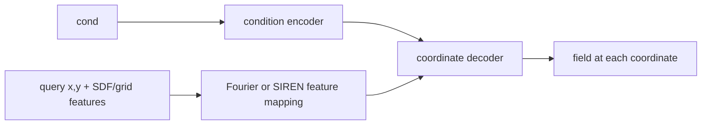

| 項目 | 内容 |
| --- | --- |
| 実装 | `src/plasma_surrogate/models/mlp/coord_mlp_torch.py` |
| 入力 | 条件表 + query座標 + 空間特徴 |
| 長所 | 連続座標表現として扱いやすい。Fourierは軽量、SIRENは高周波表現に向く。 |
| 短所 | 場全体を座標MLPだけで背負うため、低データではPOD併用型に負けやすい。 |
| 使いどころ | 新しいSDF/空間特徴の診断、格子外補間の研究、軽量な比較線。 |
| 推論時の最適化対象 | 条件値 + 幾何パラメータ。query座標を変えた局所評価にも向く。 |

### 9.4 Coord MLP POD Residual

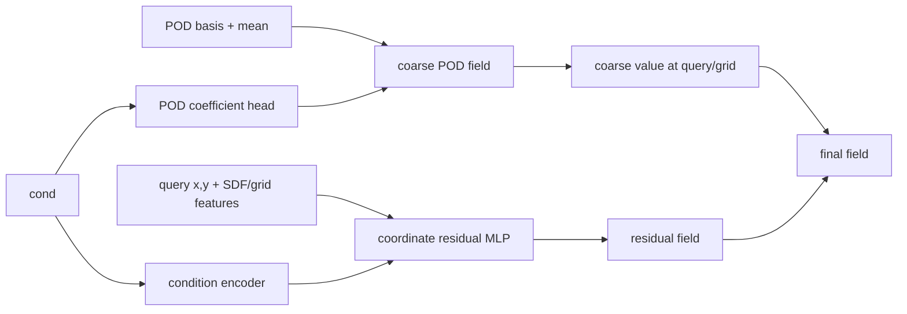

| 項目 | 内容 |
| --- | --- |
| 実装 | `src/plasma_surrogate/models/mlp/coord_mlp_pod_residual.py` |
| 入力 | 条件表 + 空間特徴 + train split POD basis |
| 長所 | PODが大域構造を持ち、Coord MLPが局所残差を補う。現行benchmarkではCoord MLP系の主力。 |
| 短所 | POD artifactが必要。Te深部や負値率は追加制約の余地がある。 |
| 使いどころ | 高精度な連続座標推論、格子外補間、POD単体で粗い局所構造の補正。 |
| 推論時の最適化対象 | 条件値 + 幾何パラメータ。局所評価点を変えた感度確認にも使いやすい。 |

### 9.5 U-Net / U-Net++ / U-Net++ Attention / U-Net Operator v2

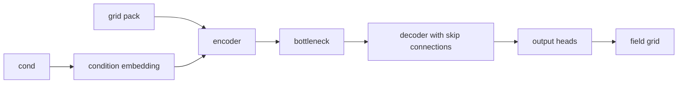

| モデル | 実装 | 特徴 |
| --- | --- | --- |
| `unet` | `src/plasma_surrogate/models/unet/simple_unet.py` | 最小のCNN基準線 |
| `unetpp` | `src/plasma_surrogate/models/unet/unetpp.py` | nested skipで局所構造を強化 |
| `unetpp_attn` | `src/plasma_surrogate/models/unet/unetpp.py` | attention gateで広域依存を補う |
| `unet_operator_v2` | `src/plasma_surrogate/models/unet/operator_v2.py` | 条件注入を強めた実務向けU-Net系候補 |

| 項目 | 内容 |
| --- | --- |
| 長所 | 局所構造や境界近傍のパターンをCNNで扱える。ケース数が増えると伸びやすい。 |
| 短所 | 低データでは不安定。重い。固定格子前提が強い。 |
| 使いどころ | 画像型モデルの比較、局所構造/境界形状の影響確認、ケース数増加時の伸びを見る。 |
| 推論時の最適化対象 | 条件値 + 幾何パラメータ。ただし推論は固定grid出力中心。 |

### 9.6 FNO / FFNO

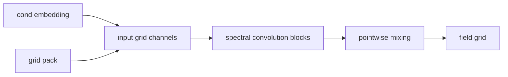

| モデル | 実装 | 特徴 |
| --- | --- | --- |
| `fno` | `src/plasma_surrogate/models/fno/simple_fno.py` | Fourier Neural Operator 型 |
| `ffno` | `src/plasma_surrogate/models/fno/factorized_fno.py` | 周波数作用素を分解型にした候補 |

| 項目 | 内容 |
| --- | --- |
| 長所 | 格子場の大域依存を扱いやすい。精度とコストのバランスがよい。 |
| 短所 | 固定grid前提が強い。細かい境界形状はSDFやgrid featureの品質に依存する。 |
| 使いどころ | 構造入力を使う作用素系の主力比較線。 |
| 推論時の最適化対象 | 条件値 + 幾何パラメータ。大域場のQoI最適化に向く。 |

### 9.7 CNN / Operator Hybrid: U-NO / CNO / CNO Operator U-Net

このグループは、純粋なCNN/U-Netではなく、CNNの局所処理とNeural Operatorの大域写像を近づけるためのhybrid系である。第三者向けには **CNN/Operator Hybrid** と呼ぶと分かりやすい。

通常のCNNは、固定grid上で局所畳み込みを重ねて画像を変換する。一方、Operator系は「条件や入力場から出力場を作る写像」を学習する。CNN/Operator Hybridは、その中間として、畳み込みの局所性を使いながら、multi-scaleな場の変換や条件依存の写像をより強く意識した構成である。

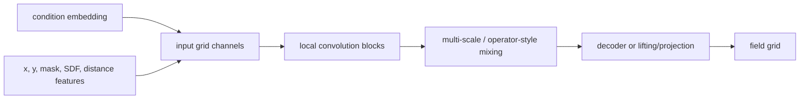

| モデル | 実装 | 特徴 |
| --- | --- | --- |
| `u_no` | `src/plasma_surrogate/models/uno/simple_uno.py` | U-Net形状のNeural Operator |
| `cno` | `src/plasma_surrogate/models/cno/simple_cno.py` | legacy CNO候補 |
| `cno_operator_unet` | `src/plasma_surrogate/models/cno/operator_unet.py` | CNO系をU-Net decoderで底上げした候補 |

| 項目 | 内容 |
| --- | --- |
| 入力 | 条件表を埋め込んだgrid channel + `x`, `y`, `mask_plasma`, `distance_signed`, `distance_any` などの空間特徴 |
| 出力 | 固定grid上の `ne`, `ni`, `Te`, `phi` |
| 学習内容 | 局所畳み込みで近傍構造を取り、multi-scale mixingやoperator風のblockで条件依存の場全体の写像を学習する |
| 純CNNとの違い | 純CNNは局所filterの積み重ねが中心。CNN/Operator Hybridは、条件から場への写像やスケール間の変換をより明示的に扱う |
| FNO/FFNOとの違い | FNO/FFNOはFourier空間のspectral mixingが中心。CNO/U-NO系は畳み込み・multi-scale構造を中心に大域性を補う |
| 長所 | CNNの局所性とoperator系の大域写像を同時に試せる。境界近傍と場全体のバランスを見やすい |
| 短所 | 現行benchmarkでは上位POD/FNO系に届かない。設計差、channel設計、down/up sampling設定の影響が大きい |
| 使いどころ | operator系の構造比較、CNO系を使う場合の実務候補、CNN系とFNO系の中間候補 |
| 推論時の最適化対象 | 条件値 + 幾何パラメータ。固定grid上のuniformity、境界近傍QoI、局所/大域バランスの比較に向く |

#### CNN/Operator Hybrid と純CNNの違い

| 観点 | 純CNN / U-Net | CNN/Operator Hybrid |
| --- | --- | --- |
| 主な発想 | 画像変換。局所filterを重ねてgrid fieldを出す | 条件や幾何から場を作る写像を、畳み込みとmulti-scale構造で近似する |
| 空間の扱い | 局所畳み込みとskip connectionが中心 | 局所畳み込みに加え、operator風のスケール変換や場全体の混合を重視 |
| 大域依存 | 深い層やbottleneckを通じて間接的に扱う | multi-scale mixingで大域依存をより直接的に扱う |
| 強い領域 | 境界近傍、局所パターン、画像的構造 | 局所構造と条件依存の大域場の両方を見たい場合 |
| 注意点 | 低データで過学習しやすい | 設計が少し複雑で、FNO/POD系より説明が難しい |

#### 各モデルの使い分け

| モデル | 使う理由 | 注意 |
| --- | --- | --- |
| `u_no` | U-Net形状でNeural Operator的なmulti-scale写像を試したい | 現行では外挿側に課題が残る |
| `cno` | CNO legacyとの互換比較、改良効果の確認 | 実務候補としては `cno_operator_unet` を優先する |
| `cno_operator_unet` | CNO系を残す場合の第一候補。U-Net decoderで局所復元を補う | POD/FNO/Coord POD residualにはまだ届かない |

この分類を置くと、`cno_operator_unet` は「CNN系のただの別名」ではなく、CNOのoperator性を残しつつU-Net decoderで局所復元を補ったhybrid候補として説明できる。

### 9.8 Plasma DeepONet Legacy / Geom DeepONet SIREN

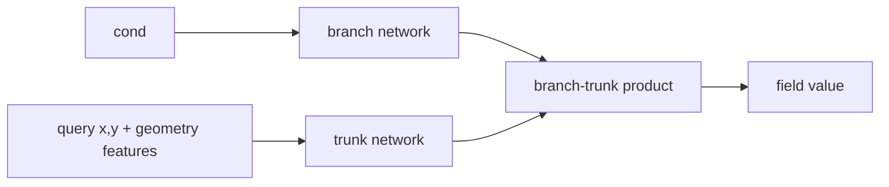

| モデル | 実装 | 特徴 |
| --- | --- | --- |
| `deeponet_plasma` | `src/plasma_surrogate/models/deeponet/plasma_operator_torch.py` | branch/trunk型の既存Plasma DeepONet |
| `geom_deeponet_siren` | `src/plasma_surrogate/models/deeponet/geom_deeponet_siren.py` | SIREN trunkで幾何付き連続場を直接生成 |

| 項目 | 内容 |
| --- | --- |
| 長所 | operator学習として分かりやすく、query座標を扱える。 |
| 短所 | 現行benchmarkではPOD版に大きく劣る。低データで直接生成型が不安定になりやすい。 |
| 使いどころ | 互換性確認、POD版との差分診断、研究用途。実務候補はPOD版を優先する。 |
| 推論時の最適化対象 | 条件値 + 幾何パラメータ + query評価位置の感度確認。 |

## 10. モデル選択早見表

| 目的 | 第一候補 | 次点 | 避けたい使い方 |
| --- | --- | --- | --- |
| 少数ケースでまず高精度にしたい | `deeponet_pod`, `deeponet_plasma_pod` | `geom_deeponet_pod` | いきなり重いCNNを探索する |
| 現行78ケースで最上位候補を使いたい | `coord_mlp_pod_residual` | `deeponet_pod`, `geom_deeponet_pod` | legacy direct DeepONetを主力にする |
| 構造入力を使った作用素系比較 | `fno`, `ffno` | `u_no` | table-only基準だけで構造効果を判断する |
| 局所/境界構造をCNNで見たい | `unet_operator_v2`, `unetpp` | `cno_operator_unet` | U-Net++ Attentionを常時デフォルトにする |
| 幾何descriptorの効果を見る | `geom_deeponet_pod` | `coord_mlp_pod_residual` | `geom_deeponet_siren`だけで幾何手法の有効性を判断する |
| 高速sanity check | `global_mlp` | `coord_mlp_fourier` | 基準線なしで重いモデルだけ比較する |

## 11. 新規モデル追加ワークフロー

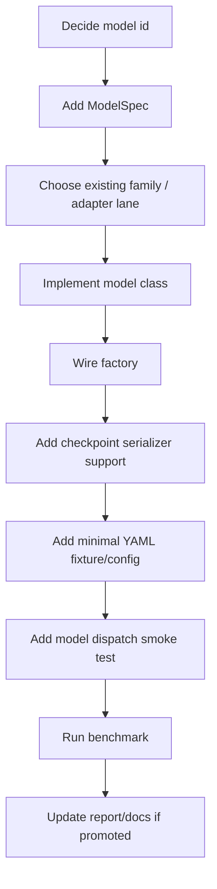

追加時の原則は次の通りである。

| 原則 | 理由 |
| --- | --- |
| 既存familyに載せる | runnerやtrainerの分岐を増やさない |
| `ModelSpec` を先に書く | input mode と構造入力要否が明確になる |
| checkpoint復元まで同時に見る | 学習だけ成功して推論不能になるのを防ぐ |
| benchmark configは `runs/` または `configs/` に置く | `tests/fixtures` を長時間実験で肥大化させない |
| testはcontract/smoke中心 | 重い精度検証を通常CIに混ぜない |

## 12. 推論時の最適化設計

推論時に最適化したい対象は、モデルごとに「何を入力として受け取れるか」で決まる。

| モデル群 | 条件最適化 | 幾何最適化 | 局所座標評価 | 主なQoI |
| --- | --- | --- | --- | --- |
| Global MLP | 可 | 不可 | 不向き | 平均値、uniformity |
| POD-DeepONet系 | 可 | Geom PODは可 | grid復元中心 | uniformity、場平均、負値率 |
| Coord MLP系 | 可 | 可 | 得意 | 局所値、uniformity、境界/深部差 |
| FNO/FFNO | 可 | 可 | 固定grid中心 | uniformity、大域場QoI |
| U-Net/CNO/U-NO系 | 可 | 可 | 固定grid中心 | 境界/局所構造QoI |
| Legacy DeepONet/SIREN | 可 | 可 | 得意 | query値、研究用診断 |

最適化処理では、探索空間を増やしすぎると解釈不能になる。最初は条件値、次に少数の幾何パラメータ、最後に物理制約を追加する順がよい。

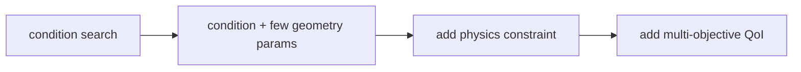

## 13. 参考文献

- Ronneberger, Fischer, Brox. U-Net: Convolutional Networks for Biomedical Image Segmentation. arXiv:1505.04597. https://arxiv.org/abs/1505.04597
- Zhou et al. UNet++: A Nested U-Net Architecture for Medical Image Segmentation. arXiv:1807.10165. https://arxiv.org/abs/1807.10165
- Lu et al. DeepONet: Learning nonlinear operators for identifying differential equations based on the universal approximation theorem of operators. arXiv:1910.03193. https://arxiv.org/abs/1910.03193
- Li et al. Fourier Neural Operator for Parametric Partial Differential Equations. arXiv:2010.08895. https://arxiv.org/abs/2010.08895
- Tran et al. Factorized Fourier Neural Operators. arXiv:2111.13802. https://arxiv.org/abs/2111.13802
- Sitzmann et al. Implicit Neural Representations with Periodic Activation Functions. arXiv:2006.09661. https://arxiv.org/abs/2006.09661
- Tancik et al. Fourier Features Let Networks Learn High Frequency Functions in Low Dimensional Domains. NeurIPS 2020. https://arxiv.org/abs/2006.10739
- Rahman et al. U-NO: U-shaped Neural Operators. arXiv:2204.11127. https://arxiv.org/abs/2204.11127
- Raonic et al. Convolutional Neural Operators for robust and accurate learning of PDEs. arXiv:2302.01178. https://arxiv.org/abs/2302.01178
- Berkooz, Holmes, Lumley. The Proper Orthogonal Decomposition in the Analysis of Turbulent Flows. Annual Review of Fluid Mechanics, 1993. https://doi.org/10.1146/annurev.fl.25.010193.002543
