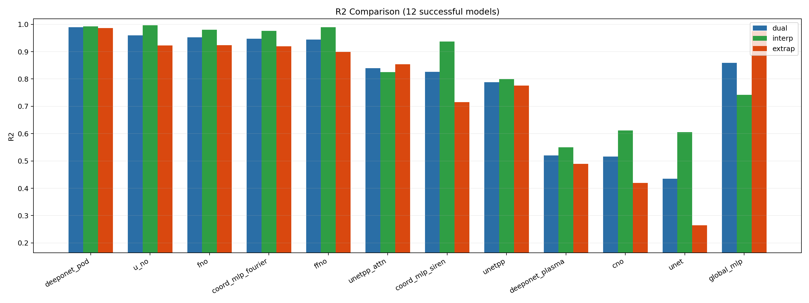
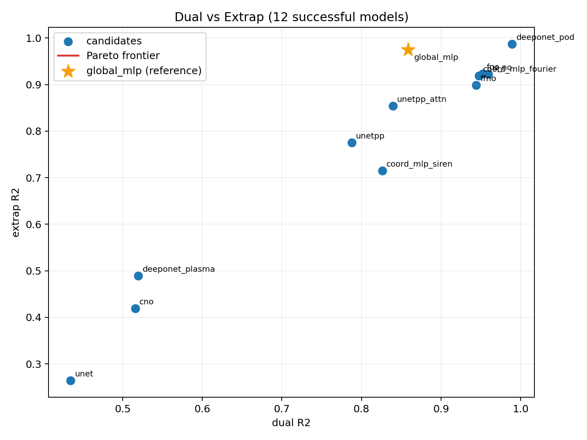
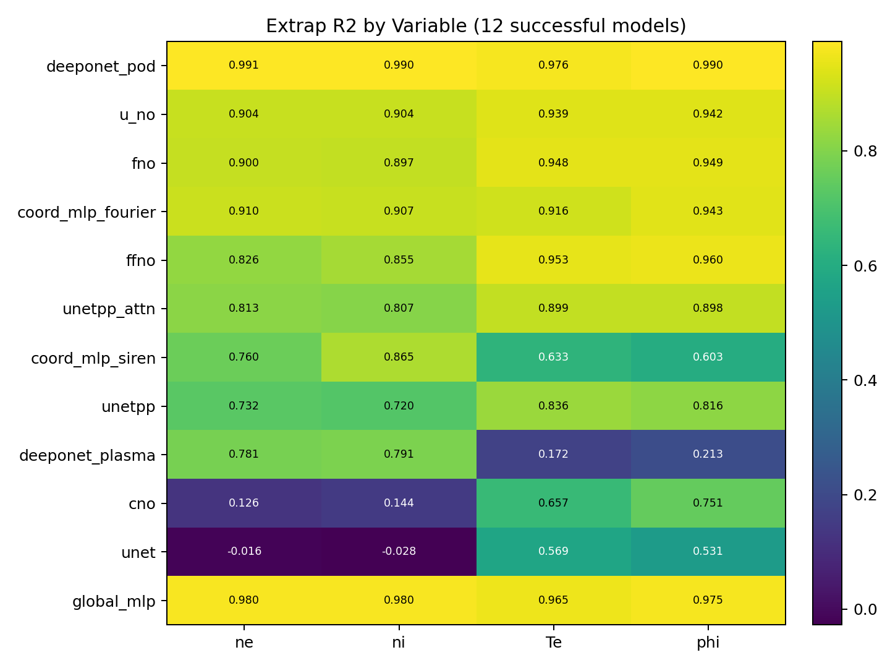
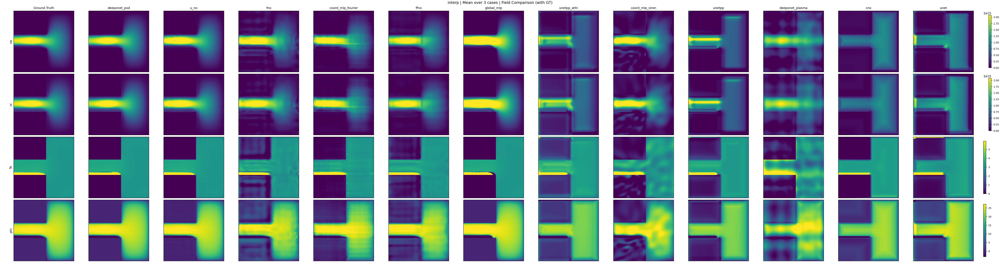
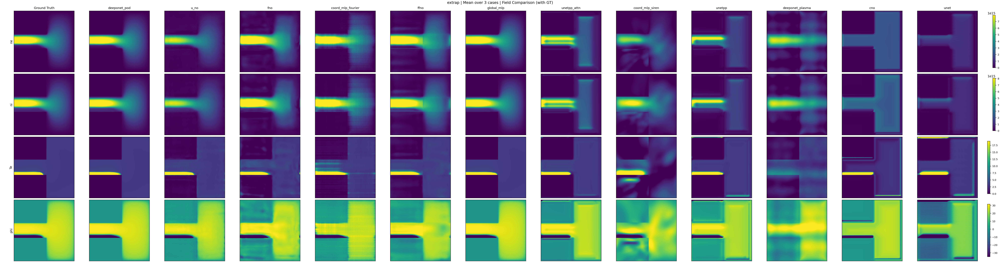
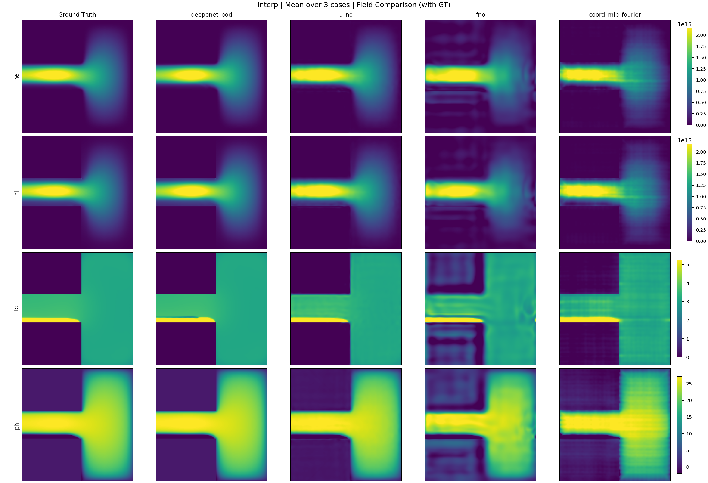
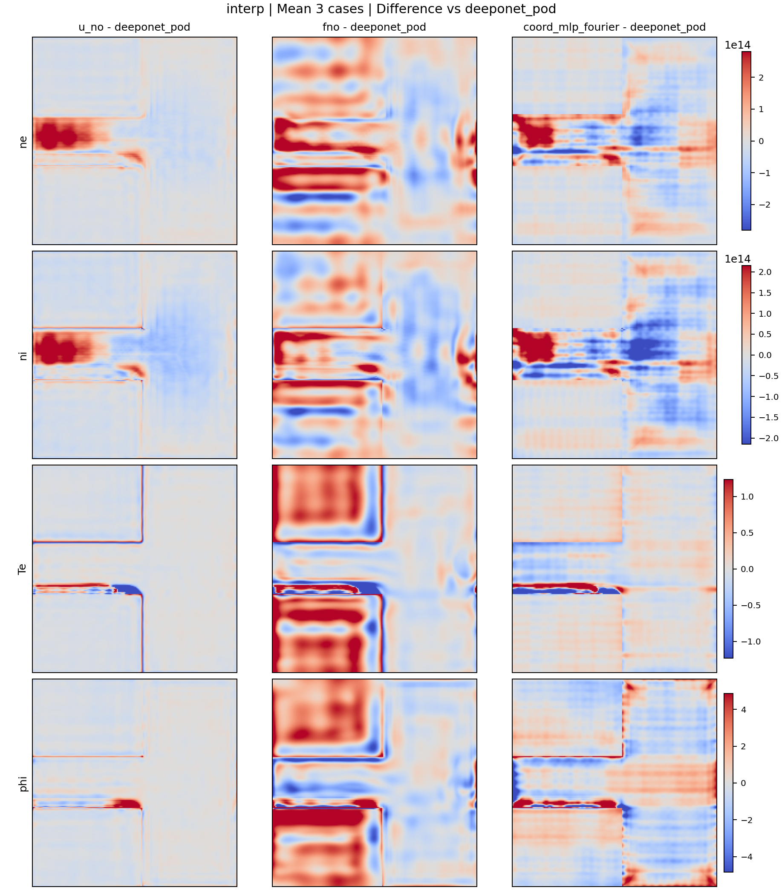
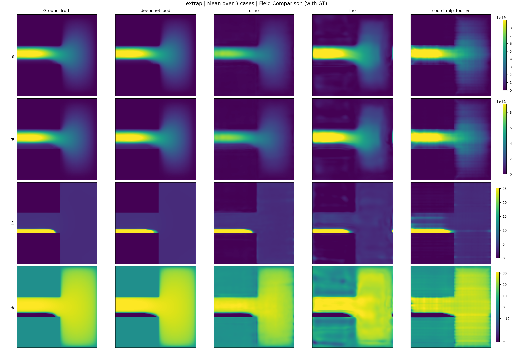
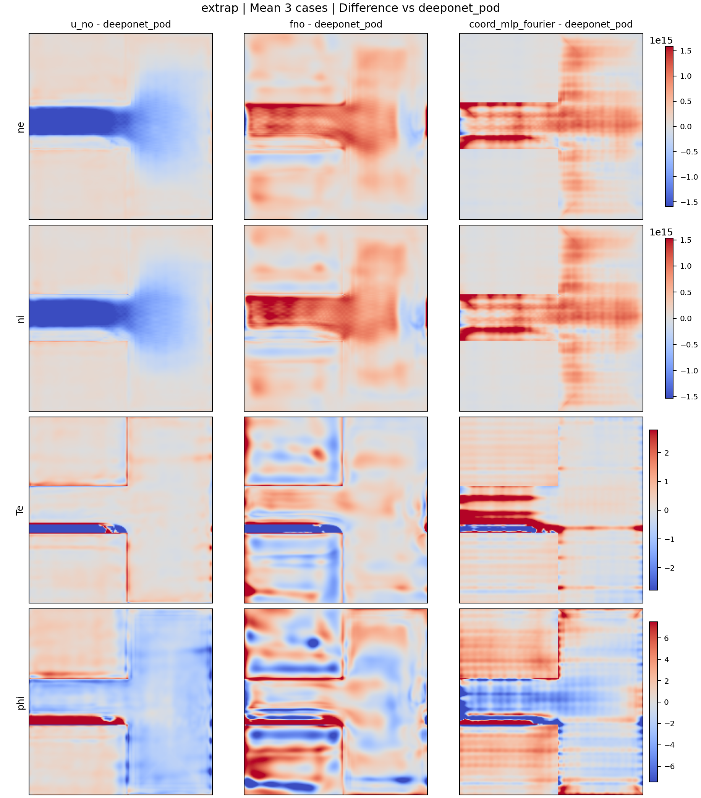

# report_20260402

## 1. 実行概要
- 対象: 13モデル計画のうち **12モデル成功**（`geom_deeponet_siren` は失敗）。
- 成功モデル: `global_mlp, unet, unetpp, unetpp_attn, fno, ffno, deeponet_plasma, deeponet_pod, coord_mlp_fourier, coord_mlp_siren, u_no, cno`
- 失敗モデル: `geom_deeponet_siren`  
  `provider_mode=parametric_parts` に必要な `parts_manifest.json` 不在で失敗。
- 評価条件: m7 periodic / dual_axis / split `seed=7`, `ratios=[0.7,0.15,0.15]`

参照ファイル:
- `docs/reports/report_20260402/evaluation_summary_success_12.csv`
- `docs/reports/report_20260402/run_status.csv`
- `runs/report_20260402/compare/success_12/selected_models_comparison.csv`

## 2. 総合評価（global除外の候補順位）
`dual > extrap > min_var_extrap` で並べた候補順位（globalは参考表示のみ）:

| Rank | Model | Dual R2 | Extrap R2 | Min Var Extrap |
|---|---|---:|---:|---:|
| 1 | deeponet_pod | 0.9894 | 0.9868 | 0.9759 |
| 2 | u_no | 0.9597 | 0.9224 | 0.9040 |
| 3 | fno | 0.9522 | 0.9237 | 0.8973 |
| 4 | coord_mlp_fourier | 0.9476 | 0.9191 | 0.9069 |
| 5 | ffno | 0.9442 | 0.8986 | 0.8256 |
| 6 | unetpp_attn | 0.8394 | 0.8542 | 0.8071 |
| 7 | coord_mlp_siren | 0.8262 | 0.7154 | 0.6029 |
| 8 | unetpp | 0.7877 | 0.7757 | 0.7197 |
| 9 | deeponet_plasma | 0.5198 | 0.4894 | 0.1716 |
| 10 | cno | 0.5158 | 0.4195 | 0.1260 |
| 11 | unet | 0.4348 | 0.2643 | -0.0276 |

参考（非順位）:
- `global_mlp`: dual `0.8587`, extrap `0.9752`（`table_only` のため同列採択対象外）

## 3. 全体グラフ
### 3.1 R2比較（dual/interp/extrap）

### 3.2 dual vs extrap（Pareto）

### 3.3 変数別 extrap ヒートマップ

## 4. 空間分布（GT付き）
### 4.1 成功12モデルの全体比較（mean 3 cases）
- interp:

- extrap:

### 4.2 上位4モデル詳細（deeponet_pod/u_no/fno/coord_mlp_fourier）
- interp mean:

- interp diff vs deeponet_pod:

- extrap mean:

- extrap diff vs deeponet_pod:

## 5. 各モデルの特徴と使いどころ（成功12）
| Model | 特徴 | 使いどころ | 注意点 |
|---|---|---|---|
| deeponet_pod | 全指標で最上位。外挿も非常に安定。 | 本番第一候補。総合最適。 | 実装/運用コストはMLP系より高め。 |
| u_no | 高dualかつ外挿も高水準。 | 高精度を保ちつつUNet系代替を狙う場合。 | モデル構成の理解がやや必要。 |
| fno | 高精度で堅実。外挿バランス良。 | 安定運用・再現性重視。 | 局所差分の表現でPODに一歩劣る。 |
| coord_mlp_fourier | 外挿強く、表現力が高い。 | 座標ベースで滑らかな場を重視する場合。 | 収束条件依存がやや強い。 |
| ffno | dual高く、速度と精度のバランス良。 | FNO系の軽量寄り選択肢。 | 変数ごとの外挿ムラがやや残る。 |
| unetpp_attn | UNet系では最良。密度・電位の形状を比較的維持。 | CNN系を使いたい場合の第一候補。 | 上位演算子系より外挿余地あり。 |
| coord_mlp_siren | interpは強いが外挿ギャップ大。 | 内挿中心の用途。 | extrapでTe/phiの崩れが出やすい。 |
| unetpp | 安定だが突出性能はなし。 | 既存UNet資産を活かす中間選択。 | dual/extrapとも頭打ち。 |
| global_mlp (ref) | extrapが高い参照点。 | ベースライン比較用途。 | `table_only` のため主採択対象外。 |
| deeponet_plasma | ne/niは一定だがTe/phiが弱い。 | 物理ヘッド検証や改善実験の土台。 | 現状は総合精度不足。 |
| cno | Te/phiは一定だが密度外挿が弱い。 | CNO系の研究用途。 | ne/ni extrapが低い。 |
| unet | 今回条件では最下位。 | 低コストの最低限ベース。 | 外挿で密度が崩れやすい。 |

## 6. 改善ポイント（複雑化を抑えた提案）
1. 採択は現状 `deeponet_pod` を第一候補、次点 `u_no` / `fno` が妥当。追加の複雑化は必須ではありません。  
2. UNet系を使うなら `unetpp_attn` 固定で十分です。新規アーキ追加より損失重み微調整を優先すべきです。  
3. `deeponet_plasma` は `Te/phi` 外挿がボトルネックなので、選択重みと出力経路（既実装の learned mix 系）を限定的に再探索する価値があります。  
4. `coord_mlp_siren` は外挿ギャップが明確なので、SIREN融合は `fourier` との比較前提で採択判断するのが安全です。  
5. `geom_deeponet_siren` はデータ側 `parts_manifest.json` を整備できるまでは今回の同条件比較から外すのが妥当です。  
