# report_20260402_78cases

## 1. 実験概要（既存78ケース結果を再集計）
- 対象: 13モデル（候補12 + 参考global 1）
  - 候補12: `unet, unetpp, unetpp_attn, fno, ffno, deeponet_plasma, deeponet_pod(table_plus_structure), coord_mlp_fourier, coord_mlp_siren, u_no, cno, geom_deeponet_siren`
  - 参考表示: `global_mlp`（`table_only`）
- データ/評価: `n_cases=78`, `m7 periodic`, `dual_axis`, `interp_mode_effective=overlap`
- 集計元:
  - `docs/reports/report_20260402_78cases/evaluation_summary_success_12.csv`
  - `docs/reports/report_20260402_78cases/run_status.csv`
  - `docs/reports/report_20260402_78cases/compare_all_13/selected_models_comparison.csv`
- 補足:
  - UNet系は既存ベスト系ランを採用（`unet: full_unet_final_opt_wd1e3_e120_b6`, `unetpp/unetpp_attn: full_unetpp_family_final_opt_lr4e4_e120_b6`）。
  - `u_no/cno/geom_deeponet_siren` は既存アーカイブ上で split が `46/15/17`、他の多くは `54/11/13` です。

## 2. 総合評価（候補12のみ順位）
順位規則は `dual > extrap > min_var_extrap`。

| Rank | Model | Dual R2 | Extrap R2 | Min Var Extrap |
|---|---|---:|---:|---:|
| 1 | fno | 0.9261 | 0.9091 | 0.8880 |
| 2 | ffno | 0.9166 | 0.8900 | 0.8640 |
| 3 | coord_mlp_fourier | 0.9139 | 0.8975 | 0.8689 |
| 4 | unetpp_attn | 0.8680 | 0.8269 | 0.7699 |
| 5 | unetpp | 0.8677 | 0.8294 | 0.7650 |
| 6 | coord_mlp_siren | 0.8220 | 0.7306 | 0.6555 |
| 7 | unet | 0.8183 | 0.7479 | 0.5981 |
| 8 | u_no | 0.8098 | 0.7522 | 0.6943 |
| 9 | deeponet_pod | 0.7472 | 0.7994 | 0.7602 |
| 10 | cno | 0.5871 | 0.5407 | 0.4278 |
| 11 | deeponet_plasma | 0.4517 | 0.4143 | 0.1338 |
| 12 | geom_deeponet_siren | 0.1690 | 0.0551 | -0.0511 |

参考（順位対象外）:
- `global_mlp`: dual `0.9279`, extrap `0.9390`（`table_only` のため主比較は分離）

## 3. 全体グラフ
### 3.1 R2（dual/interp/extrap）
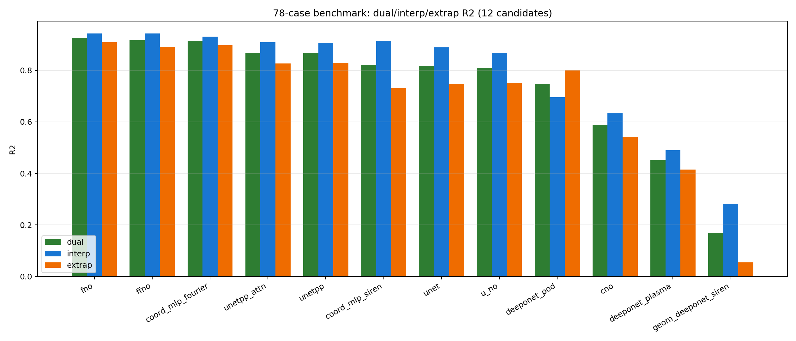

### 3.2 dual vs extrap（Pareto）
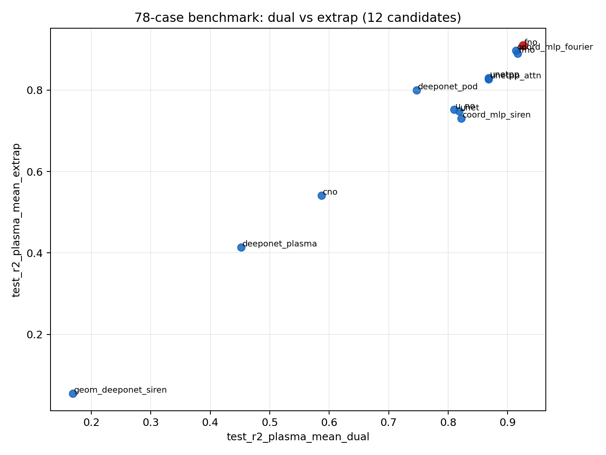

### 3.3 変数別 extrap ヒートマップ
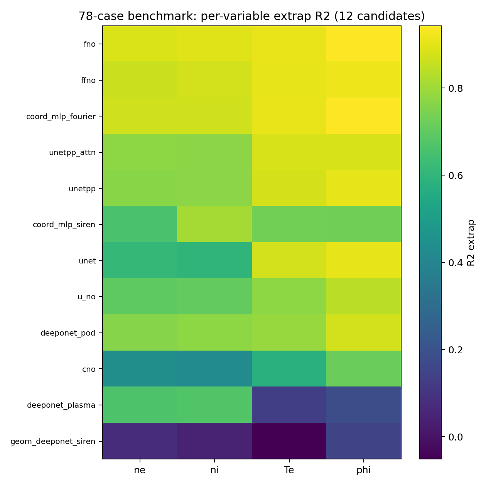

## 4. 空間分布
### 4.1 全体比較（共通ケースが取れる10モデル）
既存78ケースのアーカイブはモデル間で split が一部異なるため、12モデル全同時の共通 case hash は 0 件でした。  
そのため、共通ケースが確保できる10モデル（`fno, ffno, coord_mlp_fourier, unetpp_attn, unetpp, coord_mlp_siren, unet, u_no, cno, deeponet_plasma`）で集約しています。

- interp mean（共通1ケース, GT付き）  
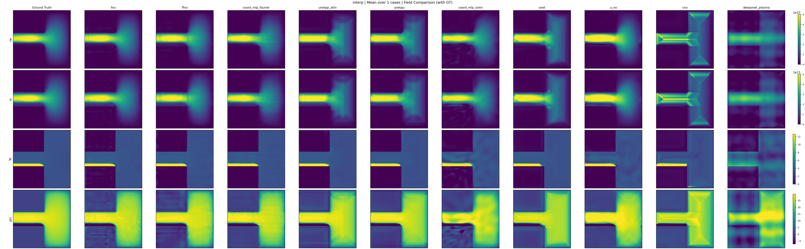
- extrap mean（共通3ケース, GT付き）  
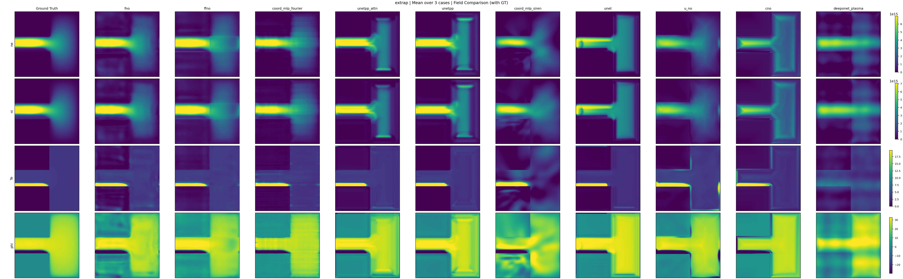

### 4.2 上位4モデル詳細（fno / ffno / coord_mlp_fourier / unetpp_attn）
- interp mean（3ケース, GT付き）  
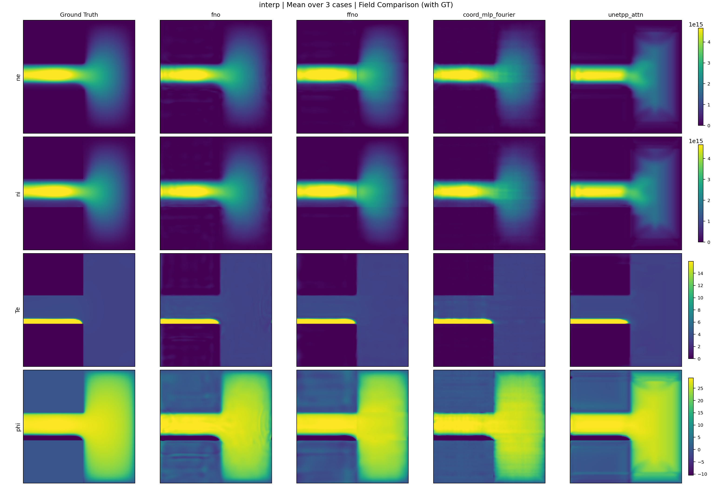
- interp diff vs fno  
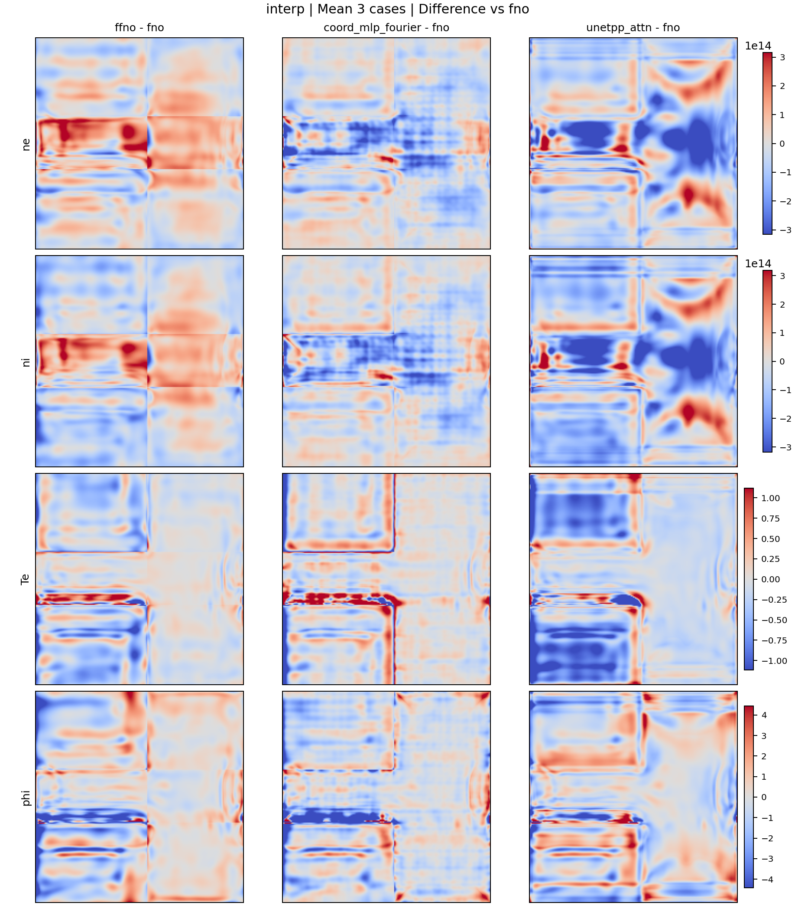
- extrap mean（3ケース, GT付き）  
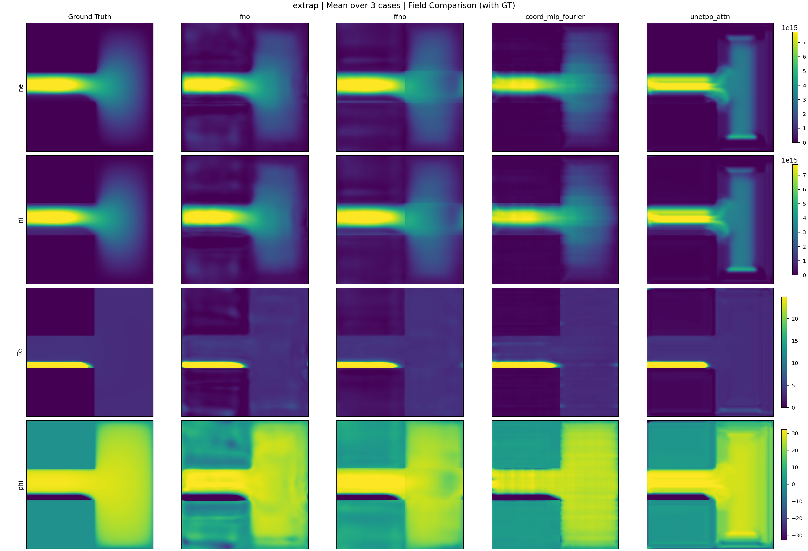
- extrap diff vs fno  
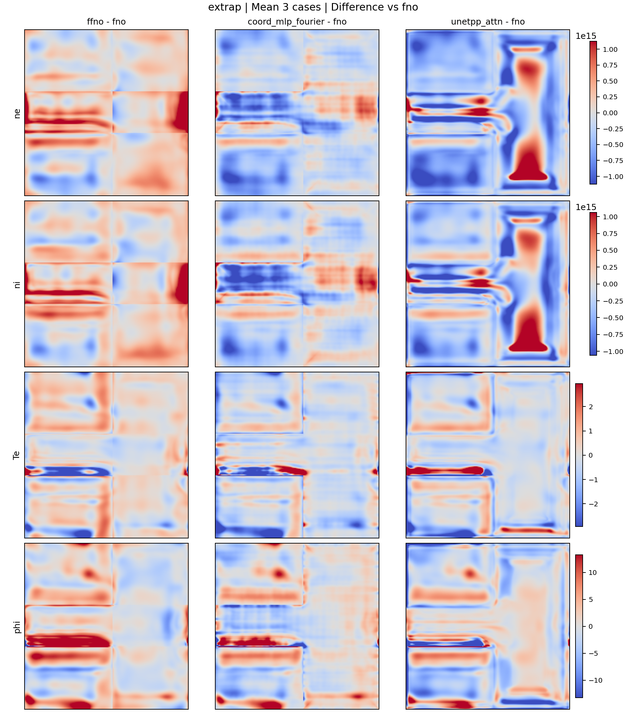

### 4.3 DeepONet-POD と Geom-DeepONet-SIREN（2モデル比較）
`geom_deeponet_siren` は既存ケースと GT マッピングが直接合わないため、この比較は予測場のみです。

- interp mean（予測場）  
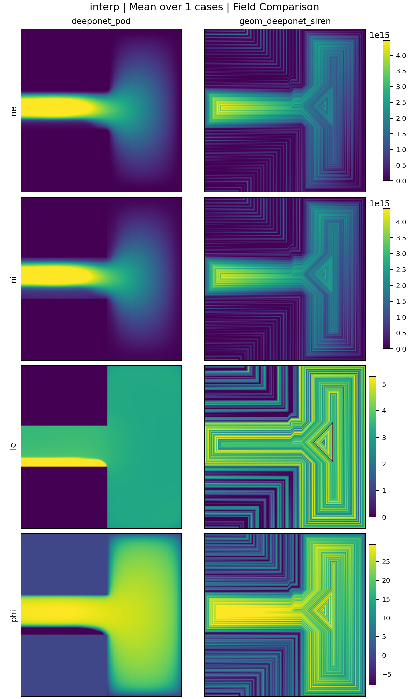
- extrap mean（予測場）  
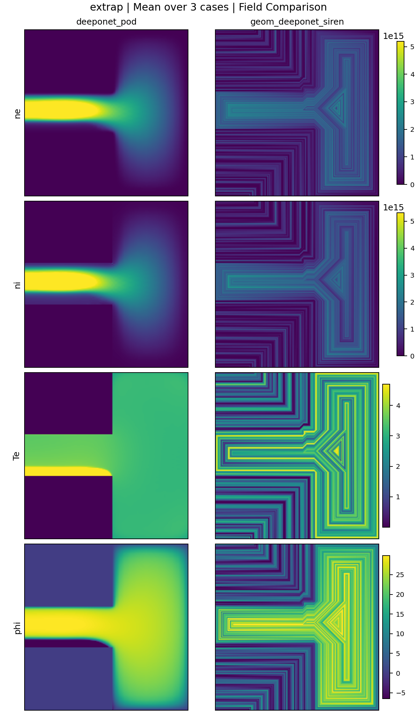

## 5. モデル特徴と使いどころ（78ケース結果ベース）
| Model | 特徴 | 使いどころ | 注意点 |
|---|---|---|---|
| fno | dual/extrap とも最上位クラスで安定 | 総合最適を狙う第一候補 | 学習コストは軽くはない |
| ffno | fnoに近い高性能 | fno代替の高精度候補 | 変数ごとのムラはfnoよりやや大きい |
| coord_mlp_fourier | 高い汎化と高いphi再現 | 座標系MLPで高精度を狙うとき | 高周波寄り設定の管理が必要 |
| unetpp_attn | CNN系で最良、dualが高い | UNet系を維持したい場合の第一候補 | ne/ni extrapは演算子系に劣る |
| unetpp | unetpp_attnと近い性能 | アテンションなしで安定運用 | extrap下位変数がやや弱い |
| coord_mlp_siren | interpは良好 | SIREN系の探索基準 | extrapでギャップが残る |
| unet | 既存最適化済みでdualは維持 | 既存UNet資産を活かす時 | ne/ni extrapがボトルネック |
| u_no | 演算子系として中位安定 | 中庸な汎化を狙う場合 | 上位演算子系に届かない |
| deeponet_pod | extrapは中位で粘る | 特定条件で外挿重視時の比較候補 | dualが上位群より低い |
| cno | phi/Te寄りは一定再現 | CNO系検証用途 | ne/ni extrapが弱い |
| deeponet_plasma | ne/ni は中位だが Te/phi が低い | Te/phi改善実験の土台 | 現状のまま本採択は難しい |
| geom_deeponet_siren | 現状スコアは低位 | 幾何条件を強く入れる研究用途 | 設定/データ整合を要再点検 |
| global_mlp (ref) | table_only で高スコア | ベースライン参照 | 主比較（table_plus_structure）とは別枠 |

## 6. まとめ
1. 78ケース既存結果では、候補12の中で `fno > ffno > coord_mlp_fourier` が総合上位でした。  
2. UNet系は `unetpp_attn` が最良で、既存最適化ラン採用時は dual を高く維持できます。  
3. 空間分布は、既存アーカイブの split 不一致により 12モデル同時の共通ケースが取れないため、比較可能な単位（all10/top4/pod-geom）で可視化しています。  
