# ext0520 27/54/78ケース ベンチマークレポート

作成日: 2026-04-13  
対象データ: `outputs_merged_td_all_success_pa_ext0520` / 変換済み `csv_npz`  
対象結果: `runs/benchmarkrun_ext0520` の 27・54・78ケース完走結果  
比較方針: 改良版を後から追加した時系列評価ではなく、現行の改良版モデル群が最初から候補に含まれている前提で横並び評価する。

## 前提

ユーザー指定の「27,55,79」は、`index_27.csv`, `index_54.csv`, `index_78.csv` のヘッダ込み行数を含む表現と解釈した。CSV はヘッダを1行含むため、実ケース数は 27 / 54 / 78 である。

本レポートでは、旧来の候補に加えて、これまで追加した `coord_mlp_pod_residual`, `geom_deeponet_pod`, `deeponet_plasma_pod`, `cno_operator_unet`, `unet_operator_v2` を通常の候補として扱う。つまり「改善前から改善後へ」という物語ではなく、現在利用できるモデル候補を同一表で比較する。

| 表示 | 入力/結果 | CSV行数 | 実ケース数 | 扱い |
| --- | --- | --- | --- | --- |
| 27 cases | `data/outputs_merged_td_csv_periodic_ext0520/index_27.csv` | 28 | 27 | 現行結果 |
| 54 cases | `data/outputs_merged_td_csv_periodic_ext0520/index_54.csv` | 55 | 54 | 現行結果 |
| 78 cases | `data/outputs_merged_td_csv_periodic_ext0520/index_78.csv` | 79 | 78 | 現行結果 |

## 背景

本コードは、プラズマ場のシミュレーション結果を代理モデルで再現し、条件変更に対する高速な推論・比較・最適化を支える基盤パッケージである。ここで重要なのは、単一モデルで勝つことだけではない。同じデータ、同じ評価手順、同じ出力形式で複数の手法を比較でき、第三者が新しい手法を追加しやすいことが基盤としての価値になる。

今回の ext0520 ベンチマークでは、低データ条件からケース数を増やしたときに、各モデルの精度、外挿耐性、空間領域別の弱点、学習・推論運用上の扱いやすさがどう変わるかを見る。

## 評価フロー

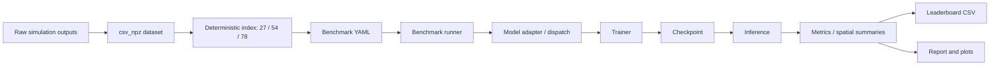

この流れが保たれていれば、モデル追加時に必要な作業は「モデル本体」「adapter/dispatch 登録」「最小 config」「checkpoint 復元」「必要な smoke test」に限定できる。評価や保存処理がモデルごとの分岐に散らばると、第三者が変更範囲を追えなくなり、基盤として弱くなる。

## 評価指標

主指標は `test_r2_plasma_mean_dual` とした。これは `interp` と `extrap` の両方を見た平均的な説明力であり、基盤モデル比較では最も読みやすい。あわせて `test_r2_plasma_mean_interp` と `test_r2_plasma_mean_extrap` を分けて確認した。

$$
R^2 = 1 - \frac{\sum_i (y_i - \hat{y}_i)^2}{\sum_i (y_i - \bar{y})^2}
$$

$$
RMSE = \sqrt{\frac{1}{N}\sum_i (y_i - \hat{y}_i)^2}
$$

$$
R^2_{\mathrm{dual}} =
\frac{1}{2}
\left(
R^2_{\mathrm{interp}} + R^2_{\mathrm{extrap}}
\right)
$$

$$
\mathrm{negative\ ratio} =
\frac{\#\{i \mid \hat{y}_i < 0\}}{N}
$$

SDF/空間分布評価では、境界近傍と深部の差を代表列として読む。

$$
\Delta R^2_{\mathrm{boundary-deep}} =
R^2_{\mathrm{boundary}} - R^2_{\mathrm{deep}}
$$

| 指標 | 何を見るか | 読み方 |
| --- | --- | --- |
| `test_r2_plasma_mean_dual` | 補間と外挿を合わせた総合精度 | 基盤比較の主順位 |
| `test_r2_plasma_mean_interp` | 既知条件に近い範囲の再現性 | 学習分布内の安定性 |
| `test_r2_plasma_mean_extrap` | 未知条件側への耐性 | 実運用時の汎化性 |
| `test_neg_ratio_*_plasma` | 本来非負の量や電位で不自然な負値が出る割合 | 物理妥当性の簡易チェック |
| `sdf_boundary_minus_deep_r2_mean` | 境界と深部の得意不得意 | SDF/空間特徴の有用性評価 |
| `sdf_boundary_to_deep_rmse_ratio_mean` | 境界誤差が深部誤差に対して大きいか | 境界近傍の破綻検出 |

## モデル一覧と使いどころ

| モデル | 内容 | メリット | デメリット | 推論時の使いどころ | 関連 |
| --- | --- | --- | --- | --- | --- |
| Global MLP | 表条件だけで場全体を出す基準線 | 速く、構造入力なしの上限/下限を見やすい | 幾何差や局所構造は直接表現しにくい | 新データの sanity check、構造入力モデルが本当に必要かの判定 | MLP |
| POD-DeepONet | POD係数を条件から予測し、POD基底で場を復元 | 低データで強く、学習・推論が軽い | POD基底外の細部変形には弱い | 最初に使う主力基準、少数ケースでの代理モデル | DeepONet, POD |
| Plasma POD-DeepONet | Plasma用途の実務版POD-DeepONet | POD-DeepONet同等の精度を用途名で明確に扱える | 現状はPOD-DeepONetと近く、差別化は物理制約追加後 | Plasma向けデフォルト候補、既存Plasma DeepONetの置換候補 | DeepONet, POD |
| Geom POD-DeepONet | 幾何descriptorを条件に足したPOD-DeepONet | Geom SIRENより大幅に安定し、78ケースで上位 | descriptor設計が悪いと性能が落ちる | 形状/境界条件差を含む設計比較、幾何感度の評価 | DeepONet, POD, geometry descriptors |
| Coord MLP POD residual | POD粗復元 + 座標MLP残差で連続場を補正 | Coord MLP系で最上位。外挿も強い | Te深部や負値率には追加制約の余地 | 連続座標推論、格子外補間、PODだけでは粗い局所補正 | SIREN/Fourier features, POD |
| Coord MLP Fourier | Fourier特徴付き座標MLP | 軽量で高精度、特徴量追加の検証が速い | 全場を直接背負うためPOD residualほどは伸びにくい | 新しい空間特徴/SDF評価の初期検証 | Fourier features |
| Coord MLP SIREN | 周期活性で座標場を表現 | 滑らかな連続場・高周波表現に向く | 今回の低データでは外挿が弱い | Fourier版との診断比較、細部表現の研究用途 | SIREN |
| FNO | 周波数領域で作用素を学習 | 格子場の大域構造に強く、78ケースでも上位 | 格子前提が強く、境界細部は別評価が必要 | 構造入力ありの主力比較線 | FNO |
| FFNO | FNOを分解型にした作用素モデル | FNO近い精度で安定、周波数作用素の別実装として有用 | 設定次第でFNOより伸びない場合がある | FNOの再現性確認、作用素系の頑健性比較 | FFNO |
| U-NO | U-Net形状のNeural Operator | 局所/大域を混ぜやすい | 今回の上位には届かず、外挿に課題 | 作用素系の中間候補、ケース増加時の伸び確認 | U-NO |
| CNO Operator U-Net | CNOの作用素性とU-Net decoderを合わせた改良版 | CNO legacyより明確に高精度 | 上位POD/FNO系にはまだ届かない | CNO系を残すならこちらを実務候補にする | CNO, U-Net |
| CNO legacy | 従来の軽量CNO | 比較用に残す価値はある | 現行結果ではOperator U-Net版に劣る | 後方互換、改良効果の確認 | CNO |
| U-Net Operator v2 | U-Netに条件埋め込み/作用素的入力を加えた改良版 | U-Netより安定 | POD/Coord POD/FNOには届かない | 画像型モデルの実務候補、局所構造を見たい場合 | U-Net |
| U-Net | 基本CNN encoder-decoder | 単純で理解しやすい | 低データで弱く、外挿も不安定 | 画像型モデルの最低限の基準線 | U-Net |
| U-Net++ | nested skip付きU-Net | 78ケースで大きく改善 | 学習コストが高め | データが増えたときのCNN系主力候補 | UNet++ |
| U-Net++ Attention | Attention付きU-Net++ | 広域依存を補える | コスト増に対して今回の上位には届かない | 境界/局所構造の比較研究 | UNet++, attention |
| Plasma DeepONet legacy | 既存のPlasma DeepONet | 互換性確認に使える | POD版に比べると現行設定では弱い | 過去結果との互換比較、旧モデルの再現 | DeepONet |
| Geom DeepONet SIREN | 幾何情報とSIREN trunkの直接生成型 | 幾何入力の診断には使える | 実務精度には届いていない | Geom POD版との差分診断、研究用途 | DeepONet, SIREN |

## ベンチマーク結果

### 27ケース 上位

| Rank | Model | Dual R2 | Interp R2 | Extrap R2 | Input mode |
| --- | --- | --- | --- | --- | --- |
| 1 | Plasma POD-DeepONet | 0.914 | 0.896 | 0.932 | table_only |
| 2 | POD-DeepONet | 0.914 | 0.896 | 0.932 | table_only |
| 3 | FFNO | 0.912 | 0.915 | 0.909 | table_plus_structure |
| 4 | Geom POD-DeepONet | 0.909 | 0.902 | 0.916 | table_plus_structure |
| 5 | Coord MLP POD residual | 0.900 | 0.864 | 0.936 | table_plus_structure |
| 6 | FNO | 0.897 | 0.898 | 0.896 | table_plus_structure |
| 7 | U-NO | 0.886 | 0.921 | 0.851 | table_plus_structure |
| 8 | Coord MLP Fourier | 0.880 | 0.850 | 0.910 | table_plus_structure |
| 9 | CNO Operator U-Net | 0.839 | 0.869 | 0.809 | table_plus_structure |
| 10 | U-Net Operator v2 | 0.836 | 0.894 | 0.777 | table_plus_structure |
| 11 | Global MLP | 0.786 | 0.717 | 0.855 | table_only |
| 12 | U-Net++ | 0.745 | 0.795 | 0.696 | table_plus_structure |

### 54ケース 上位

| Rank | Model | Dual R2 | Interp R2 | Extrap R2 | Input mode |
| --- | --- | --- | --- | --- | --- |
| 1 | Geom POD-DeepONet | 0.919 | 0.899 | 0.939 | table_plus_structure |
| 2 | Plasma POD-DeepONet | 0.917 | 0.899 | 0.935 | table_only |
| 3 | POD-DeepONet | 0.917 | 0.899 | 0.935 | table_only |
| 4 | Coord MLP POD residual | 0.906 | 0.870 | 0.942 | table_plus_structure |
| 5 | FFNO | 0.887 | 0.856 | 0.918 | table_plus_structure |
| 6 | FNO | 0.881 | 0.863 | 0.899 | table_plus_structure |
| 7 | Coord MLP Fourier | 0.871 | 0.825 | 0.917 | table_plus_structure |
| 8 | U-NO | 0.858 | 0.884 | 0.831 | table_plus_structure |
| 9 | U-Net Operator v2 | 0.832 | 0.859 | 0.805 | table_plus_structure |
| 10 | Global MLP | 0.829 | 0.726 | 0.931 | table_only |
| 11 | CNO Operator U-Net | 0.824 | 0.849 | 0.798 | table_plus_structure |
| 12 | Coord MLP SIREN | 0.799 | 0.849 | 0.749 | table_plus_structure |

### 78ケース 上位

| Rank | Model | Dual R2 | Interp R2 | Extrap R2 | Input mode |
| --- | --- | --- | --- | --- | --- |
| 1 | Coord MLP POD residual | 0.948 | 0.950 | 0.947 | table_plus_structure |
| 2 | POD-DeepONet | 0.946 | 0.951 | 0.941 | table_only |
| 3 | Plasma POD-DeepONet | 0.946 | 0.951 | 0.941 | table_only |
| 4 | Geom POD-DeepONet | 0.941 | 0.952 | 0.931 | table_plus_structure |
| 5 | FNO | 0.930 | 0.944 | 0.917 | table_plus_structure |
| 6 | Coord MLP Fourier | 0.927 | 0.932 | 0.922 | table_plus_structure |
| 7 | Global MLP | 0.922 | 0.917 | 0.928 | table_only |
| 8 | FFNO | 0.920 | 0.934 | 0.905 | table_plus_structure |
| 9 | U-NO | 0.889 | 0.948 | 0.829 | table_plus_structure |
| 10 | U-Net++ | 0.882 | 0.909 | 0.855 | table_plus_structure |
| 11 | CNO Operator U-Net | 0.876 | 0.932 | 0.820 | table_plus_structure |
| 12 | U-Net Operator v2 | 0.872 | 0.929 | 0.815 | table_plus_structure |
| 13 | U-Net++ Attention | 0.863 | 0.904 | 0.822 | table_plus_structure |
| 14 | Coord MLP SIREN | 0.850 | 0.921 | 0.778 | table_plus_structure |
| 15 | CNO legacy | 0.788 | 0.913 | 0.663 | table_plus_structure |
| 16 | U-Net | 0.772 | 0.898 | 0.647 | table_plus_structure |
| 17 | Plasma DeepONet legacy | 0.487 | 0.511 | 0.463 | table_plus_structure |
| 18 | Geom DeepONet SIREN | 0.381 | 0.427 | 0.336 | table_plus_structure |

## 条件数が異なるデータセットでの総合評価

| 実ケース数 | モデル数 | Dual R2 平均 | Dual R2 中央値 | 最上位モデル | 最上位 Dual R2 | Input mode |
| --- | --- | --- | --- | --- | --- | --- |
| 27 | 18 | 0.772 | 0.837 | Plasma POD-DeepONet | 0.914 | table_only |
| 54 | 18 | 0.798 | 0.830 | Geom POD-DeepONet | 0.919 | table_plus_structure |
| 78 | 18 | 0.841 | 0.885 | Coord MLP POD residual | 0.948 | table_plus_structure |

27ケースでは POD 系と FFNO が強いが、現行候補として追加された `geom_deeponet_pod` と `coord_mlp_pod_residual` も最上位群に入る。54ケースでは `geom_deeponet_pod`, `deeponet_plasma_pod`, `POD-DeepONet`, `coord_mlp_pod_residual` がほぼ同じ上位帯に並ぶ。78ケースでは `coord_mlp_pod_residual` が 0.948 で最上位、POD 系が 0.94 台で続き、POD基底型とPOD+残差型が現在の主力候補になっている。

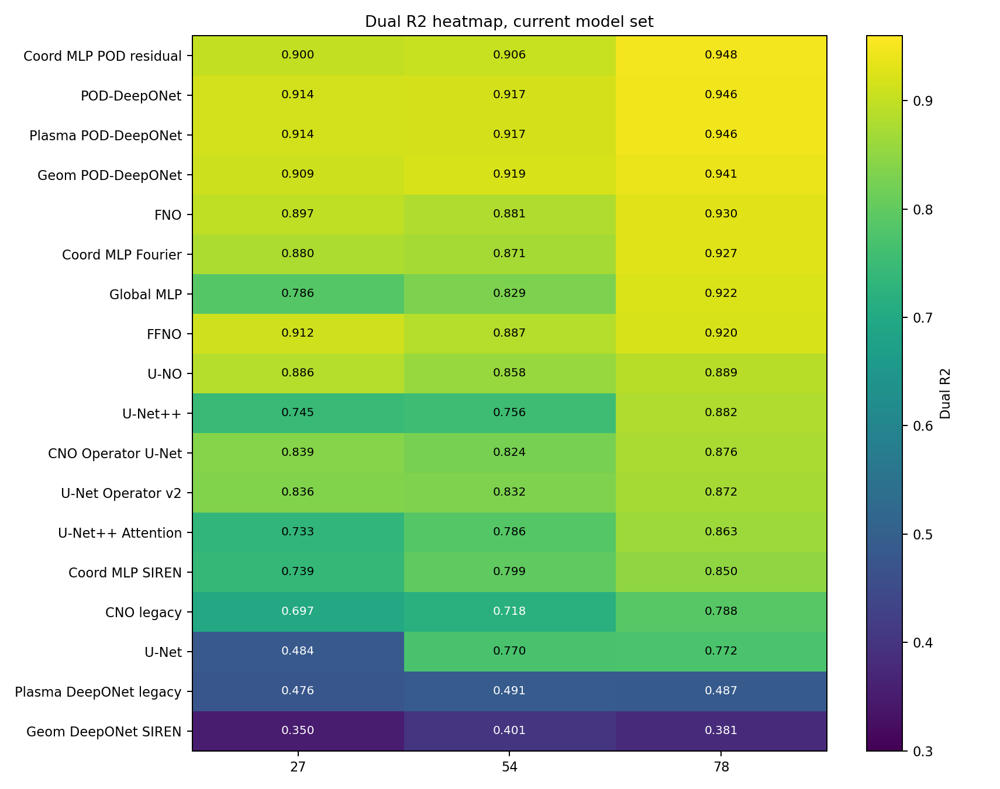

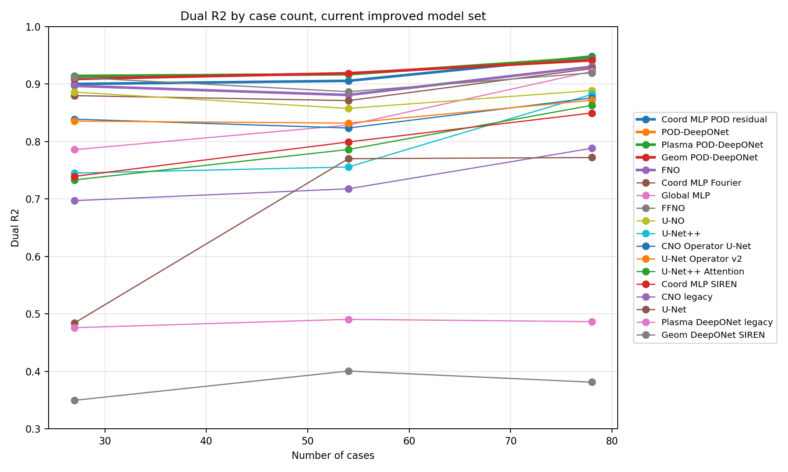

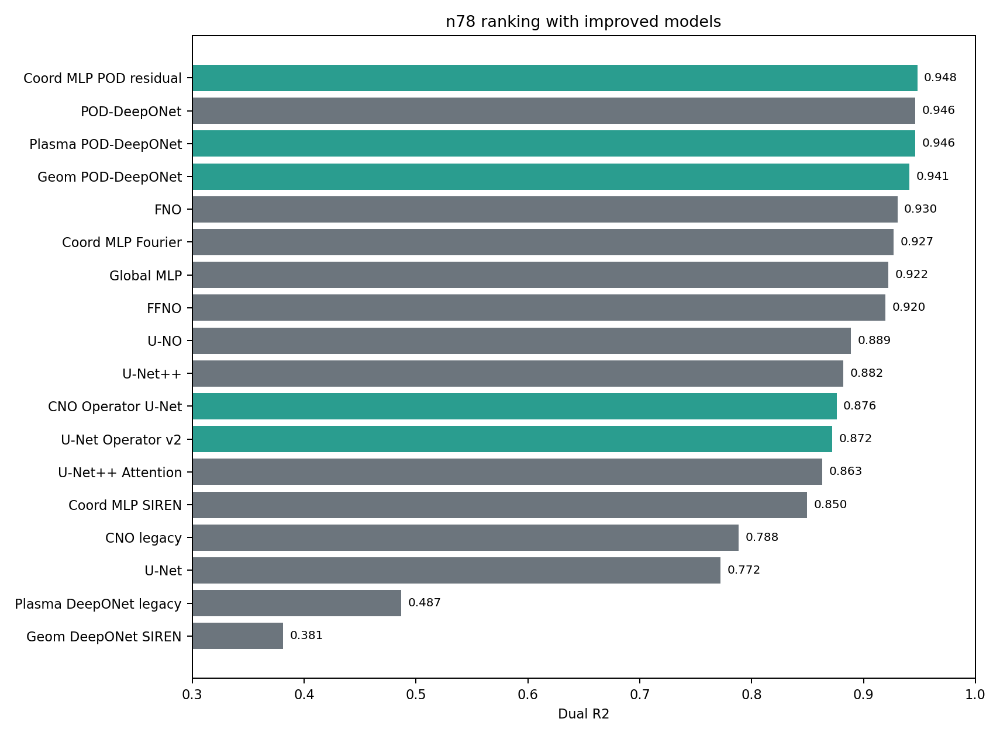

## ケース数増加による変化

| モデル | R2@27 | R2@54 | R2@78 | Δ54-27 | Δ78-54 |
| --- | --- | --- | --- | --- | --- |
| Coord MLP POD residual | 0.900 | 0.906 | 0.948 | 0.005 | 0.042 |
| POD-DeepONet | 0.914 | 0.917 | 0.946 | 0.003 | 0.029 |
| Plasma POD-DeepONet | 0.914 | 0.917 | 0.946 | 0.003 | 0.029 |
| Geom POD-DeepONet | 0.909 | 0.919 | 0.941 | 0.010 | 0.022 |
| FNO | 0.897 | 0.881 | 0.930 | -0.016 | 0.049 |
| Coord MLP Fourier | 0.880 | 0.871 | 0.927 | -0.009 | 0.056 |
| Global MLP | 0.786 | 0.829 | 0.922 | 0.043 | 0.093 |
| FFNO | 0.912 | 0.887 | 0.920 | -0.025 | 0.033 |
| U-NO | 0.886 | 0.858 | 0.889 | -0.028 | 0.031 |
| U-Net++ | 0.745 | 0.756 | 0.882 | 0.011 | 0.126 |
| CNO Operator U-Net | 0.839 | 0.824 | 0.876 | -0.015 | 0.052 |
| U-Net Operator v2 | 0.836 | 0.832 | 0.872 | -0.004 | 0.040 |
| U-Net++ Attention | 0.733 | 0.786 | 0.863 | 0.053 | 0.077 |
| Coord MLP SIREN | 0.739 | 0.799 | 0.850 | 0.060 | 0.050 |
| CNO legacy | 0.697 | 0.718 | 0.788 | 0.021 | 0.070 |
| U-Net | 0.484 | 0.770 | 0.772 | 0.286 | 0.002 |
| Plasma DeepONet legacy | 0.476 | 0.491 | 0.487 | 0.015 | -0.004 |
| Geom DeepONet SIREN | 0.350 | 0.401 | 0.381 | 0.051 | -0.019 |

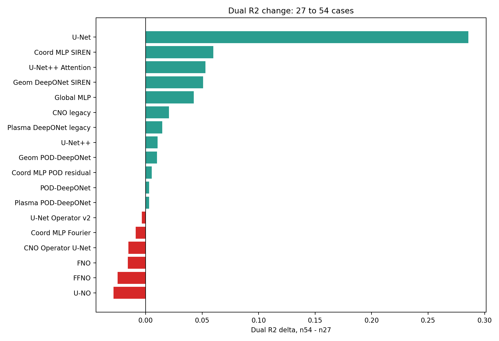

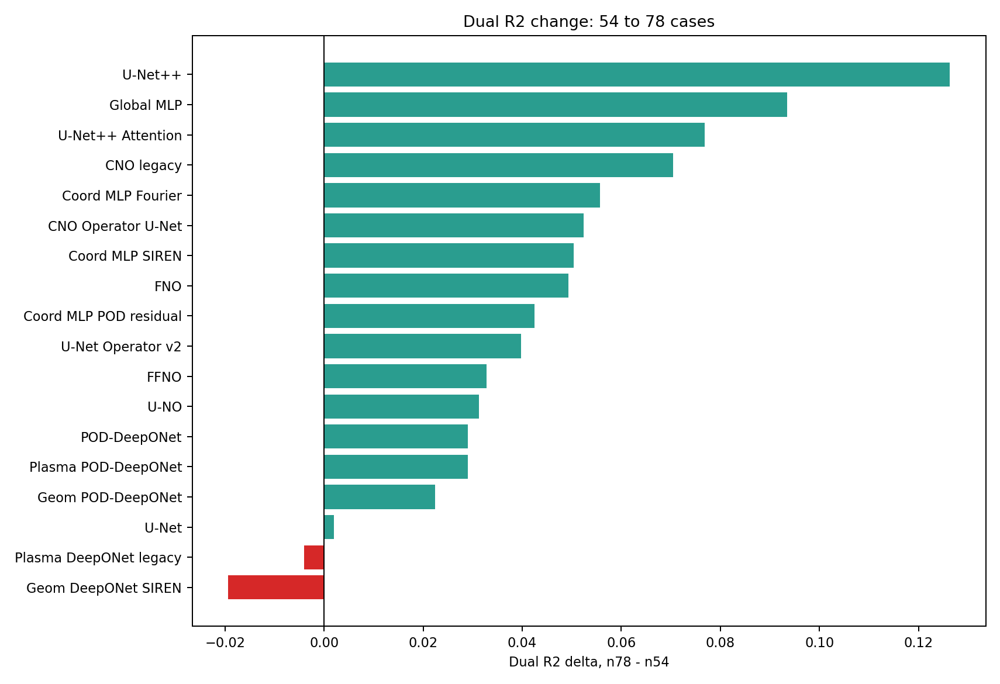

## 精度と実行コスト

54ケースと78ケースでは、POD系と Coord MLP POD residual が高精度かつ比較的軽い。FNO/FFNO は精度とコストのバランスがよく、構造入力を使う作用素系の主力比較線として残す価値が高い。U-Net++ や Attention 系は重く、局所構造の確認や画像型モデルの伸びを見る用途に限定した方が運用しやすい。

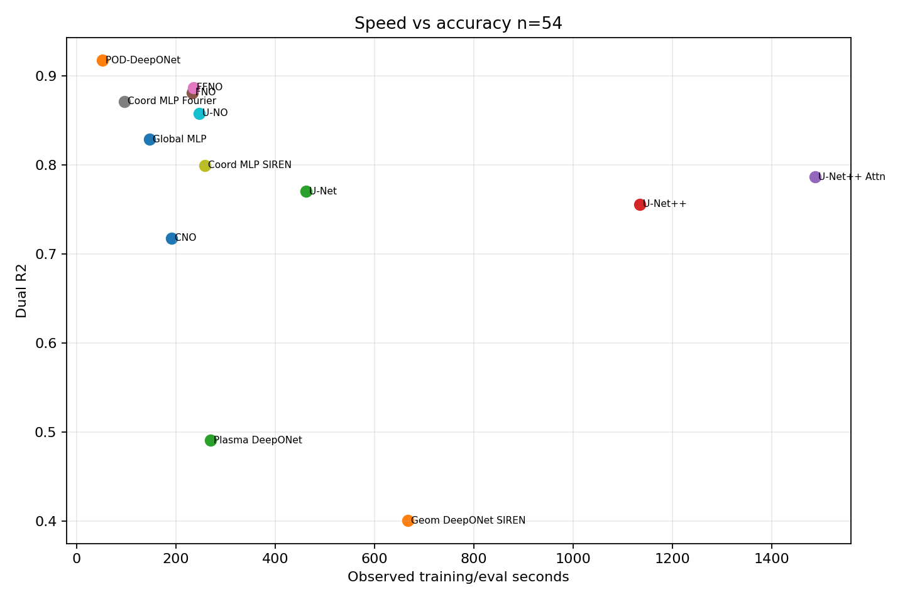

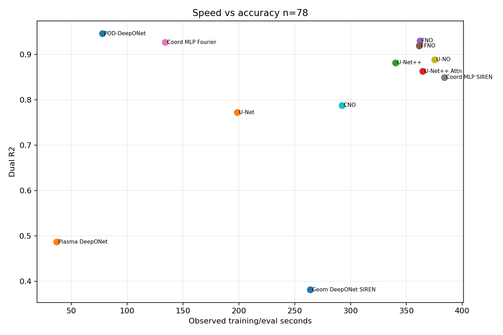

## 改良版を含むファミリー別評価

| 観点 | 結果 | 判断 |
| --- | --- | --- |
| Coord MLP系 | POD residual が 27/54/78 全てで Fourier/SIREN を上回る。78ケースでは全体1位。 | Coord MLPの正式な主力候補は `coord_mlp_pod_residual`。Fourierは軽量診断用として残す。 |
| DeepONet/POD系 | POD-DeepONet と Plasma POD-DeepONet は同水準で、Geom PODも上位。 | POD基底型を実務候補の中心に置く。用途名や幾何descriptorで派生させる。 |
| CNO系 | CNO Operator U-Net は legacy CNO を全サイズで上回る。 | CNOを使うなら改良版を優先し、legacyは比較用に限定する。 |
| U-Net系 | U-Net Operator v2 は素のU-Netより安定。U-Net++は78ケースで伸びる。 | 画像型候補は Operator v2 / U-Net++ を中心にし、重いAttentionは役割を限定する。 |
| 旧Plasma/Geom直接生成 | legacy Plasma DeepONet と Geom SIREN はPOD系に明確に劣る。 | 削除ではなく互換・診断用に残し、実務候補からは外す。 |

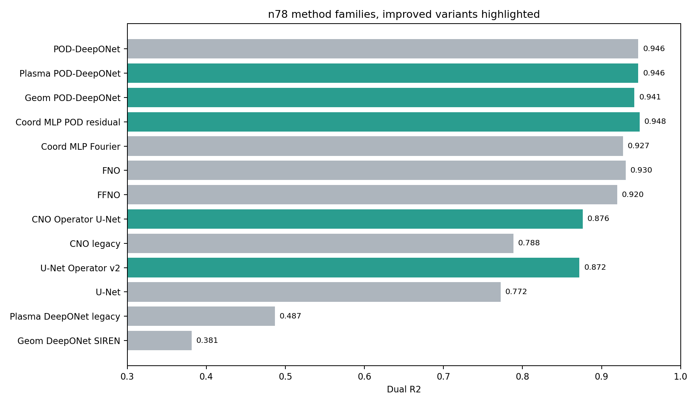

`coord_mlp_pod_residual` は Coord MLP 系の中で明確に最上位である。Fourier/SIREN は比較・診断用として残す価値があるが、実務候補としては POD coarse + coordinate residual の構成を優先するのが自然である。

`geom_deeponet_pod` は、幾何情報を使うモデルとして `geom_deeponet_siren` より大幅に安定した。これは「幾何特徴そのものが効かない」のではなく、低データ条件では直接 SIREN trunk より POD 係数予測の方が実務的であることを示す。

`cno_operator_unet` と `unet_operator_v2` は、それぞれ legacy CNO / plain U-Net より安定している。ただし 78ケース上位の POD 系、FNO 系、Coord POD residual にはまだ差があるため、実務の第一候補ではなく、CNN/Operator 系の構造比較候補として扱うのがよい。

## 空間分布と物理妥当性

平均 R2 だけでは、境界近傍とプラズマ深部のどちらで誤差が出ているかが見えない。そこで、leaderboard に出ている SDF 由来の代表指標と深部 R2 を確認する。

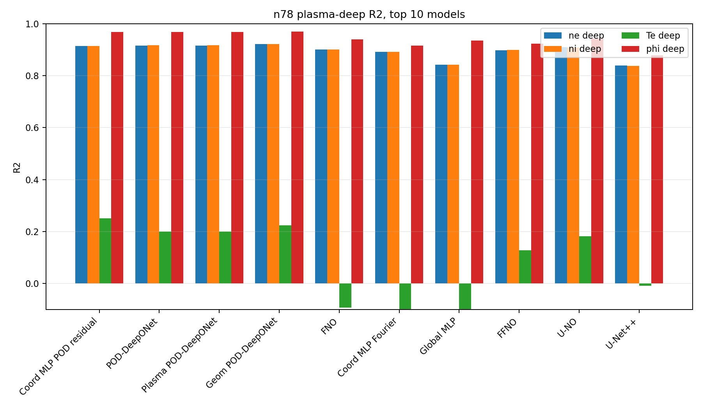

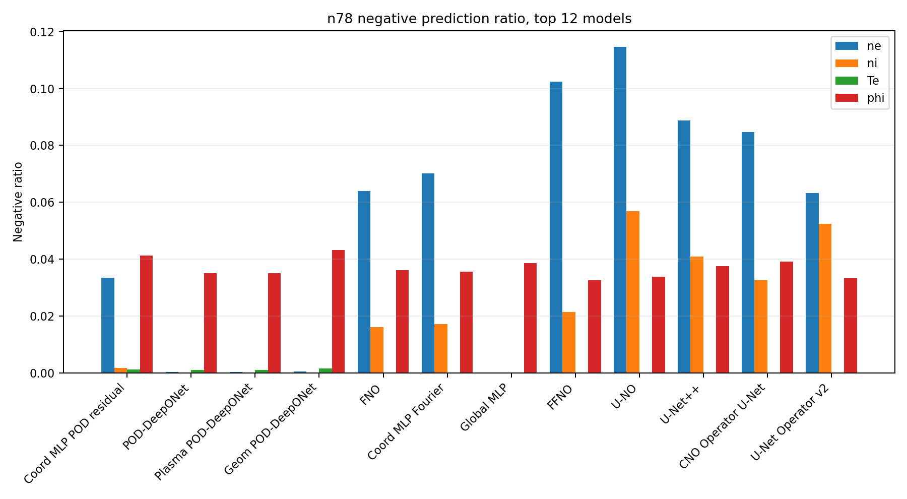

上位モデルでも `Te` の plasma deep は相対的に弱い場合がある。`coord_mlp_pod_residual` は総合 R2 が高い一方で、Te深部や負値率には追加の制約余地が残る。POD 系は平均性能が高いが、POD基底外の局所構造に弱い場合がある。次の改善はモデルを増やすより、物理妥当性と深部領域を少数の代表指標で監視する方が保守しやすい。

## 総合結論

現行の横並び評価では、最も有望な主力候補は `coord_mlp_pod_residual`, `deeponet_plasma_pod` / `POD-DeepONet`, `geom_deeponet_pod`, `FNO`, `FFNO` である。特に `coord_mlp_pod_residual` は 27/54/78 全てで Coord MLP 系を上回り、78ケースでは全体最上位になった。

| 役割 | 該当モデル | 理由 |
| --- | --- | --- |
| 最上位候補 | Coord MLP POD residual | 78ケースで全体最上位。POD粗復元と局所残差の分担が効いている。 |
| POD系主力 | POD-DeepONet, Plasma POD-DeepONet, Geom POD-DeepONet | 低データで強く、学習・推論が軽く、用途別派生も作りやすい。 |
| 作用素系主力 | FNO, FFNO | 格子場の大域構造を扱いやすく、現行78でも上位。 |
| CNN/Operator候補 | U-Net Operator v2, CNO Operator U-Net, U-Net++ | 局所構造の比較に有用。上位POD/FNO系には届かないが基盤から外すべきではない。 |
| 互換・診断用 | Global MLP, legacy CNO, Plasma DeepONet legacy, Geom SIREN | 旧結果や単純基準との差を確認するために残す。実務候補とは分ける。 |

開発方針としては、モデル本体を増やすだけではなく、`benchmark config`, `ModelAdapter`, `checkpoint`, `metrics builder` の境界をシンプルに保つことが重要である。今回の改良版は、できるだけ既存 family と runner 契約に載せる形にしており、第三者がモデル追加・比較・推論再利用を追いやすい構造を保っている。

## 今後の改良点

| 優先度 | 対象 | 改良内容 | 理由 | 複雑化を避ける条件 |
| --- | --- | --- | --- | --- |
| 高 | レポート生成 | 既存成果物から Markdown/CSV/図を生成する軽量コマンドを正式化する | 手作業の転記ミスを防ぎ、第三者が同じ表を再生成できる | 学習コマンドとは分ける |
| 高 | 物理妥当性 | 負値率、Te深部R2、境界/深部差を summary に残す | R2が高くても物理的に不自然な予測は実務で問題になる | 代表指標を少数に絞る |
| 高 | Coord MLP POD residual | Te深部と負値率を軽く抑える制約を検討する | 現行最上位だが深部Teに弱点が残る | 新モデルを増やさず loss/metric の最小追加で見る |
| 中 | Geom POD-DeepONet | descriptor の安定化と正規化仕様を明文化する | 幾何入力の良し悪しが性能に直結する | descriptor を増やしすぎない |
| 中 | CNN/Operator系 | U-Net Operator v2 と CNO Operator U-Net を主比較線にする | legacy より良いが上位との差がある | 旧実装は互換・診断用に限定 |
| 中 | GPU実行契約 | Torch model の device, forward/backward, checkpoint 契約を smoke test 化する | CPU落ちや引数不一致を長時間実行前に検出する | モデル別特殊分岐ではなく共通契約で見る |

## 生成成果物

- 集約CSV: `comparison_27_54_78.csv`
- 横持ち比較CSV: `wide_comparison_27_54_78.csv`
- 空間集約CSV: `spatial_metric_summary_27_54_78.csv`
- 比較図: `plots/dual_r2_heatmap_current.png`, `plots/dual_r2_by_case_count.png`, `plots/ranking_n78_current.png`, `plots/improved_family_n78.png`
- 変化図: `plots/delta_r2_54_minus_27.png`, `plots/delta_r2_78_minus_54.png`
- コスト図: `plots/speed_accuracy_n54.png`, `plots/speed_accuracy_n78.png`
- 物理/空間図: `plots/negative_ratio_n78.png`, `plots/spatial_deep_r2_n78_top10.png`

## 参考文献

- Ronneberger, Fischer, Brox. U-Net: Convolutional Networks for Biomedical Image Segmentation. arXiv:1505.04597. https://arxiv.org/abs/1505.04597
- Zhou et al. UNet++: A Nested U-Net Architecture for Medical Image Segmentation. arXiv:1807.10165. https://arxiv.org/abs/1807.10165
- Lu et al. DeepONet: Learning nonlinear operators for identifying differential equations based on the universal approximation theorem of operators. arXiv:1910.03193. https://arxiv.org/abs/1910.03193
- Li et al. Fourier Neural Operator for Parametric Partial Differential Equations. arXiv:2010.08895. https://arxiv.org/abs/2010.08895
- Tran et al. Factorized Fourier Neural Operators. arXiv:2111.13802. https://arxiv.org/abs/2111.13802
- Sitzmann et al. Implicit Neural Representations with Periodic Activation Functions. arXiv:2006.09661. https://arxiv.org/abs/2006.09661
- Tancik et al. Fourier Features Let Networks Learn High Frequency Functions in Low Dimensional Domains. NeurIPS 2020. https://arxiv.org/abs/2006.10739
- Rahman et al. U-NO: U-shaped Neural Operators. arXiv:2204.11127. https://arxiv.org/abs/2204.11127
- Raonic et al. Convolutional Neural Operators for robust and accurate learning of PDEs. arXiv:2302.01178. https://arxiv.org/abs/2302.01178
- Berkooz, Holmes, Lumley. The Proper Orthogonal Decomposition in the Analysis of Turbulent Flows. Annual Review of Fluid Mechanics, 1993. https://doi.org/10.1146/annurev.fl.25.010193.002543
