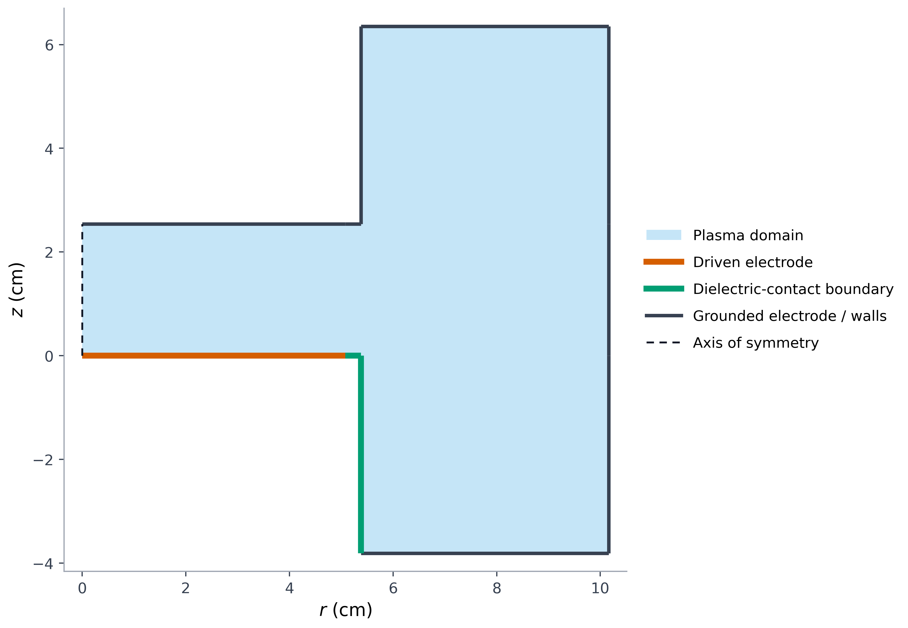
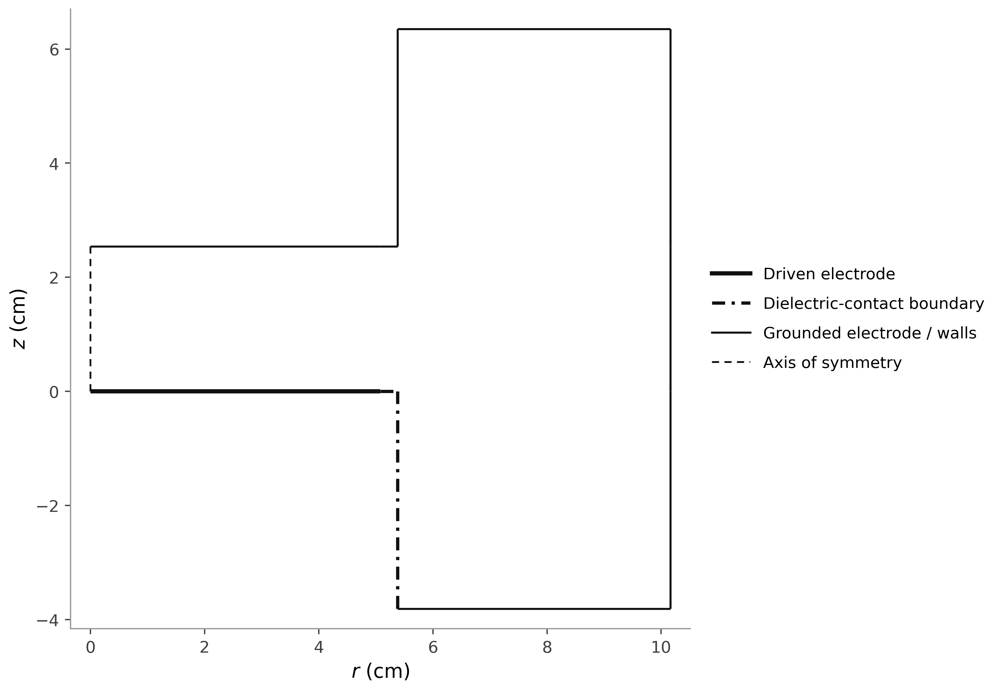

# GEC-CCP representative geometry

- Representative alternative: `base4`
- Selection basis: matches the standard COMSOL 3 mm dielectric break
- Coordinate system: axisymmetric r-z section, centimeters

## Color

- Formats: [PNG](gec_ccp_geometry_overview.png), [PDF](gec_ccp_geometry_overview.pdf), [SVG](gec_ccp_geometry_overview.svg)
- Provenance: [gec_ccp_geometry_overview_metadata.json](gec_ccp_geometry_overview_metadata.json)

## Outline only

- Formats: [PNG](gec_ccp_geometry_outline.png), [PDF](gec_ccp_geometry_outline.pdf), [SVG](gec_ccp_geometry_outline.svg)
- Provenance: [gec_ccp_geometry_outline_metadata.json](gec_ccp_geometry_outline_metadata.json)

The dielectric is represented faithfully as a boundary contact, not as an invented solid region. Mesh-control edges are omitted.
