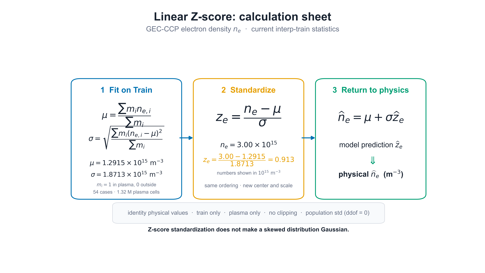
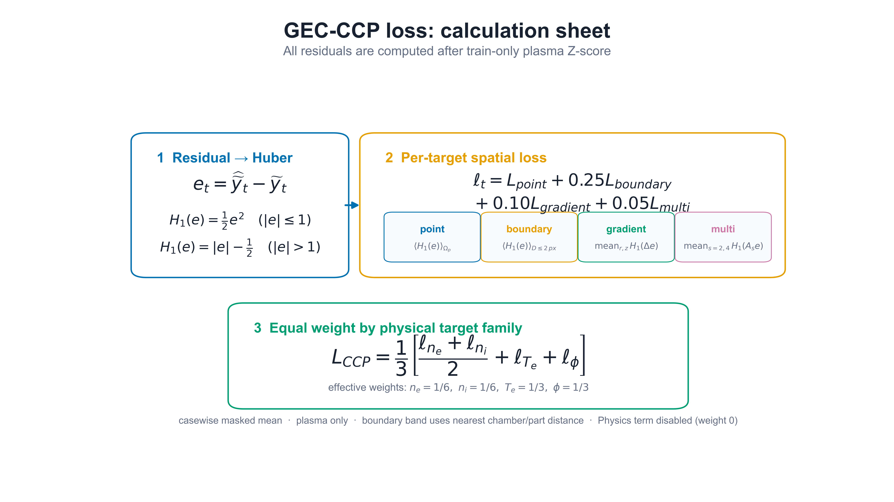
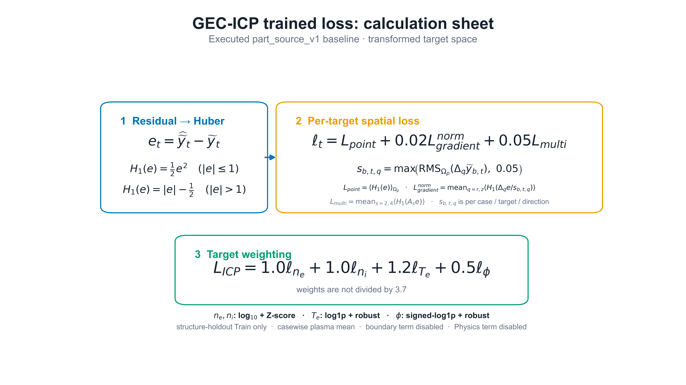
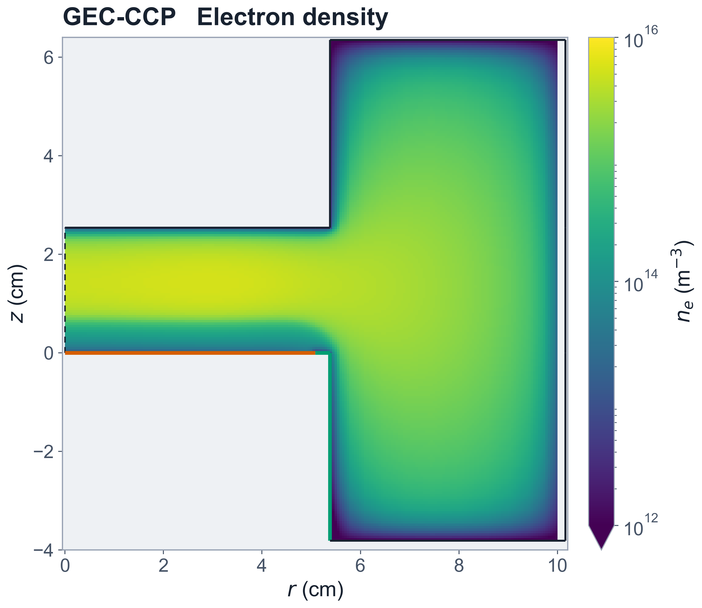
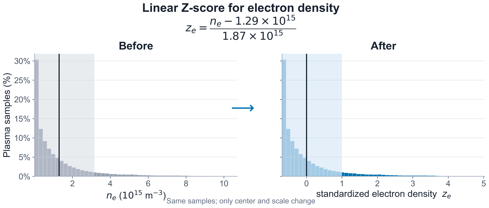
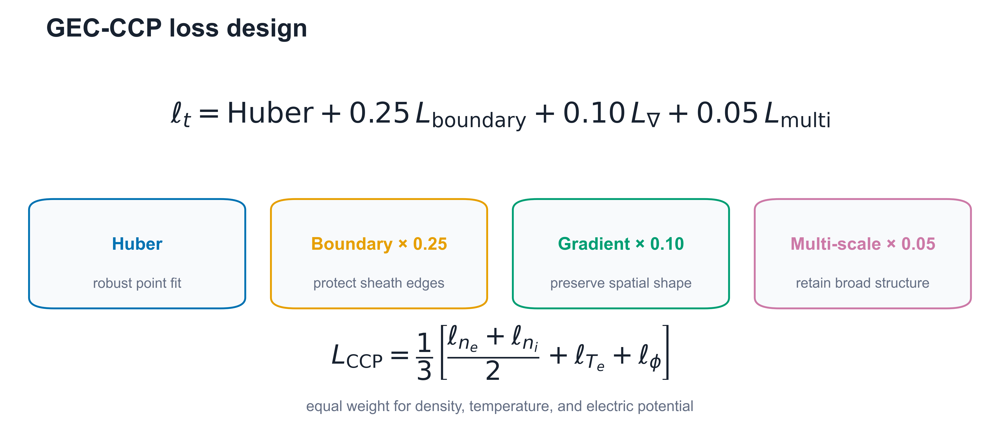
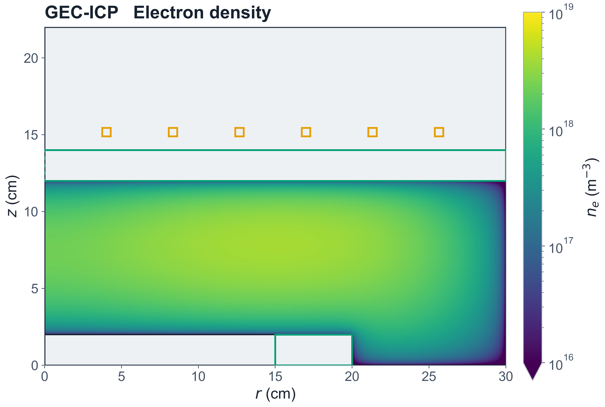
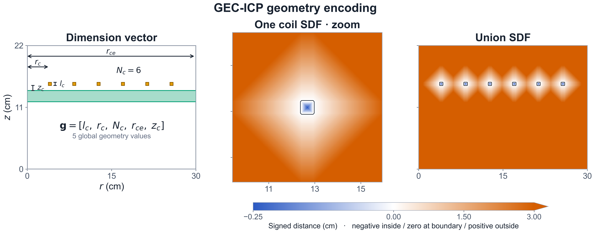
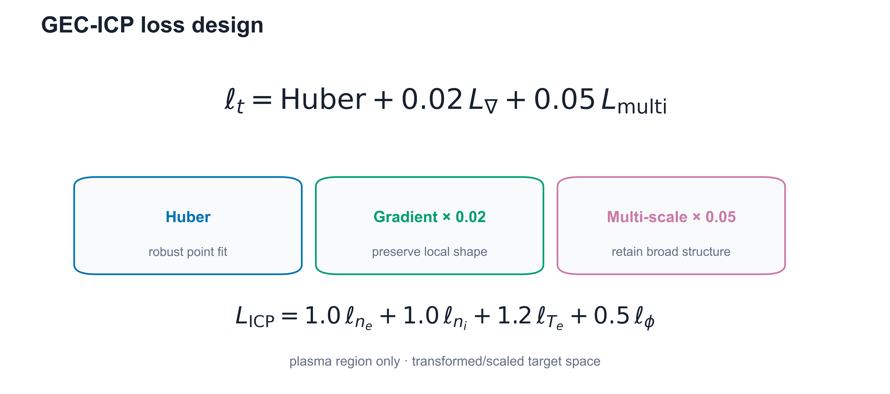

# GEC-CCP / GEC-ICP 学会発表用・簡略図版

GEC-CCPで最終採用したRMSE散布図、電子密度空間分布、評価条件、学習lossの数式は
[GEC-CCP学会発表用・採用結果README](README.md)にまとめています。

一枚で一つの主張だけが伝わるように再構成したスライド用図版です。代表場は電子密度一面、Z-scoreは電子密度のBefore/After、SDFは代表一例とunionだけに絞っています。データセット品質は数値カードではなく、入力・応答分布を示す図だけを残しています。

各図は PNG（スライド）、PDF（印刷・投稿）、SVG（編集）と、根拠を記録したmetadata JSONを収録しています。

## GEC-CCPだけを探す場合

GEC-CCPのジオメトリー、4物性の空間分布、モデル別の真値・予測・誤差、モデル比較図、最適化結果を
まとめて探す場合は、[GEC-CCP専用目次](gec_ccp_index.md)を使用してください。
プロジェクト直下の[README](../../README.md)と[レポート一覧](../index.md)からも到達できます。

センサー同化・入力最適化の図だけを使う場合は、[GEC-CCP最適化グラフ集](optimization_assets/index.md)に
収束、trial budget別達成率、最終品質、計算費用、TPE trial profile、最適化後電子密度場をまとめています。
[疑似PAP逆問題の学会用資料](optimization_assets/pap_inverse_example/index.md)では、問題設定図、
CMA-ESの500 trialアニメーション、静止画、CSV、metadataを一括して参照できます。

## 独立パーツ集（スライド再配置用・推奨）

複数パネルを後から分けて使う場合は、[第三者向け選択ガイド付きの独立パーツ集](independent_assets/index.md)を使用してください。機械可読の一覧は[asset_catalog.csv](independent_assets/asset_catalog.csv)です。

## 計算式（追加図）

以下の3枚は、既存の簡略概要図とは別に使う計算手順図です。データ件数やsplit比率は図にせず、[独立パーツ集](independent_assets/index.md)の表へ集約しています。

### A. GEC-CCP：線形Z-score計算手順



- Train 54ケースのplasma画素だけで平均・母標準偏差を計算
- 電子密度のforward式、数値例、physical valueへのinverse式を3段階で表示
- identity物理値に対する中心・尺度の変更であり、対数化やGaussian化ではありません
- [PNG](ccp_zscore_calculation.png) / [PDF](ccp_zscore_calculation.pdf) / [SVG](ccp_zscore_calculation.svg) / [metadata](ccp_zscore_calculation_metadata.json)

### B. GEC-CCP：Loss計算手順



- Z-score空間の残差 → Huber → point / boundary / gradient / multi-scale → target-family集約を順番に表示
- targetの実効重みは`ne=1/6, ni=1/6, Te=1/3, phi=1/3`
- [PNG](gec_ccp_loss_calculation.png) / [PDF](gec_ccp_loss_calculation.pdf) / [SVG](gec_ccp_loss_calculation.svg) / [metadata](gec_ccp_loss_calculation_metadata.json)

### C. GEC-ICP：実学習済みLoss計算手順



- 変換済みtarget空間の残差 → Huber → target-RMS正規化gradient / multi-scale → target重みを順番に表示
- target重みは`ne=1.0, ni=1.0, Te=1.2, phi=0.5`で、合計3.7による除算はありません
- これは実行済み`part_source_v1` baselineの式です。未学習のSDF-vs-dimension比較用設定とは混在させません
- [PNG](gec_icp_loss_calculation.png) / [PDF](gec_icp_loss_calculation.pdf) / [SVG](gec_icp_loss_calculation.svg) / [metadata](gec_icp_loss_calculation_metadata.json)

## GEC-CCP

### 1. 代表電子密度分布



- 既存ジオメトリと同じ`base4`、`case_td003_pp0_3_gamma_007__steady`
- 色は物理値`ne [m^-3]`の対数カラースケール。軸・境界・colorbarをスライド向けに大型化
- [PNG](ccp_representative_physical_fields.png) / [PDF](ccp_representative_physical_fields.pdf) / [SVG](ccp_representative_physical_fields.svg) / [metadata](ccp_representative_physical_fields_metadata.json)

### 2. 電子密度の線形Z-score



- 電子密度だけの`Before → After`
- identityの線形物理値をtrain-only / plasma-onlyで中心化・尺度統一
- 分布をGaussian化した図や性能改善の実証ではなく、同じ分布形状を共通スケールへ移す効果を示します
- [PNG](ccp_linear_zscore_effect.png) / [PDF](ccp_linear_zscore_effect.pdf) / [SVG](ccp_linear_zscore_effect.svg) / [metadata](ccp_linear_zscore_effect_metadata.json)

### 3. 簡略loss設計



- 上段: robust point fit + boundary + gradient + multiscale
- 下段: density / temperature / electric potentialの3物理familyを均等化
- 等重み化は前処理後のtarget空間に対して適用しています
- Huber区分式、前処理式、実装注記は主図から除外し、metadataへ残しています
- [PNG](gec_ccp_loss_design.png) / [PDF](gec_ccp_loss_design.pdf) / [SVG](gec_ccp_loss_design.svg) / [metadata](gec_ccp_loss_design_metadata.json)

## GEC-ICP

### 4. 代表電子密度分布



- 既存ジオメトリと同じ`case_g002_op01`、6 coils
- 学習対象と対応する電子密度一面だけを表示。コイル・window・chamber外形を重ねています
- [PNG](icp_representative_physical_fields.png) / [PDF](icp_representative_physical_fields.pdf) / [SVG](icp_representative_physical_fields.svg) / [metadata](icp_representative_physical_fields_metadata.json)

### 5. 寸法ベクトルと代表SDF



- `Dimension vector`、中央コイル1個の拡大SDF、6コイルunion SDFの3面だけ
- SDFはraw距離をcm表示し、負=内部、0=境界、正=外部
- 色表示は3 cmでクリップし、3 cm以上は同色にまとめて境界近傍を読みやすくしています
- 6枚すべてのslot SDFとsource-sumは主図から除外しました
- [PNG](icp_geometry_features_sdf.png) / [PDF](icp_geometry_features_sdf.pdf) / [SVG](icp_geometry_features_sdf.svg) / [metadata](icp_geometry_features_sdf_metadata.json)

### 6. 簡略loss設計



- 上段: Huber + gradient + multiscale
- 下段: 実学習済み`part_source_v1` baselineのtarget weights
- dimension-vs-SDF未学習制御設定のlossとは分離しています
- [PNG](gec_icp_loss_design.png) / [PDF](gec_icp_loss_design.pdf) / [SVG](gec_icp_loss_design.svg) / [metadata](gec_icp_loss_design_metadata.json)

## 再生成

```powershell
.\.venv-test\Scripts\python.exe experiments/conference/scripts/plot_gec_conference_simple.py
.\.venv-test\Scripts\python.exe experiments/conference/scripts/plot_gec_conference_dataset_and_formula.py
```

簡略図の生成元: [plot_gec_conference_simple.py](../../experiments/conference/scripts/plot_gec_conference_simple.py)

計算式図の生成元: [plot_gec_conference_dataset_and_formula.py](../../experiments/conference/scripts/plot_gec_conference_dataset_and_formula.py)

数値監査・詳細版の生成元は、同じ`experiments/conference/scripts/`内の`plot_gec_data_and_features.py`、`plot_gec_dataset_quality.py`、`plot_gec_loss_design.py`に残しています。

既存の対応ジオメトリ図: [GEC-CCP](../gec_ccp_geometry/index.md) / [GEC-ICP](../gec_icp_geometry/index.md)
