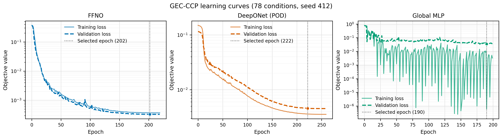

# FFNO / DeepONet / Global MLP：学会用モデル詳細図

[プロジェクト入口](../../../README.md) → [GEC-CCP学会用画像](../gec_ccp_index.md) → モデル詳細図

3モデルの学習曲線と空間分布を、発表資料へそのまま配置できる形式でまとめています。
DeepONetは、採用済みのbranch調整版POD-DeepONetです。

## 比較条件

| 項目 | 設定 |
|---|---|
| データセット | GEC-CCP、全78条件 |
| seed | 412 |
| 評価split | `interp` test（学習・validationに未使用） |
| 空間分布の共通ケース | `case_td003_pp0_3_gamma_004__steady` |
| 表示物性 | 電子密度 $n_e$、イオン密度 $n_i$、電子温度 $T_e$、電位 $\phi$ |
| 空間図の構成 | Geometry / Mask、Truth、Prediction、Signed error |
| 学習曲線 | Training / Validation objective、縦軸は対数スケール、採用epochを点線表示 |

空間分布は3モデルで同じtestケースを使用しているため、モデル間で直接比較できます。
学習曲線のobjectiveは各モデルで設定された損失関数です。絶対値の大小はモデル間順位には使わず、各モデル内の収束と過学習の確認に用いてください。

## 学習曲線

[](selected_models_learning_curves.png)

| モデル | 個別図 | 採用epoch |
|---|---|---:|
| FFNO | [PNG](ffno_learning_curve.png) / [PDF](ffno_learning_curve.pdf) / [SVG](ffno_learning_curve.svg) | 202 |
| DeepONet（POD） | [PNG](deeponet_pod_learning_curve.png) / [PDF](deeponet_pod_learning_curve.pdf) / [SVG](deeponet_pod_learning_curve.svg) | 222 |
| Global MLP | [PNG](global_mlp_learning_curve.png) / [PDF](global_mlp_learning_curve.pdf) / [SVG](global_mlp_learning_curve.svg) | 190 |
| 3モデル横並び | [PNG](selected_models_learning_curves.png) / [PDF](selected_models_learning_curves.pdf) / [SVG](selected_models_learning_curves.svg) | — |

## 空間分布：Truth / Prediction / Signed error

| モデル | 電子密度 $n_e$ | イオン密度 $n_i$ | 電子温度 $T_e$ | 電位 $\phi$ |
|---|---|---|---|---|
| FFNO | [PNG](spatial/publication_by_field/ffno/ne/interp/representative_case_td003_pp0_3_gamma_004__steady_ne.png) / [PDF](spatial/publication_by_field/ffno/ne/interp/representative_case_td003_pp0_3_gamma_004__steady_ne.pdf) | [PNG](spatial/publication_by_field/ffno/ni/interp/representative_case_td003_pp0_3_gamma_004__steady_ni.png) / [PDF](spatial/publication_by_field/ffno/ni/interp/representative_case_td003_pp0_3_gamma_004__steady_ni.pdf) | [PNG](spatial/publication_by_field/ffno/Te/interp/representative_case_td003_pp0_3_gamma_004__steady_Te.png) / [PDF](spatial/publication_by_field/ffno/Te/interp/representative_case_td003_pp0_3_gamma_004__steady_Te.pdf) | [PNG](spatial/publication_by_field/ffno/phi/interp/representative_case_td003_pp0_3_gamma_004__steady_phi.png) / [PDF](spatial/publication_by_field/ffno/phi/interp/representative_case_td003_pp0_3_gamma_004__steady_phi.pdf) |
| DeepONet（POD） | [PNG](spatial/publication_by_field/deeponet_pod/ne/interp/representative_case_td003_pp0_3_gamma_004__steady_ne.png) / [PDF](spatial/publication_by_field/deeponet_pod/ne/interp/representative_case_td003_pp0_3_gamma_004__steady_ne.pdf) | [PNG](spatial/publication_by_field/deeponet_pod/ni/interp/representative_case_td003_pp0_3_gamma_004__steady_ni.png) / [PDF](spatial/publication_by_field/deeponet_pod/ni/interp/representative_case_td003_pp0_3_gamma_004__steady_ni.pdf) | [PNG](spatial/publication_by_field/deeponet_pod/Te/interp/representative_case_td003_pp0_3_gamma_004__steady_Te.png) / [PDF](spatial/publication_by_field/deeponet_pod/Te/interp/representative_case_td003_pp0_3_gamma_004__steady_Te.pdf) | [PNG](spatial/publication_by_field/deeponet_pod/phi/interp/representative_case_td003_pp0_3_gamma_004__steady_phi.png) / [PDF](spatial/publication_by_field/deeponet_pod/phi/interp/representative_case_td003_pp0_3_gamma_004__steady_phi.pdf) |
| Global MLP | [PNG](spatial/publication_by_field/global_mlp/ne/interp/representative_case_td003_pp0_3_gamma_004__steady_ne.png) / [PDF](spatial/publication_by_field/global_mlp/ne/interp/representative_case_td003_pp0_3_gamma_004__steady_ne.pdf) | [PNG](spatial/publication_by_field/global_mlp/ni/interp/representative_case_td003_pp0_3_gamma_004__steady_ni.png) / [PDF](spatial/publication_by_field/global_mlp/ni/interp/representative_case_td003_pp0_3_gamma_004__steady_ni.pdf) | [PNG](spatial/publication_by_field/global_mlp/Te/interp/representative_case_td003_pp0_3_gamma_004__steady_Te.png) / [PDF](spatial/publication_by_field/global_mlp/Te/interp/representative_case_td003_pp0_3_gamma_004__steady_Te.pdf) | [PNG](spatial/publication_by_field/global_mlp/phi/interp/representative_case_td003_pp0_3_gamma_004__steady_phi.png) / [PDF](spatial/publication_by_field/global_mlp/phi/interp/representative_case_td003_pp0_3_gamma_004__steady_phi.pdf) |

数値と出典は[空間図CSV](spatial/publication_field_plots.csv)、[学習曲線CSV](learning_curves.csv)、[run metadata](run_metadata.json)、[選択manifest](selection_manifest.csv)から確認できます。

## 再生成

```powershell
.\.venv-test\Scripts\python.exe experiments\conference\scripts\plot_gec_ccp_selected_model_details.py
$env:PLASMA_SURROGATE_ENABLE_TORCH='1'
$env:PYTHONPATH='src'
.\.venv-torch\Scripts\python.exe scripts\plot_gec_ccp_all_best_publication_fields.py --selection-manifest reports\gec_conference_materials\model_detail_assets\selection_manifest.csv --out-root reports\gec_conference_materials\model_detail_assets\spatial --splits interp --fixed-case-id case_td003_pp0_3_gamma_004__steady
```
