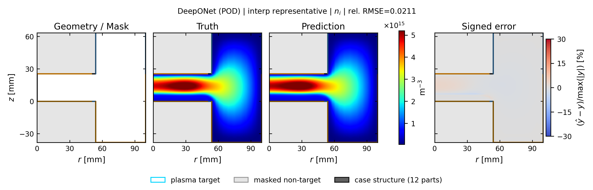
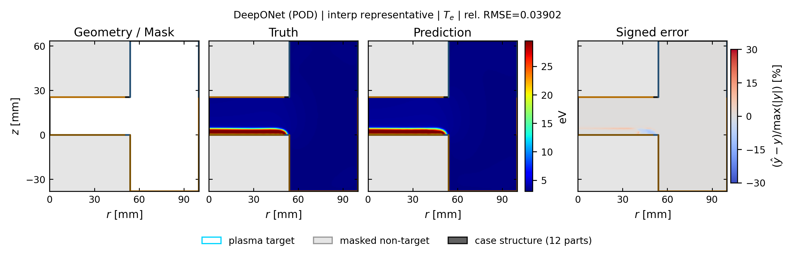
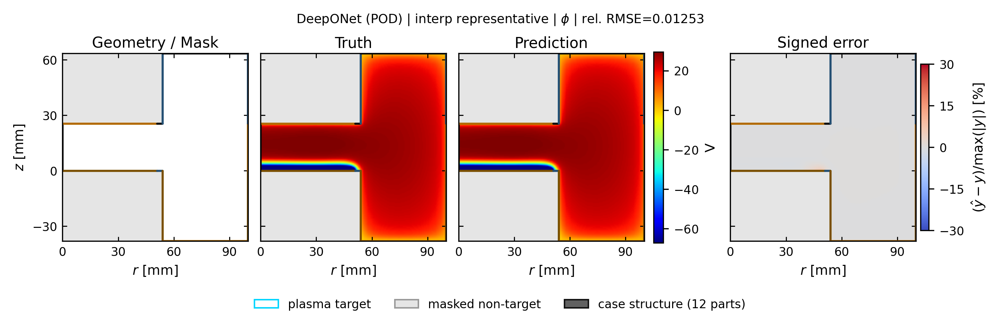

# deeponet_pod: spatial truth / prediction / error

[← 全モデルの集約へ](../index.md)

- validation-only representative seed: `412`
- run: `runs/gec_ccp_pod_branch_tuned_v2/final/seed_412/n78/deeponet_pod`
- Common held-out representative case: `case_td003_pp0_3_gamma_004__steady`
- 代表ケースは4物性の平均相対RMSEで best / p25 / median / p75 / worst を選択
- 各図は Structure / Mask、Truth、Prediction、Signed error の順
- Truth と Prediction は同じカラースケール

## interp: marginal補間

Signed error の表示範囲は `±30%`。飽和色はこの値以上の誤差を表します。

| 物性 | ケース数 | mean rel.RMSE | SD | median | min | max |
| --- | ---: | ---: | ---: | ---: | ---: | ---: |
| `ne` | 13 | 0.0294 | 0.0167 | 0.0211 | 0.0098 | 0.0628 |
| `ni` | 13 | 0.0260 | 0.0148 | 0.0211 | 0.0097 | 0.0538 |
| `Te` | 13 | 0.0437 | 0.0207 | 0.0364 | 0.0199 | 0.0898 |
| `phi` | 13 | 0.0152 | 0.0066 | 0.0143 | 0.0081 | 0.0321 |

### ne

| 代表位置 | case | rel.RMSE | 図 |
| --- | --- | ---: | --- |
| representative | `case_td003_pp0_3_gamma_004__steady` | 0.0211 | [PNG](../publication_by_field/deeponet_pod/ne/interp/representative_case_td003_pp0_3_gamma_004__steady_ne.png) / [PDF](../publication_by_field/deeponet_pod/ne/interp/representative_case_td003_pp0_3_gamma_004__steady_ne.pdf) |

### ni

| 代表位置 | case | rel.RMSE | 図 |
| --- | --- | ---: | --- |
| representative | `case_td003_pp0_3_gamma_004__steady` | 0.0211 | [PNG](../publication_by_field/deeponet_pod/ni/interp/representative_case_td003_pp0_3_gamma_004__steady_ni.png) / [PDF](../publication_by_field/deeponet_pod/ni/interp/representative_case_td003_pp0_3_gamma_004__steady_ni.pdf) |

### Te

| 代表位置 | case | rel.RMSE | 図 |
| --- | --- | ---: | --- |
| representative | `case_td003_pp0_3_gamma_004__steady` | 0.0390 | [PNG](../publication_by_field/deeponet_pod/Te/interp/representative_case_td003_pp0_3_gamma_004__steady_Te.png) / [PDF](../publication_by_field/deeponet_pod/Te/interp/representative_case_td003_pp0_3_gamma_004__steady_Te.pdf) |

### phi

| 代表位置 | case | rel.RMSE | 図 |
| --- | --- | ---: | --- |
| representative | `case_td003_pp0_3_gamma_004__steady` | 0.0125 | [PNG](../publication_by_field/deeponet_pod/phi/interp/representative_case_td003_pp0_3_gamma_004__steady_phi.png) / [PDF](../publication_by_field/deeponet_pod/phi/interp/representative_case_td003_pp0_3_gamma_004__steady_phi.pdf) |

