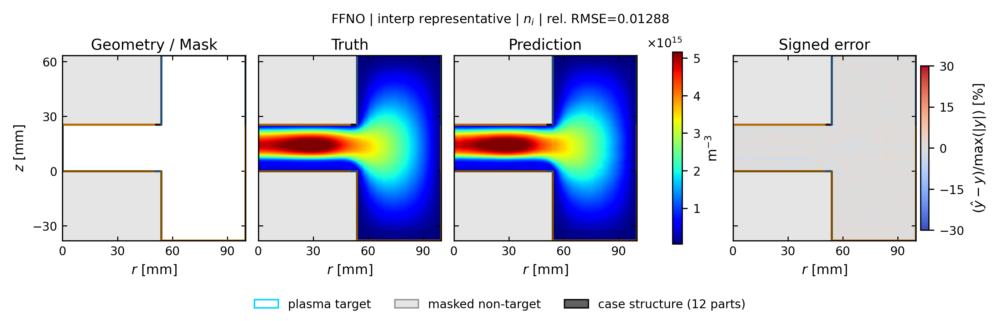
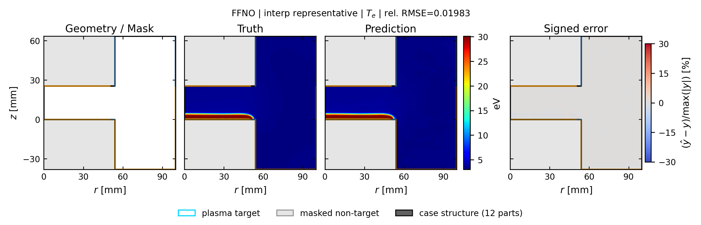
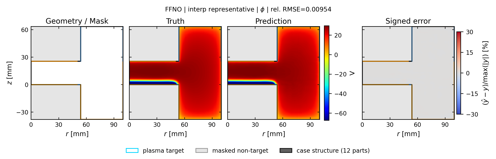

# ffno: spatial truth / prediction / error

[← 全モデルの集約へ](../index.md)

- validation-only representative seed: `412`
- run: `runs/gec_ccp_nn_operator_comparison_v1/seed_412/n78/ffno`
- Common held-out representative case: `case_td003_pp0_3_gamma_004__steady`
- 代表ケースは4物性の平均相対RMSEで best / p25 / median / p75 / worst を選択
- 各図は Structure / Mask、Truth、Prediction、Signed error の順
- Truth と Prediction は同じカラースケール

## interp: marginal補間

Signed error の表示範囲は `±30%`。飽和色はこの値以上の誤差を表します。

| 物性 | ケース数 | mean rel.RMSE | SD | median | min | max |
| --- | ---: | ---: | ---: | ---: | ---: | ---: |
| `ne` | 13 | 0.0181 | 0.0064 | 0.0176 | 0.0113 | 0.0323 |
| `ni` | 13 | 0.0180 | 0.0062 | 0.0173 | 0.0105 | 0.0312 |
| `Te` | 13 | 0.0258 | 0.0078 | 0.0246 | 0.0173 | 0.0451 |
| `phi` | 13 | 0.0117 | 0.0020 | 0.0121 | 0.0091 | 0.0146 |

### ne

| 代表位置 | case | rel.RMSE | 図 |
| --- | --- | ---: | --- |
| representative | `case_td003_pp0_3_gamma_004__steady` | 0.0133 | [PNG](../publication_by_field/ffno/ne/interp/representative_case_td003_pp0_3_gamma_004__steady_ne.png) / [PDF](../publication_by_field/ffno/ne/interp/representative_case_td003_pp0_3_gamma_004__steady_ne.pdf) |

### ni

| 代表位置 | case | rel.RMSE | 図 |
| --- | --- | ---: | --- |
| representative | `case_td003_pp0_3_gamma_004__steady` | 0.0129 | [PNG](../publication_by_field/ffno/ni/interp/representative_case_td003_pp0_3_gamma_004__steady_ni.png) / [PDF](../publication_by_field/ffno/ni/interp/representative_case_td003_pp0_3_gamma_004__steady_ni.pdf) |

### Te

| 代表位置 | case | rel.RMSE | 図 |
| --- | --- | ---: | --- |
| representative | `case_td003_pp0_3_gamma_004__steady` | 0.0198 | [PNG](../publication_by_field/ffno/Te/interp/representative_case_td003_pp0_3_gamma_004__steady_Te.png) / [PDF](../publication_by_field/ffno/Te/interp/representative_case_td003_pp0_3_gamma_004__steady_Te.pdf) |

### phi

| 代表位置 | case | rel.RMSE | 図 |
| --- | --- | ---: | --- |
| representative | `case_td003_pp0_3_gamma_004__steady` | 0.0095 | [PNG](../publication_by_field/ffno/phi/interp/representative_case_td003_pp0_3_gamma_004__steady_phi.png) / [PDF](../publication_by_field/ffno/phi/interp/representative_case_td003_pp0_3_gamma_004__steady_phi.pdf) |

