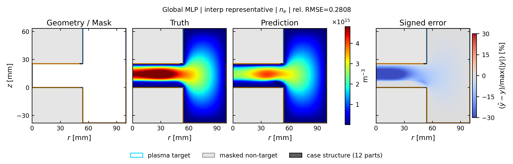
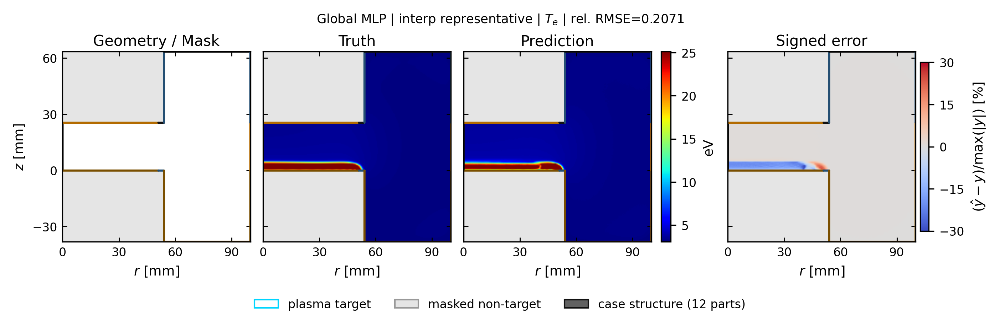
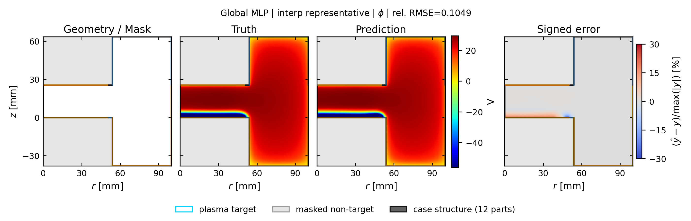

# global_mlp: spatial truth / prediction / error

[← 全モデルの集約へ](../index.md)

- validation-only representative seed: `412`
- run: `runs/gec_ccp_nn_operator_comparison_v1/seed_412/n78/global_mlp`
- Common held-out representative case: `case_td003_pp0_3_gamma_004__steady`
- 代表ケースは4物性の平均相対RMSEで best / p25 / median / p75 / worst を選択
- 各図は Structure / Mask、Truth、Prediction、Signed error の順
- Truth と Prediction は同じカラースケール

## interp: marginal補間

Signed error の表示範囲は `±30%`。飽和色はこの値以上の誤差を表します。

| 物性 | ケース数 | mean rel.RMSE | SD | median | min | max |
| --- | ---: | ---: | ---: | ---: | ---: | ---: |
| `ne` | 13 | 0.2860 | 0.2348 | 0.1954 | 0.0776 | 0.7198 |
| `ni` | 13 | 0.2811 | 0.2302 | 0.1893 | 0.0760 | 0.6997 |
| `Te` | 13 | 0.3132 | 0.2063 | 0.2710 | 0.0907 | 0.8620 |
| `phi` | 13 | 0.1695 | 0.1069 | 0.1181 | 0.0590 | 0.4437 |

### ne

| 代表位置 | case | rel.RMSE | 図 |
| --- | --- | ---: | --- |
| representative | `case_td003_pp0_3_gamma_004__steady` | 0.2808 | [PNG](../publication_by_field/global_mlp/ne/interp/representative_case_td003_pp0_3_gamma_004__steady_ne.png) / [PDF](../publication_by_field/global_mlp/ne/interp/representative_case_td003_pp0_3_gamma_004__steady_ne.pdf) |

### ni

| 代表位置 | case | rel.RMSE | 図 |
| --- | --- | ---: | --- |
| representative | `case_td003_pp0_3_gamma_004__steady` | 0.2783 | [PNG](../publication_by_field/global_mlp/ni/interp/representative_case_td003_pp0_3_gamma_004__steady_ni.png) / [PDF](../publication_by_field/global_mlp/ni/interp/representative_case_td003_pp0_3_gamma_004__steady_ni.pdf) |

### Te

| 代表位置 | case | rel.RMSE | 図 |
| --- | --- | ---: | --- |
| representative | `case_td003_pp0_3_gamma_004__steady` | 0.2071 | [PNG](../publication_by_field/global_mlp/Te/interp/representative_case_td003_pp0_3_gamma_004__steady_Te.png) / [PDF](../publication_by_field/global_mlp/Te/interp/representative_case_td003_pp0_3_gamma_004__steady_Te.pdf) |

### phi

| 代表位置 | case | rel.RMSE | 図 |
| --- | --- | ---: | --- |
| representative | `case_td003_pp0_3_gamma_004__steady` | 0.1049 | [PNG](../publication_by_field/global_mlp/phi/interp/representative_case_td003_pp0_3_gamma_004__steady_phi.png) / [PDF](../publication_by_field/global_mlp/phi/interp/representative_case_td003_pp0_3_gamma_004__steady_phi.pdf) |

