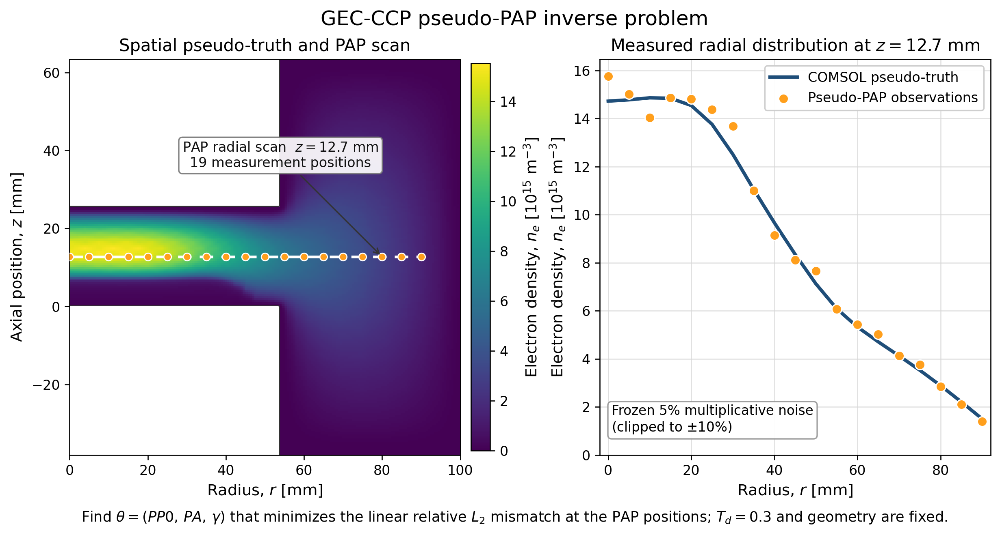
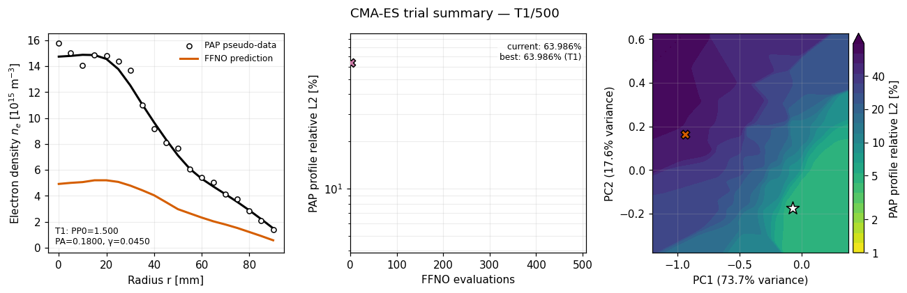
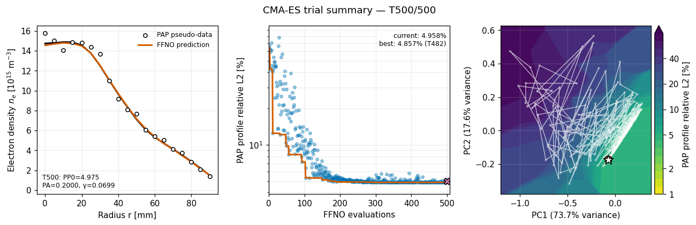

# GEC-CCP 疑似PAP逆問題 学会用資料

[プロジェクト入口](../../../../README.md) → [GEC-CCP学会資料](../../gec_ccp_index.md) → [入力最適化](../index.md) → 疑似PAP逆問題

FFNOを用い、一定高さのPAP半径方向電子密度に整合する `PP0`、`PA`、`gamma` を
CMA-ESで探索する発表例題です。図版は次の順序で参照すると、問題設定から探索結果までを説明できます。

> **評価範囲:** 疑似真値はCMA-ESの挙動を説明しやすいnon-held-out train COMSOLケースです。
> 逆問題とサロゲート反復評価の例示専用であり、FFNOのheld-out汎化精度を示す資料ではありません。

## 推奨する説明順序

| 順序 | 内容 | 用途 | ファイル |
|---:|---|---|---|
| 1 | 疑似PAP問題設定 | 電子密度場、走査高さ、19計測点、ノイズ付き疑似計測を説明 | [PNG](ccp_pseudo_pap_problem_setup.png) / [PDF](ccp_pseudo_pap_problem_setup.pdf) / [SVG](ccp_pseudo_pap_problem_setup.svg) |
| 2 | CMA-ES結果サマリー | 初期・最良profile、loss履歴、PCA応答曲面を一枚で説明 | [PNG](pap_inverse_summary.png) / [PDF](pap_inverse_summary.pdf) / [SVG](pap_inverse_summary.svg) |
| 3 | 500 trialアニメーション | trial進行に伴うprofile、loss、探索軌跡の変化を説明 | [GIF](trial_summary_animation.gif) |
| 4 | PCA探索軌跡 | 500 trial全体の探索経路を静止画で確認 | [PNG](pca_trial_trajectory.png) / [PDF](pca_trial_trajectory.pdf) / [SVG](pca_trial_trajectory.svg) |

## 問題設定図

- 疑似真値: COMSOL電子密度場
- 計測位置: `z=12.7 mm`、`r=0–90 mm`、5 mm間隔の19点
- 疑似計測: 電子密度に標準偏差5%の固定乗算ノイズ、±10%でclip
- 探索変数: `PP0`、`PA`、`gamma`
- 固定条件: `Td=0.3`、GEC-CCP形状
- 目的関数: PAP位置における線形電子密度profileのrelative L2

図の出典・計測点・seedは[metadata](ccp_pseudo_pap_problem_setup_metadata.json)に保存しています。

## Trial進行アニメーション

[アニメーションを開く](trial_summary_animation.gif)

| 開始 | Trial 500 |
|---|---|
|  |  |

- 左: 疑似PAP点と現在trialのFFNO半径方向profile
- 中央: 各trialのloss、現在点、best-so-far
- 右: 固定PCA応答曲面と白色の探索軌跡
- 500 frame、12 fps、ループなし、最後はTrial 500で停止

動画仕様は[animation metadata](trial_summary_animation.json)に保存しています。

## 数値データ

| 内容 | ファイル |
|---|---|
| 疑似PAP計測値 | [pap_observation.csv](pap_observation.csv) |
| CMA-ES 500 trial | [trials.csv](trials.csv) |
| run summary | [summary.json](summary.json) |
| PCA座標 | [pca_trial_trajectory.csv](pca_trial_trajectory.csv) |
| PCA metadata | [pca_trial_trajectory.json](pca_trial_trajectory.json) |

再生成コードはプロジェクトの
[逆問題実行](../../../../scripts/run_gec_ccp_ffno_pap_inverse_example.py)、
[アニメーション](../../../../scripts/animate_gec_ccp_pap_inverse_trials.py)、
[PCA軌跡](../../../../scripts/plot_gec_ccp_pap_pca_trajectory.py)、
[問題設定図](../../../../scripts/plot_gec_ccp_pap_problem_setup.py)です。
