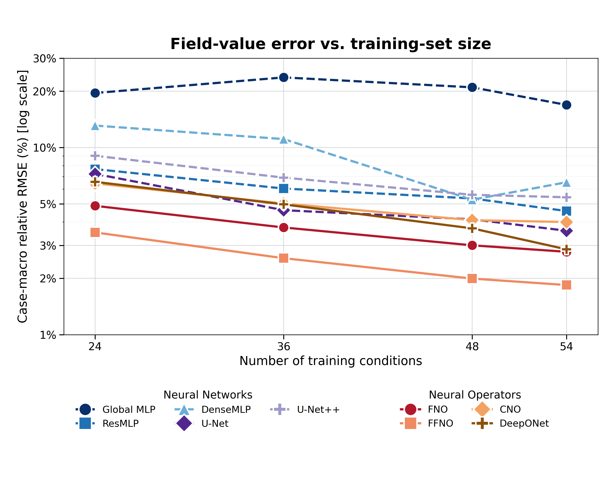
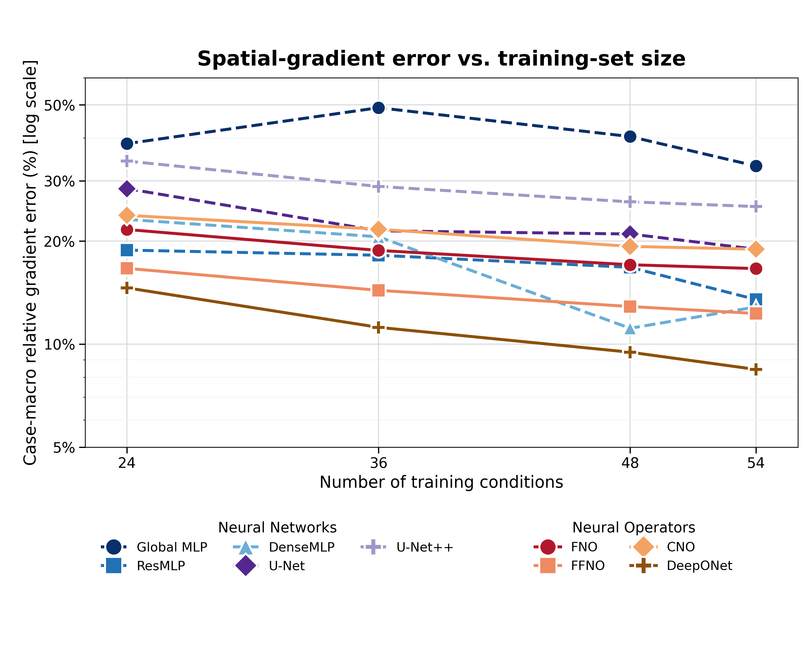
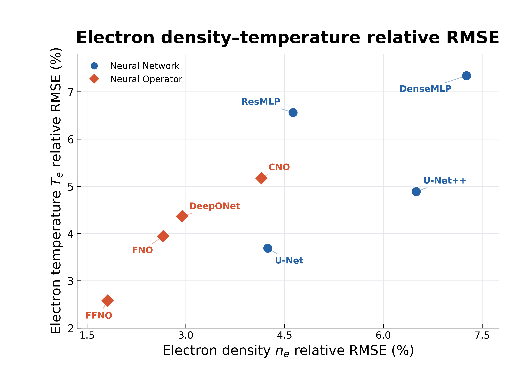
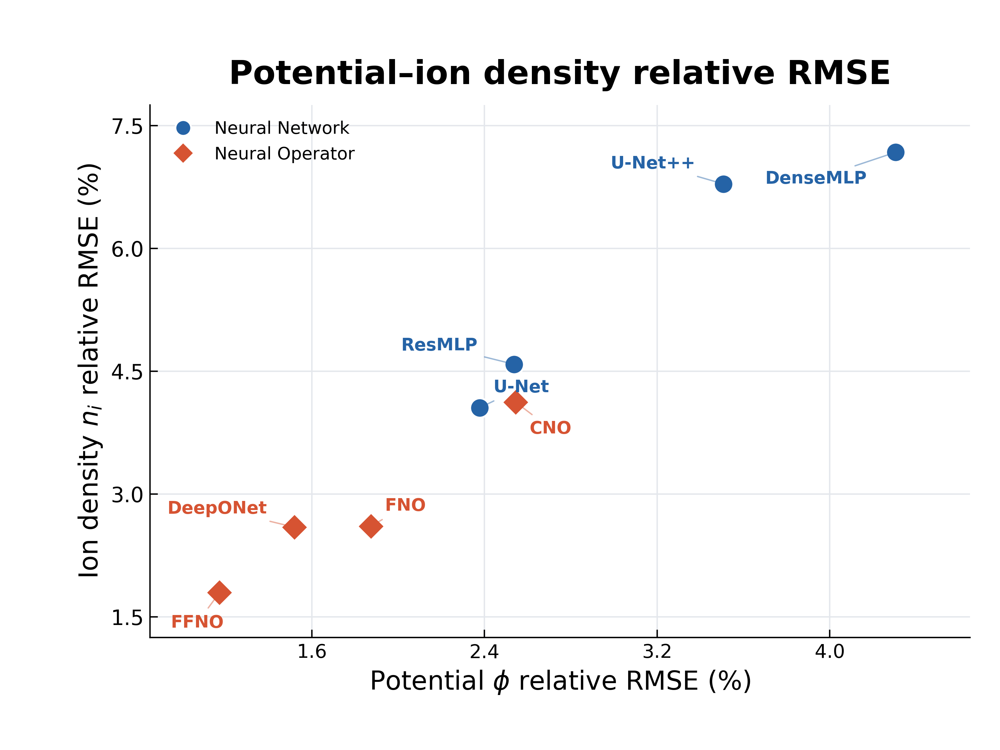
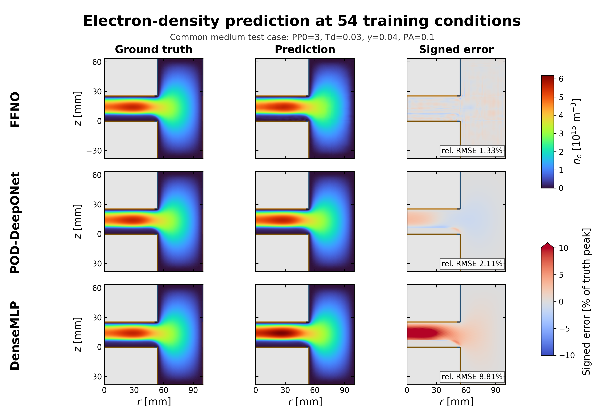
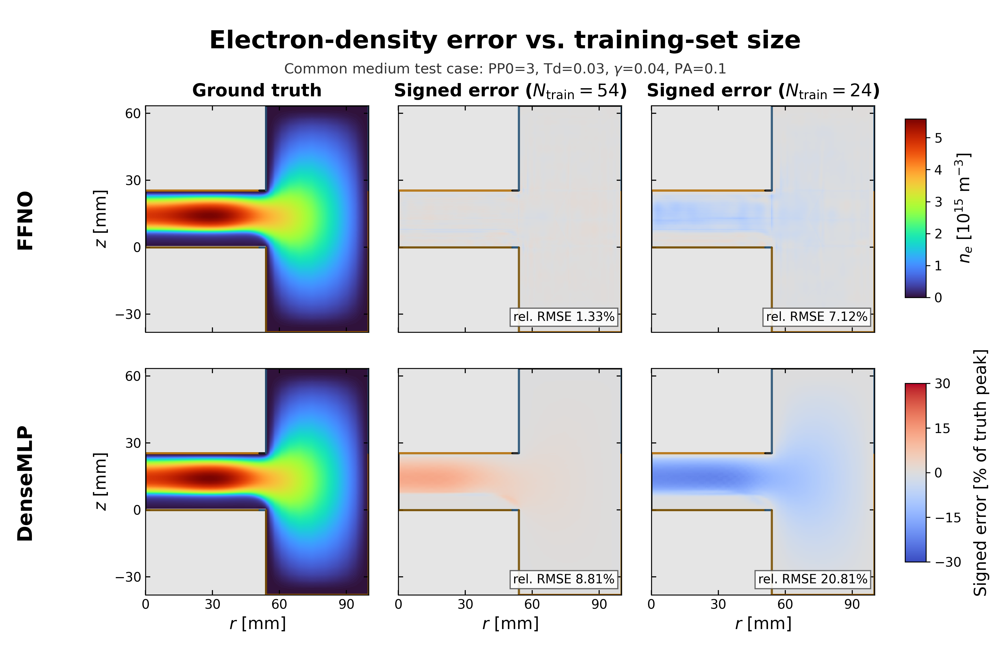

# GEC-CCP 学習データ数比較・学会用グラフ

[GEC-CCP学会用画像](../gec_ccp_index.md) → 学習データ数比較

固定した13件の補間テストデータを用い、学習条件数54・48・36・24に対するモデル精度を
比較した発表用セットです。全体指標、54条件の物性別指標、同じMediumテストケースを
使った空間誤差図を同じフォルダに保存しています。

## 推奨する提示順

1. 全体の物理量値誤差
2. 54条件モデルの物性別RMSE
3. 全体の空間勾配誤差
4. 54条件モデル3種の電子密度Truth / Prediction / Error
5. FFNOとDenseMLPの学習データ数別電子密度空間誤差

## 全体指標

### Case-macro relative RMSE

[PNG](ccp_case_macro_relative_rmse_by_training_size.png) / [PDF](ccp_case_macro_relative_rmse_by_training_size.pdf) / [SVG](ccp_case_macro_relative_rmse_by_training_size.svg)

### Case-macro relative gradient error

[PNG](ccp_case_macro_relative_gradient_error_by_training_size.png) / [PDF](ccp_case_macro_relative_gradient_error_by_training_size.pdf) / [SVG](ccp_case_macro_relative_gradient_error_by_training_size.svg)

両図の縦軸は対数スケールです。Neural Network系を寒色・破線、Neural Operator系を
暖色・実線で表示しています。U-NOとDeepONet Plasmaは数値CSVには保持し、発表図からは
除外しています。

## 54条件モデルの物性別RMSE

### 電子密度と電子温度

[PNG](ccp_n54_relative_rmse_ne_vs_te.png) / [PDF](ccp_n54_relative_rmse_ne_vs_te.pdf) / [SVG](ccp_n54_relative_rmse_ne_vs_te.svg)

### 電位とイオン密度

[PNG](ccp_n54_relative_rmse_phi_vs_ni.png) / [PDF](ccp_n54_relative_rmse_phi_vs_ni.pdf) / [SVG](ccp_n54_relative_rmse_phi_vs_ni.svg)

[数値CSV](ccp_n54_relative_rmse_pair_scatter_data.csv) / [metadata](ccp_n54_relative_rmse_pair_scatter_metadata.json)

固定13件の補間テストケースに対するcase-macro relative RMSEです。U-NOとDeepONet Plasmaは
Global MLPとともに除外し、branch調整済みPOD-DeepONetを `DeepONet` と表示しています。

## 電子密度の空間誤差

### 54条件モデル3種の比較

[PNG](ccp_n54_ffno_pod_deeponet_densemlp_ne_comparison.png) / [PDF](ccp_n54_ffno_pod_deeponet_densemlp_ne_comparison.pdf) / [SVG](ccp_n54_ffno_pod_deeponet_densemlp_ne_comparison.svg) / [metadata](ccp_n54_ffno_pod_deeponet_densemlp_ne_comparison_metadata.json)

同じMediumテストケースについて、FFNO、branch調整済みPOD-DeepONet、DenseMLPの
真値・予測値・符号付き誤差を共通色尺度で比較します。小さい誤差構造を読み取れるよう、
3モデル比較の誤差レンジは共通の `±10%` としています。

### FFNOとDenseMLPの学習データ数比較

[PNG](ccp_ffno_densemlp_ne_error_by_training_size.png) / [PDF](ccp_ffno_densemlp_ne_error_by_training_size.pdf) / [SVG](ccp_ffno_densemlp_ne_error_by_training_size.svg) / [metadata](ccp_ffno_densemlp_ne_error_by_training_size_metadata.json)

共通ケースは `PP0=3, Td=0.03, gamma=0.04, PA=0.1` です。誤差は
`100 × (prediction - truth) / max(abs(truth))` とし、全パネルを共通の `±30%` で表示します。
赤は過大予測、青は過小予測です。

## 数値と出典

- [全モデル数値](case_macro_errors_by_training_size.csv)
- [全体図provenance](case_macro_plot_provenance.json)
- [54条件3モデル比較metadata](ccp_n54_ffno_pod_deeponet_densemlp_ne_comparison_metadata.json)
- [空間誤差図metadata](ccp_ffno_densemlp_ne_error_by_training_size_metadata.json)
