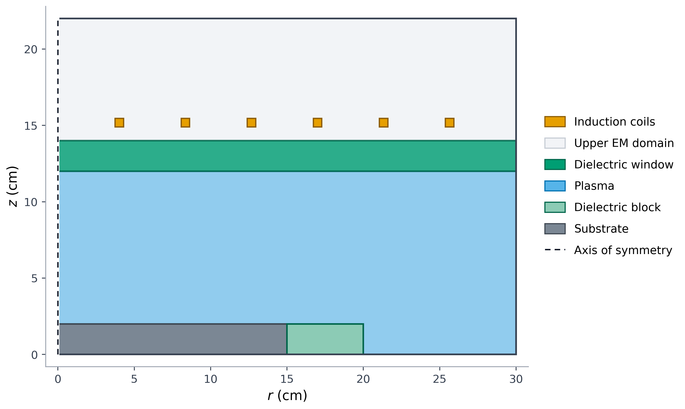
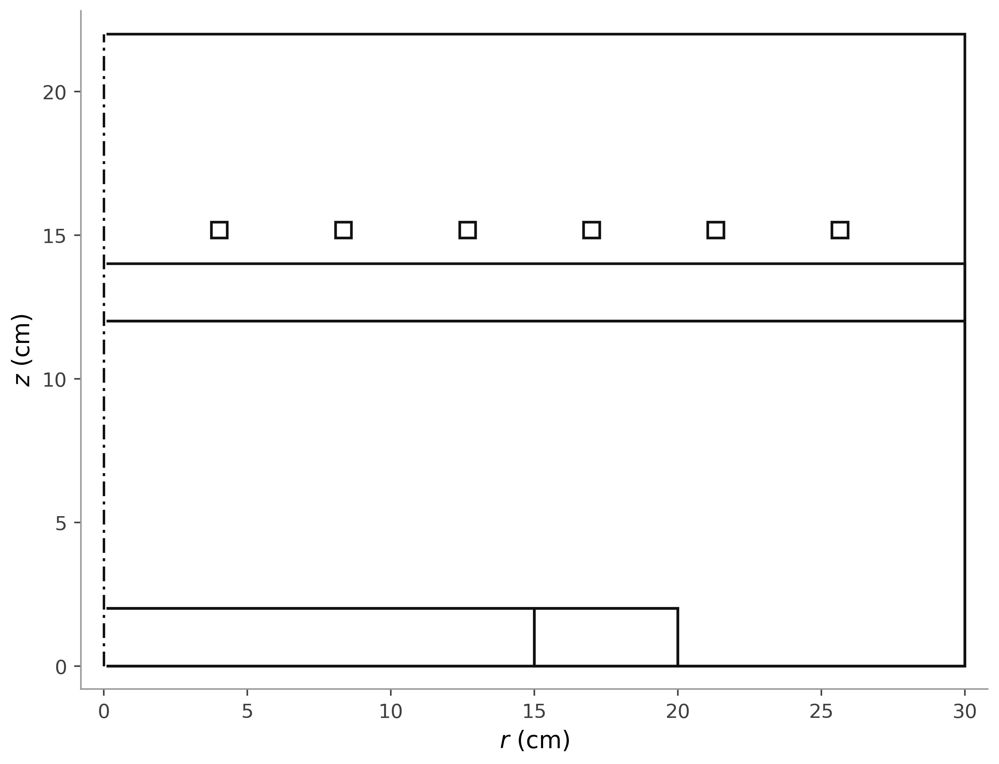

# GEC-ICP geometry overview

- Representative case: `case_g002_op01` (6 active coils)
- Coordinate system: axisymmetric r-z section, centimeters

## Color

- Formats: [PNG](gec_icp_geometry_overview.png), [PDF](gec_icp_geometry_overview.pdf), [SVG](gec_icp_geometry_overview.svg)
- Provenance: [gec_icp_geometry_overview_metadata.json](gec_icp_geometry_overview_metadata.json)

## Outline only

- Formats: [PNG](gec_icp_geometry_outline.png), [PDF](gec_icp_geometry_outline.pdf), [SVG](gec_icp_geometry_outline.svg)
- Provenance: [gec_icp_geometry_outline_metadata.json](gec_icp_geometry_outline_metadata.json)

The optimization-only integration segment is intentionally omitted from the presentation figures.
