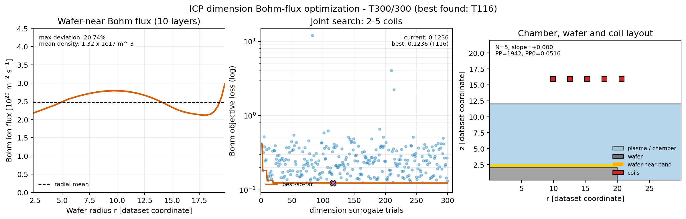

# ICP寸法入力モデル Bohmフラックス最適化・学会発表素材

寸法入力U-Netを用いた、2～5コイル・300 Trialの統合最適化を示す発表用素材です。

## アニメーション

[300 Trialアニメーションを開く](bohm_optimization_trial_animation.gif)

- 左：各Trialのウェハ近傍10層・32半径区間のBohmフラックス1次元分布
- 中：各Trialの目的Lossとbest-so-far
- 右：チャンバー、ウェハ、評価領域、そのTrialの等間隔・同一高さコイル配置
- SDF版と共通の縦軸範囲：`0～4.5 × 10^20 m^-2 s^-1`
- Trial 1～300の300フレーム、12 fps、約26.7秒
- 2・3・4・5コイルを交互に表示し、各75候補を収録
- 最終フレームは発表順Trial 116（元trial_id 253）の最良Lossケースを1.8秒保持

## 静止画



- [PNG](bohm_optimization_conference_layout.png)
- [PDF](bohm_optimization_conference_layout.pdf)
- [SVG](bohm_optimization_conference_layout.svg)

動画仕様は[metadata](bohm_optimization_trial_animation.json)に保存しています。

## 再生成

```powershell
$env:PLASMA_SURROGATE_ENABLE_TORCH='1'
.venv-torch\Scripts\python.exe scripts\animate_icp_bohm_sdf_trials.py `
  --representation dimension `
  --run runs\icp_stage4_bohm_flux_dimension_300trials_v1 `
  --trial-order interleaved --stop-trial 300 --frames 300 --fps 12 --profile-ymax-scaled 4.5
```

この寸法表現では、コイルは等間隔・同一高さに制限されます。高忠実度ICP再解析は未実施です。
