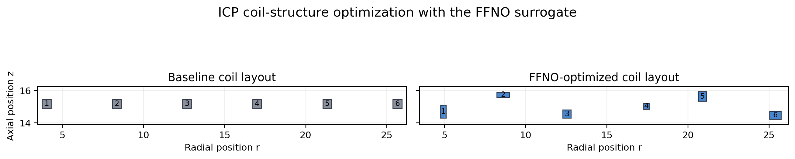
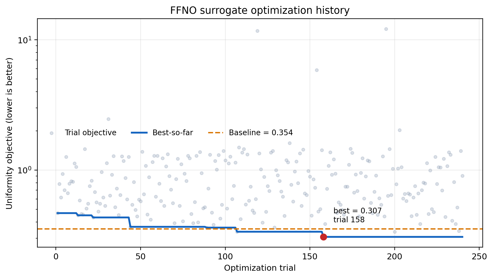
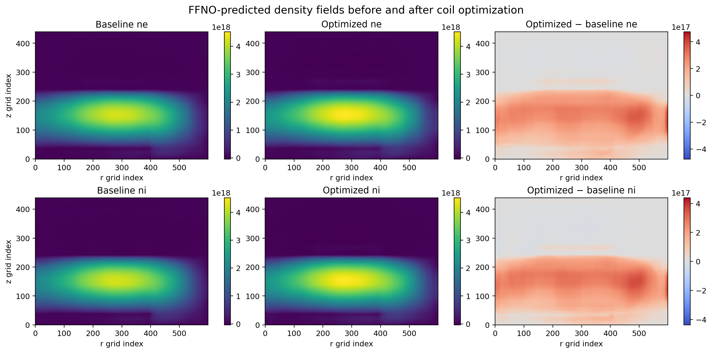
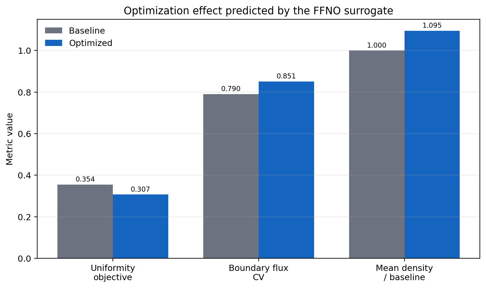

# ICP FFNOコイル構造最適化

過去のFFNO構造最適化runを、再最適化せず学会用図へ再構成した。

## 対象ケース

- 学習済みモデル：FFNO
- 基準ケース：`case_g002_op01`
- 最適化変数：`pp`, `pp0`と6個の矩形コイルの中心位置・幅・高さ
- 探索：random search、240 trials、seed 23
- 目的：プラズマ平均高さにおける電子密度不均一性の最小化
- 目的値：`0.35439 → 0.30688`（13.41%低減）
- 電子密度平均：基準比1.0955

この結果はFFNOサロゲート内の最適化結果であり、高忠実度シミュレーションによる再検証結果ではない。目的値は改善したが、境界フラックスCVは`0.790 → 0.851`へ悪化しているため、総合的な物理解としては扱わない。

## 1. コイル構造

- [PNG](icp_ffno_coil_layout_before_after.png)
- [PDF](icp_ffno_coil_layout_before_after.pdf)
- [SVG](icp_ffno_coil_layout_before_after.svg)

## 2. 最適化Loss history

灰色点は各trial、青線はbest-so-farである。通常の学習Lossではなく、構造最適化の目的関数履歴を示す。最良解はtrial 158（1始まり）で得られた。

- [PNG](icp_ffno_optimization_history.png)
- [PDF](icp_ffno_optimization_history.pdf)
- [SVG](icp_ffno_optimization_history.svg)

## 3. 最適化前後の密度分布

`ne`, `ni`について、最適化前、最適化後、差分を同じ図に示す。

- [PNG](icp_ffno_density_fields_before_after.png)
- [PDF](icp_ffno_density_fields_before_after.pdf)
- [SVG](icp_ffno_density_fields_before_after.svg)

## 4. QoI比較

- [PNG](icp_ffno_optimization_qoi.png)
- [PDF](icp_ffno_optimization_qoi.pdf)
- [SVG](icp_ffno_optimization_qoi.svg)

数値根拠：[metadata.json](metadata.json)

生成元：[plot_icp_ffno_structure_optimization.py](../../../experiments/conference/scripts/plot_icp_ffno_structure_optimization.py)
