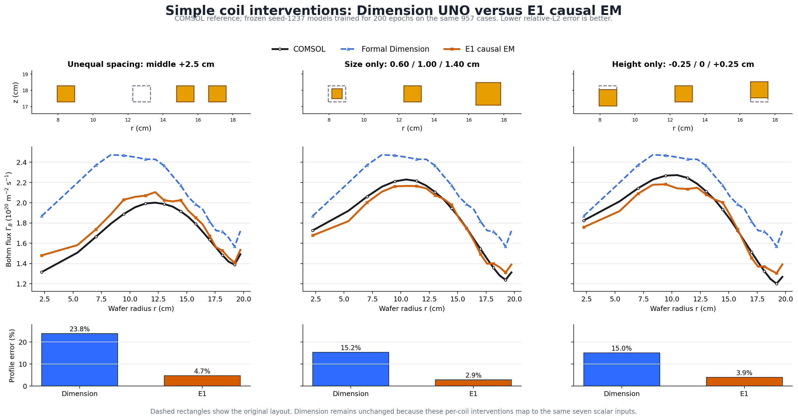
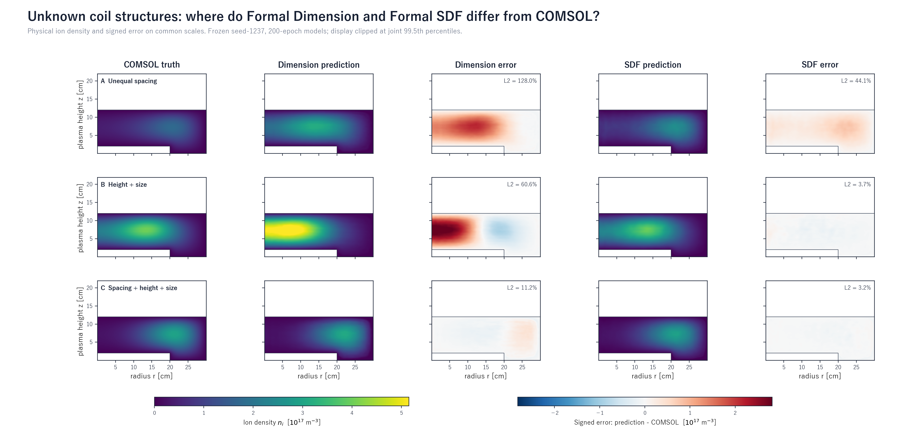

# ICP UNO E1–Dimension 学会用比較資料

このディレクトリは、固定した同一データ・分割・学習条件で得た Formal Dimension と E1 causal EM を比較するための、学会用図表と最適化アニメーションの参照入口です。

## まず見る図：未知の単純構造変化に対するCOMSOL比較

[00：コイル間隔・サイズ・高さ変化のCOMSOL／Dimension／E1比較（PNG）](00_e1_vs_dimension_simple_geometry_bohm.png)

[ベクター版SVG](00_e1_vs_dimension_simple_geometry_bohm.svg)



保持した3ケースのBohmプロファイル相対L2誤差は次の通りです。

| 未知構造ケース | Formal Dimension | E1 causal EM |
|---|---:|---:|
| 中央コイルを右へ2.5 cm移動 | 23.8% | 4.7% |
| 左から右へサイズを0.60／1.00／1.40 cmに変更 | 15.2% | 2.9% |
| 左から右へ高さを-0.25／0／+0.25 cmに変更 | 15.0% | 3.9% |

## 最新正式モデルの空間分布：COMSOL真値／予測値／誤差

[推奨：Formal DimensionとFormal SDFの直接比較（PNG）](formal_dimension_sdf_spatial_v52/22_formal_dimension_sdf_truth_prediction_error.png) ([SVG](formal_dimension_sdf_spatial_v52/22_formal_dimension_sdf_truth_prediction_error.svg)／[PDF](formal_dimension_sdf_spatial_v52/22_formal_dimension_sdf_truth_prediction_error.pdf))



同じ未知構造3例について、`COMSOL真値 | Dimension予測 | Dimension誤差 | SDF予測 | SDF誤差` を同一色軸で示します。物理量はイオン密度、符号付き誤差は `予測 − COMSOL` です。

- [図一式と読み方](formal_dimension_sdf_spatial_v52/README.md)
- [Formal Dimensionのみ](formal_dimension_sdf_spatial_v52/20_formal_dimension_truth_prediction_error.png)
- [Formal SDFのみ](formal_dimension_sdf_spatial_v52/20_formal_sdf_truth_prediction_error.png)
- 未知構造75例全体のイオン密度相対L2中央値：Dimension `27.37%`、SDF `7.10%`。
- 表示3例は誤差の空間的位置を説明する代表例です。全体性能の主張は75例の集団統計に基づきます。

## 最適化アニメーション

全版とも、モデルごとに独立した横長レイアウトです。両モデルで同じ7,040評価から均等に抽出した90 trial、固定軸、12 fps、終端保持1.57秒を使用しています。各フレームの1D分布・2D分布・コイル構造・ピンクの現在点は、すべて同じtrialに対応します。橙線だけがその時点までの最良値です。

### 1D Bohm版：Bohm分布｜探索履歴｜コイル配置

- [Formal Dimension 1Dアニメーション](optimization_seed1237/horizontal_animation_v51/dimension/dimension_optimization_1d_horizontal.gif) ([最終フレームPNG](optimization_seed1237/horizontal_animation_v51/dimension/dimension_optimization_1d_horizontal_final.png))
- [E1 causal EM 1Dアニメーション](optimization_seed1237/horizontal_animation_v51/e1/e1_optimization_1d_horizontal.gif) ([最終フレームPNG](optimization_seed1237/horizontal_animation_v51/e1/e1_optimization_1d_horizontal_final.png))

### 2D Bohm版：2D分布｜探索履歴｜コイル配置

- [Formal Dimension 2Dアニメーション](optimization_seed1237/horizontal_animation_v51/dimension/dimension_optimization_2d_horizontal.gif) ([最終フレームPNG](optimization_seed1237/horizontal_animation_v51/dimension/dimension_optimization_2d_horizontal_final.png))
- [E1 causal EM 2Dアニメーション](optimization_seed1237/horizontal_animation_v51/e1/e1_optimization_2d_horizontal.gif) ([最終フレームPNG](optimization_seed1237/horizontal_animation_v51/e1/e1_optimization_2d_horizontal_final.png))

### 1D＋2D版：1D分布｜2D分布｜探索履歴｜コイル配置

- [Formal Dimension 1D＋2Dアニメーション](optimization_seed1237/horizontal_animation_v51/dimension/dimension_optimization_1d_2d_horizontal.gif) ([最終フレームPNG](optimization_seed1237/horizontal_animation_v51/dimension/dimension_optimization_1d_2d_horizontal_final.png))
- [E1 causal EM 1D＋2Dアニメーション](optimization_seed1237/horizontal_animation_v51/e1/e1_optimization_1d_2d_horizontal.gif) ([最終フレームPNG](optimization_seed1237/horizontal_animation_v51/e1/e1_optimization_1d_2d_horizontal_final.png))

## 静止画の最適化結果

- [最終設計、1D Bohm分布、Dmaxの比較](optimization_seed1237/10_optimized_design_comparison.png) ([SVG](optimization_seed1237/10_optimized_design_comparison.svg))
- [コイル数ごとの最良結果](optimization_seed1237/11_coil_count_comparison.png) ([SVG](optimization_seed1237/11_coil_count_comparison.svg))
- [7,040評価の収束履歴](optimization_seed1237/12_optimization_convergence.png) ([SVG](optimization_seed1237/12_optimization_convergence.svg))

## 条件と主張範囲

- 学習条件：同じ957ケース、固定split、seed 1237、200 epochs。
- 最適化条件：両モデルとも7,040候補を評価し、平均密度が `1.0e17 m^-3` 以上となる候補の最大局所偏差 Dmax を最小化。
- 最良代理モデル予測：Dimension `Dmax=11.546%`、E1 `Dmax=11.178%`。
- E1は個別コイルの間隔・高さ・サイズを入力として区別できます。Dimensionは正規配置を表す7個の寸法変数で区別できる構造に探索範囲が限定されます。
- 00図は既存COMSOL結果との直接比較です。一方、最適化アニメーションの最終設計は代理モデル予測であり、COMSOL未確認です。したがって、アニメーションだけから物理的優位性を断定しません。

## 検証・再生成

- [図の設計契約](CHART_CONTRACT.md)
- [数値・表示検証レポート](optimization_seed1237/VALIDATION_REPORT.md)
- [GIFメタデータ、trial対応検証、共通表示範囲](optimization_seed1237/horizontal_animation_v51/horizontal_animation_v51_summary.json)
- [2D current-trialキャッシュの検証](optimization_seed1237/animation_trial_spatial_cache_v52_summary.json)

横長アニメーションの再生成コマンド：

```powershell
.venv-torch\Scripts\python.exe experiments\icp_stage4\uno_causal_response_v48\render_e1_dimension_animation_horizontal_v51.py
```

00図の再生成コマンド：

```powershell
.venv-torch\Scripts\python.exe experiments\icp_stage4\uno_causal_response_v48\plot_e1_dimension_00.py
```

Formal Dimension／SDF空間分布図の再生成コマンド：

```powershell
.venv-torch\Scripts\python.exe experiments\icp_stage4\uno_epoch500_four_model_protocol_v47\plot_formal_dimension_sdf_truth_prediction_error_v52.py
```

READMEから参照する図の入力CSV、v49探索履歴、候補payload、各表示trialに対応するv52空間分布キャッシュも同じコミットに含めています。横長アニメーションの再生成は学習・最適化・COMSOLを再実行せず、保存済み結果だけを描画します。
