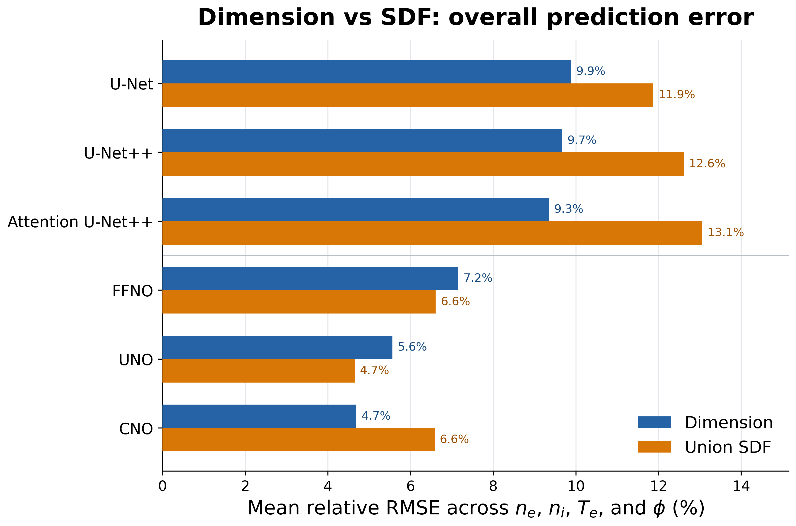

# ICP Dimension / SDF 学習精度比較

共通36件のstructure-holdout test caseに対するcase-macro相対RMSEです。
FNOは正式図から除外しています。RMSEが低いほど学習精度が高いことを示します。

## Dimension / SDF直接比較

**この図を学会発表の主図として正式採用します。**

[PNG](dimension_vs_sdf_relative_rmse_comparison.png) / [PDF](dimension_vs_sdf_relative_rmse_comparison.pdf) / [SVG](dimension_vs_sdf_relative_rmse_comparison.svg)

- 青棒: Dimension
- 橙棒: Union SDF
- 指標: 4物性のcase-macro相対RMSEの単純平均

発表用の説明文、数値表、解釈上の注意は[学会正式採用ガイド](ADOPTION_GUIDE.md)を参照してください。

## NN系 / NO系の色分け比較

- [Dimension: ne vs Te](dimension/dimension_relative_rmse_ne_vs_Te.png)
- [Dimension: phi vs ni](dimension/dimension_relative_rmse_phi_vs_ni.png)
- [SDF: ne vs Te](sdf/sdf_relative_rmse_ne_vs_Te.png)
- [SDF: phi vs ni](sdf/sdf_relative_rmse_phi_vs_ni.png)

## 数値と再現情報

- [集約RMSE CSV](model_family_rmse.csv)
- [metadata](metadata.json)
- [正式採用図カタログ](adopted_figures.csv)
- [生成スクリプト](../../../experiments/conference/scripts/plot_icp_dimension_sdf_fieldwise_rmse.py)
