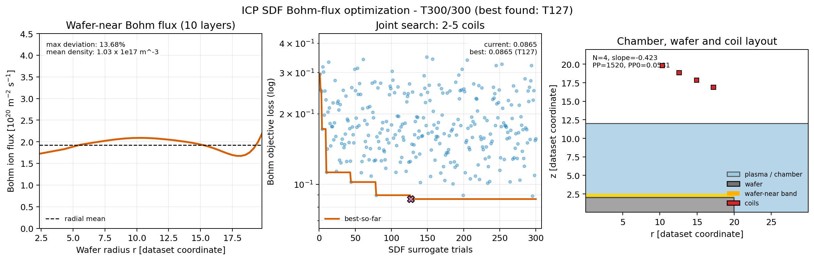

# ICP SDF Bohmフラックス最適化・学会発表素材

SDF入力U-Netを用いた、2～5コイル・500 Trialの統合最適化を示す発表用素材です。

## アニメーション

[500 Trialアニメーションを開く](bohm_optimization_trial_animation.gif)

- 左：各Trialのウェハ近傍10層・32半径区間のBohmフラックス1次元分布
- 中：各Trialの目的Lossとbest-so-far
- 右：チャンバー、ウェハ、評価領域、そのTrialのコイル配置
- 全フレームでBohmフラックスの縦軸範囲を固定
- Trial 1～300の300フレーム、12 fps、約26.7秒
- 2・3・4・5コイルを交互に表示し、各75候補を収録
- 最終フレームは発表順Trial 127（元trial_id 281）の最良Lossケースを1.8秒保持

## 静止画



- [PNG](bohm_optimization_conference_layout.png)
- [PDF](bohm_optimization_conference_layout.pdf)
- [SVG](bohm_optimization_conference_layout.svg)

動画仕様と表示範囲は[metadata](bohm_optimization_trial_animation.json)に保存しています。

## 再生成

```powershell
$env:PLASMA_SURROGATE_ENABLE_TORCH='1'
.venv-torch\Scripts\python.exe scripts\animate_icp_bohm_sdf_trials.py --trial-order interleaved --stop-trial 300 --frames 300 --fps 12 --profile-ymax-scaled 4.5
```

可変高さ構造は、同一高さ構造を中心に学習したサロゲートに対する外挿です。本図はサロゲート探索の説明用であり、ICP高忠実度再解析による検証結果ではありません。
