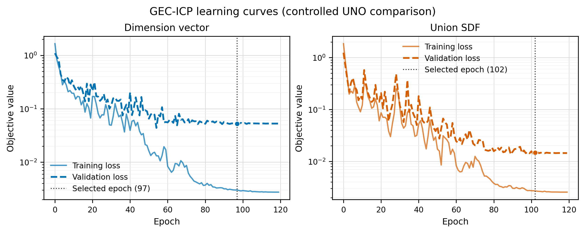
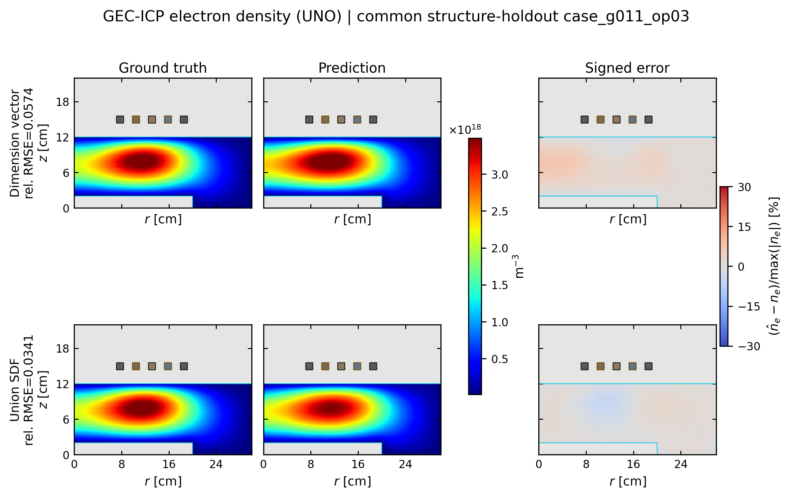

# ICP学会用 UNO Dimension / SDF 学習結果

最新の正式UNO学習ペア（training seed 1237）を、過去のICP U-Net採用図と同じレイアウトで可視化した図一式です。DimensionとUnion SDFは、同じデータ、structure-holdout split、seed、損失、batch size、120 epoch予算で比較しています。

## 学習曲線

- [PNG](dimension_sdf_learning_curves.png) / [PDF](dimension_sdf_learning_curves.pdf) / [SVG](dimension_sdf_learning_curves.svg)
- Dimension単独: [PNG](dimension_learning_curve.png) / [PDF](dimension_learning_curve.pdf) / [SVG](dimension_learning_curve.svg)
- SDF単独: [PNG](sdf_learning_curve.png) / [PDF](sdf_learning_curve.pdf) / [SVG](sdf_learning_curve.svg)

## 電子密度の真値・予測・誤差

共通の未学習構造 `case_g011_op03` を表示しています。これは両表現のtest caseにおける平均relative L2が中央値となるケースであり、best caseではありません。

- [PNG](dimension_vs_sdf_ne_comparison.png) / [PDF](dimension_vs_sdf_ne_comparison.pdf) / [SVG](dimension_vs_sdf_ne_comparison.svg)
- Dimension単独: [PNG](dimension_ne_truth_prediction_error.png) / [PDF](dimension_ne_truth_prediction_error.pdf) / [SVG](dimension_ne_truth_prediction_error.svg)
- SDF単独: [PNG](sdf_ne_truth_prediction_error.png) / [PDF](sdf_ne_truth_prediction_error.pdf) / [SVG](sdf_ne_truth_prediction_error.svg)

| 構造表現 | 採用epoch | 表示case rel. RMSE | 表示case R² | 絶対誤差 p99 |
|---|---:|---:|---:|---:|
| Dimension vector | 97 | 0.05737 | 0.99200 | 6.92% |
| Union SDF | 102 | 0.03414 | 0.99717 | 4.47% |

誤差はplasma領域内で `100 × (prediction - truth) / max(|truth|)` と定義し、U-Net版と同じ ±30% の発散色域を使用しています。

## 数値と再現情報

- [学習履歴CSV](learning_curves.csv)
- [空間誤差CSV](spatial_metrics.csv)
- [生成metadata](metadata.json)
- [図カタログ](adopted_figures.csv)

生成スクリプト: [plot_gec_icp_representation_model_details.py](../../../experiments/conference/scripts/plot_gec_icp_representation_model_details.py)
