# ICP_stage4 における構造特徴量ベース低圧 ICP サロゲート学習と推論最適化

作成日: 2026-05-29  
対象データセット: `data/outputs_icp_stage4_enriched_360_csv_npz_multifield_structure_v1`  
主学習結果: `runs/icp_stage4_multifield_plasma_ffno_modes24_e80/full/ffno_plasma_modes24_grad005_gpu80_20260528_211257`  
主最適化結果: `reports/icp_stage4_opt_feature_archive_20260529_full512`

## 要旨

本レポートでは、低圧誘導結合プラズマ ICP 装置におけるコイル数・配置・寸法の設計問題を、従来の寸法パラメータベクトル入力ではなく、コイル構造から生成される mask、signed distance function、part SDF、境界・近接特徴量としてニューラルサロゲートへ入力する問題設定として整理する。対象は ICP_stage4 の 60 構造 × 6 process 条件、計 360 ケースであり、主学習では process scalar `pp`, `pp0` と構造特徴量から 2 次元場 `ne`, `ni`, `Te`, `phi` を予測した。拡張データセットとして `Br`, `Bz`, `Jelr`, `Jelz` も整理し、物性ごとに有効領域が異なることを評価上の重要条件とした。

主モデル FFNO は plasma 4-field に対して平均 R2 = 0.9826 を得た。推論最適化では、単純な均一性だけでは密度低下や高密度偏重が起こり得るため、指定 line 上の密度正規化均一性

$$
J = \frac{U(n_e)}{n_{e,\max} / n_{e,\max}^{base}}
$$

を最小化した。さらに、寸法パラメータ空間の局所探索に対し、構造特徴 descriptor 空間で候補を多様化する feature archive sampler を比較した。feature archive は best objective を 0.1324 から 0.1174 に改善し、上位候補の構造特徴空間距離を約 2.53 倍に拡大した。ただし best case は密度最大値を強く伸ばす一方で line CV 自体は悪化しており、最終設計選定には Pareto 評価および COMSOL 再計算が必要である。

**キーワード:** low-pressure ICP, plasma surrogate modeling, Fourier neural operator, structure-aware features, signed distance function, coil design optimization, multi-physics field prediction, feature-space optimization

**本稿の主な貢献**を以下にまとめる。

| 貢献 | 内容 | 根拠となる節・図 |
|---|---|---|
| C1 | coil 寸法パラメータを直接の scalar 入力にせず、構造特徴量 field として扱う問題設定を定式化した | Sections 1-5, Fig. 1-3 |
| C2 | 60 構造 × 6 process 条件の ICP_stage4 dataset に対し、構造特徴量 + process scalar から plasma 2D field を予測した | Sections 4, 6, Fig. 4-11 |
| C3 | target ごとの有効領域が異なる multi-physics field 評価の必要性を明確化した | Sections 4.2, 6.4, 9.3, Fig. 2, Fig. 12-17 |
| C4 | parameter-space optimization と feature-space archive optimization を比較し、構造特徴空間で多様な候補を得られることを示した | Sections 7-8, Fig. 18-32 |
| C5 | scalar objective の改善と物理設計要件の違いを分離し、Pareto 評価と COMSOL 再計算の必要性を明示した | Sections 8-10, Fig. 18, Fig. 20-22 |

本稿は、最終装置設計の断定ではなく、構造特徴量ベース surrogate と推論最適化が ICP coil design に対してどのように有用かを検証するものである。

査読上の誤解を避けるため、本稿が主張しないことも明示する。本稿は、COMSOL や実験を置き換える最終設計手法を主張しない。また、raw-parameter ベクトル入力モデルが常に低精度であるとは主張しない。さらに、FFNO が任意 mesh や任意 reactor geometry へそのまま汎化することも主張しない。本稿の主張は、ICP_stage4 の範囲で、coil geometry を構造特徴量 field として扱うことが、field surrogate 学習と COMSOL 再計算候補の多様な探索に有用である、という点に限定される。

## 1. 背景

半導体製造用の低圧 ICP では、RF コイルが誘導電場を作り、電子加熱、電離、電子温度分布、密度ピーク位置、wafer 近傍の密度均一性を支配する。設計変数としては coil 数、R 方向位置、Z 方向位置、断面寸法、coil pitch、さらに process 条件が存在する。しかし実際のプラズマ場は、これらの寸法パラメータの線形応答ではなく、境界、skin layer、coil 近傍電磁場、plasma bulk の輸送に依存する非線形な 2 次元場である。

低圧 ICP の coil design では、coil から誘起される周方向電場とそれに伴う power deposition が、電子温度、電離率、荷電粒子密度、電位構造へ段階的に伝播する。したがって、設計で本当に制御したい対象は、単一の寸法値や scalar QoI ではなく、反応器断面内の空間 2 次元場である。特に wafer 近傍や中間高さの radial profile は、密度最大値、密度均一性、局所 peak 位置、境界近傍の勾配に同時に依存する。

このため、サロゲートモデルの入力表現は重要である。coil を単なる寸法ベクトルとして扱うと、coil 境界が plasma にどの程度近いか、coil 間 gap が局所場へどう効くか、active coil 数が topology をどう変えるかを、モデルが間接的に推測しなければならない。一方、coil mask、SDF、part SDF、proximity、boundary feature として与えれば、モデルは field が解かれる geometry を直接見ることができる。

従来型の機械学習では、coil geometry を `llcoil`, `rrc`, `nncoil`, `rrce`, `zzc` のような数値ベクトルとして入力し、QoI や場を直接予測する設計が自然に見える。しかし、coil 数 `nncoil` は topology を変える離散変数であり、同一に近い coil layout が異なるパラメータで表現される場合もある。さらに固定スロット形式では inactive slot や coil order に敏感になりやすく、モデルが「装置内のどこに coil boundary があり、plasma からどれだけ近いか」を直接見ることができない。

本研究ではこの課題に対し、寸法パラメータを通常の有限次元 scalar input としてモデルへ直接入れるのではなく、幾何生成器を通して構造特徴量へ変換し、process scalar と組み合わせて 2 次元場を予測する。主モデルには FFNO を用いる。FFNO はニューラルネットワークの一種として実装されるが、問題設定としては「有限個の数値から有限個の数値を返す通常のニューラルネットワーク」ではなく、「入力場から出力場への写像を学習するニューラルオペレータ」である。

## 2. 従来手法の課題

寸法パラメータベクトル型の surrogate は、以下の点で ICP コイル設計には不利である。

1. `nncoil` の変化は連続パラメータではなく、active coil 数と topology を変える。
2. 固定 6 slot 表現では、coil order や inactive slot が学習上のノイズになり得る。
3. 同一または近接する physical layout が異なる parameter vector として現れる非一意性がある。
4. 境界近傍、coil 近傍、plasma/solid 距離など、局所物理に重要な情報が明示されない。
5. 60 構造しかないため、raw vector では外挿時に過信しやすい。

この問題は単なる feature engineering ではない。装置設計の観点では、学習器が見るべき対象は「寸法列」ではなく「場が解かれる geometry」である。

さらに、従来の評価は R2 や RMSE のような global field metric に偏りやすい。しかし ICP の設計判断では、局所 peak、radial profile、境界近傍勾配、wafer line 上の均一性、密度崩壊の有無が重要になる。R2 が高くても、ピーク位置がずれる、勾配が振動する、目的 line 上の profile が外れる場合、設計最適化には不十分である。

また、目的変数ごとに物理的な有効領域が異なる。`ne`, `ni`, `Te`, `phi`, `Jelr`, `Jelz` は plasma/current 領域で意味を持つ一方、`Br`, `Bz` は coil 近傍を含む full-domain field として評価する必要がある。この違いを無視すると、存在しない領域の密度や温度を学習・評価したり、逆に磁場の重要領域を mask で落としたりする。

したがって本研究の課題は、単に「高い R2 の surrogate を作ること」ではない。coil 構造を geometry field として扱い、target ごとの有効領域を尊重し、2 次元場としての分布品質を評価し、その field から設計 QoI を導くことである。

## 3. 目的

本レポートの目的は次の 3 点である。

1. ICP_stage4 dataset を用いて、構造特徴量ベースの 2 次元場 surrogate 学習問題を定義する。
2. FFNO による学習結果を field accuracy、分布連続性、target ごとの有効領域の観点で評価する。
3. 学習済み surrogate を用いた coil 構造・配置・数の推論最適化において、寸法パラメータ空間探索と構造特徴空間探索を比較し、構造特徴量化の設計探索上の有用性を示す。

より具体的には、次の仮説を検証する。

| 仮説 | 内容 | 本レポートでの検証 |
|---|---|---|
| H1 | coil 寸法ベクトルではなく構造特徴量を入力することで、field operator としての学習が物理的に自然になる | mask/SDF/part SDF を用いた FFNO の field prediction を評価 |
| H2 | target ごとの有効領域を区別しないと、密度・温度・磁場・電流を同じ基準で誤評価する | target scope と 8-field 参照結果を整理 |
| H3 | parameter 空間の局所探索より、構造特徴空間で多様な候補を選ぶ方が、設計候補の重複を減らせる | parameter two-stage と feature archive sampler を比較 |
| H4 | scalar objective の best だけでは設計判断に不十分で、Pareto と field profile の同時確認が必要である | CV-density trade-off、line profile、top layout overlay を評価 |

本レポートのスコープは、COMSOL 再計算前の surrogate 学習・推論最適化評価である。最終的な装置設計の採否は、上位候補の COMSOL 再計算、実験制約、装置実装制約を含めて判断する必要がある。また、現行 dataset で scalar process condition として実際に使えるのは `pp`, `pp0` であり、gas pressure、flow、frequency、bias power などを同時最適化するには追加データが必要である。

## 4. データセット説明と問題設定

### 4.1 Dataset overview

| 項目 | 内容 |
|---|---|
| dataset root | `data/outputs_icp_stage4_enriched_360_csv_npz_multifield_structure_v1` |
| case 数 | 360 |
| 構造 group 数 | 60 |
| split | train 288, val 36, test 36 |
| grid shape | 440 × 600 |
| scalar process 条件 | `pp, pp0` |
| 幾何 source | `llcoil, rrc, nncoil, rrce, zzc` |
| output fields | `ne, ni, phi, Te, Br, Bz, Jelr, Jelz` |
| coil count 分布 | nncoil=2..6 が各 72 cases |

データセットは 60 種類の coil 構造に対して 6 種類の process 条件を持つ。split は構造 group 単位で扱うことで、同一 coil 構造が train/test にまたがる leakage を避ける。

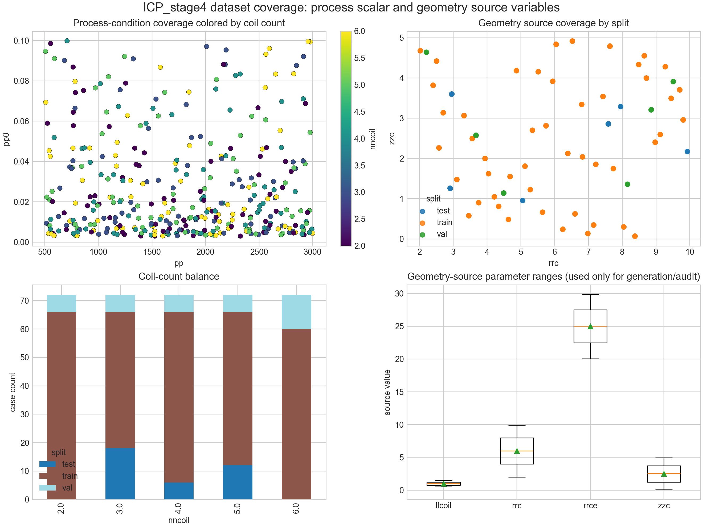

*Fig. 1: process scalar (`pp`, `pp0`) と geometry source (`llcoil`, `rrc`, `rrce`, `zzc`, `nncoil`) のデータ分布。geometry source は学習器への scalar 入力ではなく、構造特徴量生成と audit に使う。split は source_split を示し、構造 group 単位の分離が評価の前提である。*

### 4.2 入力変数と出力場

本研究の surrogate は次の写像として定義する。

$$
\hat{\mathbf{Y}}(r,z) = f_\theta\left(\mathbf{c},\, \Phi(G)\right), \quad \mathbf{c} = (pp, pp0)
$$

ここで $G$ は `llcoil`, `rrc`, `nncoil`, `rrce`, `zzc` から生成される coil geometry であり、$\Phi(G)$ は mask/SDF/part-SDF などの構造特徴量である。重要なのは、`llcoil`, `rrc`, `nncoil`, `rrce`, `zzc` を直接 scalar condition として入れない点である。これらは幾何生成と audit のために使い、モデル入力には構造 field として与える。

出力は 2 次元場である。QoI は一次目的変数ではなく、推論後の field から導出する。

| target | 物理量 | unit | 評価・学習 scope | min | max | finite rate |
|---|---|---:|---|---:|---:|---:|
| `Br` | magnetic_field | T | valid_field | 0 | 0.01495 | 1.0 |
| `Bz` | magnetic_field | T | valid_field | -1.355e-20 | 0.02925 | 1.0 |
| `Jelr` | electron_current | A/m^2 | plasma_only | -889.7 | 560.5 | 1.0 |
| `Jelz` | electron_current | A/m^2 | plasma_only | -1400 | 371.9 | 1.0 |
| `Te` | electron_temperature | eV | plasma_only | 0.647 | 10.79 | 1.0 |
| `ne` | electron_density | m^-3 | plasma_only | 1.582e+08 | 6.254e+18 | 1.0 |
| `ni` | ion_density | m^-3 | plasma_only | 3.399e+09 | 6.254e+18 | 1.0 |
| `phi` | electric_potential | V | plasma_only | 1.894e-05 | 31.63 | 1.0 |

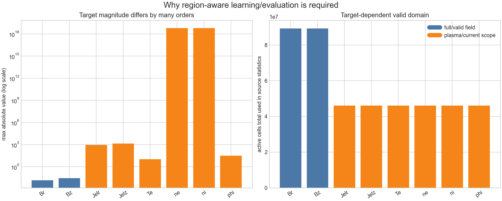

*Fig. 2: target ごとの値スケールと有効領域。`ne`, `ni` は 10^18 m^-3 オーダー、`Te` は eV、`Br/Bz` は T、`Jelr/Jelz` は A/m^2 と大きく異なる。さらに、密度・温度・電流は plasma/current 領域、磁場は coil 周辺を含む full/valid field 領域で評価すべきである。*

本レポートの主学習・最適化では `ne`, `ni`, `Te`, `phi` の 4-field plasma model を用いた。8-field dataset として `Br`, `Bz`, `Jelr`, `Jelz` も整備しており、磁場は full-domain、密度・温度・電流は plasma scope として扱う必要がある。

### 4.3 評価プロトコルと再現性

本稿の評価は、構造 group split を前提とする。つまり、同じ coil 構造が train/test にまたがらないようにすることで、単なる process 条件補間ではなく、未見構造に対する外挿的な汎化を評価する。これは、coil design surrogate として重要である。もし同一構造が train/test に混在すると、モデルは geometry response を学習したように見えても、実際には既知構造内の process response を補間しているだけになる可能性がある。

評価指標は、以下の階層で整理する。

| 階層 | 指標 | 目的 |
|---|---|---|
| field-level | target 別 R2、RMSE、分布 metric | 2D 場の大域再現性を確認 |
| distribution-level | peak 位置、gradient、mid-height profile | 設計指標に効く空間形状を確認 |
| domain-aware | plasma-only / full-domain / current scope | 物性ごとの有効領域を尊重 |
| QoI-level | line CV、density ratio、Pareto trade-off | 推論最適化で使う指標を評価 |
| design-level | top layout overlay、feature-space distance | COMSOL 再計算候補の多様性を評価 |

再現に必要な成果物は付録 A にまとめた。学習済み run、最適化 run、図生成結果をすべて path として残しており、第三者は同じ run artifact から数値と図を追跡できる。

### 4.4 データセット整形・前処理・特徴量化・学習ワークフロー

Fig. 形式の空間分布だけでは、どの段階で情報が変換され、どの情報が学習器へ入るかが分かりにくい。そこで、本研究の dataset shaping から FFNO 学習までの処理を Mermaid workflow として整理する。

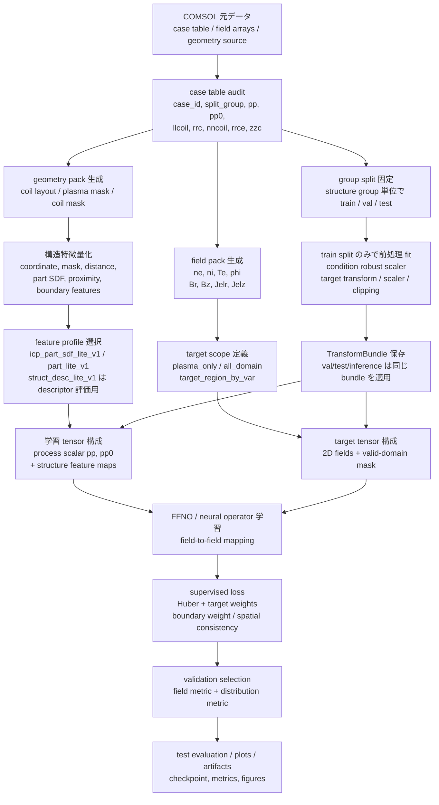
```mermaid
flowchart TD
  A["COMSOL 元データ<br/>case table / field arrays / geometry source"] --> B["case table audit<br/>case_id, split_group, pp, pp0,<br/>llcoil, rrc, nncoil, rrce, zzc"]
  B --> C["group split 固定<br/>structure group 単位で train / val / test"]
  B --> D["field pack 生成<br/>ne, ni, Te, phi<br/>Br, Bz, Jelr, Jelz"]
  B --> E["geometry pack 生成<br/>coil layout / plasma mask / coil mask"]
  E --> F["構造特徴量化<br/>coordinate, mask, distance,<br/>part SDF, proximity, boundary features"]
  F --> G["feature profile 選択<br/>icp_part_sdf_lite_v1 / part_lite_v1<br/>struct_desc_lite_v1 は descriptor 評価用"]
  D --> H["target scope 定義<br/>plasma_only / all_domain<br/>target_region_by_var"]
  C --> I["train split のみで前処理 fit<br/>condition robust scaler<br/>target transform / scaler / clipping"]
  I --> J["TransformBundle 保存<br/>val/test/inference は同じ bundle を適用"]
  G --> K["学習 tensor 構成<br/>process scalar pp, pp0<br/>+ structure feature maps"]
  H --> L["target tensor 構成<br/>2D fields + valid-domain mask"]
  J --> K
  J --> L
  K --> M["FFNO / neural operator 学習<br/>field-to-field mapping"]
  L --> M
  M --> N["supervised loss<br/>Huber + target weights<br/>boundary weight / spatial consistency"]
  N --> O["validation selection<br/>field metric + distribution metric"]
  O --> P["test evaluation / plots / artifacts<br/>checkpoint, metrics, figures"]
```

この workflow で重要なのは、`llcoil`, `rrc`, `nncoil`, `rrce`, `zzc` を学習器の raw scalar 入力にしない点である。これらは geometry pack と構造特徴量生成には使うが、FFNO が直接見るのは process scalar `pp`, `pp0` と構造特徴量 map である。また、scaler と clipping の fit は train split のみに限定し、val/test/inference には保存済み `TransformBundle` を適用する。これにより、データリークを避けながら、学習時と推論最適化時で同じ前処理を使える。

## 5. 学習手法と構造特徴量化

本手法は、coil geometry source を通常の scalar/vector input として直接モデルへ入れるのではなく、必ず構造特徴量へ変換してから FFNO field surrogate に渡す。処理の流れは次の通りである。

1. COMSOL 由来の case table から process scalar `pp`, `pp0` と geometry source `llcoil`, `rrc`, `nncoil`, `rrce`, `zzc` を読み出す。
2. geometry source から coil layout、part mask、part SDF、plasma/coil mask、distance feature を生成する。
3. 学習器には `pp`, `pp0` と構造特徴量 map を入力し、coil 寸法 source は scalar condition として渡さない。
4. 出力は `ne`, `ni`, `Te`, `phi` などの 2 次元 field とし、QoI は推論後に field から計算する。
5. 評価は target ごとの有効領域を考慮し、R2 だけでなく profile、gradient、peak、Pareto 指標も確認する。
6. 最適化では candidate geometry を生成し、構造特徴量へ変換して surrogate 推論し、field-derived objective を評価する。

この設計により、学習器は「設計パラメータ列」ではなく「場が解かれる空間構造」を入力として扱う。これは、異なる coil 数や配置を比較するときに特に重要である。

### 5.1 FFNO とニューラルオペレータの位置づけ

本稿の主モデルは FFNO であり、これは Fourier Neural Operator 系のニューラルオペレータである。深層学習に詳しくない読者向けに、通常のニューラルネットワークとニューラルオペレータの違いを整理する。

通常のニューラルネットワークは、典型的には有限次元ベクトルを有限次元ベクトルへ写す。

$$
\hat{\mathbf{y}} = g_\theta(\mathbf{x})
$$

例えば、coil 寸法、process 条件、coil 数を一列の数値ベクトル $\mathbf{x}$ として入力し、QoI や場の係数を出すような設計である。この場合、モデルが見るのは「数値の並び」であり、coil が空間内でどのような形状を持ち、どの境界が plasma に近いかは、モデルが間接的に推測する必要がある。

一方、ニューラルオペレータは、関数または場から関数または場への写像を学習する。

$$
\hat{Y}(r,z) = \mathcal{G}_\theta\left(c, X_1(r,z), X_2(r,z), \ldots\right)
$$

ここで $X_i(r,z)$ は mask、SDF、coil proximity などの空間特徴量であり、出力 $\hat{Y}(r,z)$ は密度、温度、電位などの 2 次元場である。つまり、ニューラルオペレータは「設計パラメータの表」ではなく、「場が解かれる空間構造」を入力として扱う。

FFNO はこの operator learning を Fourier 空間で効率よく行う。低周波から中程度の Fourier mode を使うことで、局所的な pixel 単位の写像だけでなく、反応器全体にわたる長距離の空間相関を扱いやすい。ICP では coil 近傍の電磁場、plasma bulk、境界応答が離れた位置の密度・温度分布へ影響するため、この global coupling を扱えることが重要である。

| 観点 | 通常のベクトル入力ニューラルネットワーク | FFNO / ニューラルオペレータ |
|---|---|---|
| 入力 | 寸法・条件の数値ベクトル | process scalar + 構造特徴量 field |
| 出力 | scalar QoI または固定長 vector | 2 次元 field 全体 |
| 学習する写像 | $\mathbf{x} \mapsto \mathbf{y}$ | function/field $\mapsto$ function/field |
| geometry の扱い | 数値列から間接的に推定 | mask/SDF/proximity として直接入力 |
| ICP での利点 | 実装は単純 | 境界、coil 近傍、長距離空間相関を扱いやすい |
| 注意点 | field 構造を失いやすい | 本稿では固定 grid 上の検証であり、任意 mesh 汎化を主張しない |

したがって、本稿で「ニューラルネットワーク」と呼ぶ場合は広義の実装技術を指す。一方、手法の本質は FFNO によるニューラルオペレータ学習であり、coil 構造特徴量 field から plasma field への operator を近似している点にある。

### 5.2 構造特徴量

| feature family | 例 | 役割 |
|---|---|---|
| coordinate/mask | `x`, `y`, `mask_plasma`, `mask_coil` | 場の座標、plasma/solid 領域 |
| distance | `distance_signed`, `distance_any`, `distance_coil` | 境界・coil 近傍距離 |
| proximity | `coil_proximity` | coil 近傍の局所影響を滑らかに表現 |
| fixed slot part SDF | `sdf_coil_01` ... `sdf_coil_06` | ICP 既存データ互換の coil part 表現 |
| part summary | `part_sdf_nearest`, `part_gap_proxy` など | coil order に依存しにくい集約特徴 |
| global descriptor | `struct_desc_lite_v1` | 最適化候補の構造特徴空間評価 |

今回の主学習 run では `icp_part_sdf_lite_v1` を使用した。これは既存 6 slot coil SDF と互換で、構造特徴量の有効性を安定に評価する基準である。以後の設計探索では、候補 geometry を構造 descriptor に写像して feature-space diversity を制御した。

構造特徴量化の中心は、coil の有無だけではなく、coil boundary からの距離や近接度を連続値として表す点である。SDF は境界をまたぐ符号付き距離を与え、proximity feature は coil 近傍の局所的な影響を滑らかに表す。part SDF は coil ごとの配置を保持し、part summary は coil order に依存しにくい配置情報を与える。これらは、離散的な coil 数変更と連続的な配置変更を同じ field representation の上で扱うための表現である。

本研究で重要なのは、geometry source を消しているわけではない点である。`llcoil`, `rrc`, `nncoil`, `rrce`, `zzc` は geometry generator の入力としては使う。しかし、surrogate が直接見るのは、生成された structure field である。これにより、将来的に別の parameterization で同じ physical layout が生成されても、近い構造は近い特徴量として扱える。

### 5.3 前処理と loss

主学習設定では、process scalar は robust scaler、密度は `log10_floor`、温度は `log1p`、電位は `signed_log1p` を用いる。supervised loss は Huber を用い、plasma variables の target region は `plasma_only` とした。構造境界近傍の誤差を重視するため、`boundary_weight` と軽量な gradient consistency を有効化した。

代表的な supervised loss は次で表せる。

$$
\mathcal{L}_{sup} = \sum_{v \in \mathcal{V}} w_v
\frac{\sum_{r,z} m_v(r,z)\, \rho_\delta(\hat{y}_v(r,z)-y_v(r,z))}
{\sum_{r,z} m_v(r,z)}
$$

ここで $v$ は target variable、$m_v$ は target ごとの有効領域 mask、$\rho_\delta$ は Huber loss である。分布の滑らかさを補助する場合は

$$
\mathcal{L}_{grad} = \lambda \sum_v \left\| \nabla \hat{y}_v - \nabla y_v \right\|_{\rho_\delta, m_v}
$$

を加える。ただし、この項は汎用の分布場学習補助であり、ICP 固有名を本体コードに直書きするものではない。

前処理では、target の物理スケール差に注意する必要がある。密度は桁が大きく、温度は eV オーダー、電位は符号や広い範囲の変動を持つ。したがって、同一 scaler を全 target に機械的に適用するのではなく、target ごとに value transform と scaler を選ぶ。これは ICP 固有の実装ではなく、任意の多物理場 surrogate に必要な一般的処理である。

また、loss の mask は全 target で同一であるべきではない。密度・温度・電位は plasma domain、磁場は full domain、電流は定義に応じて plasma/current domain を使う。現行の主学習は plasma 4-field に絞っているため `plasma_only` で評価しているが、8-field 学習では target-region-aware supervision が重要になる。

### 5.4 パラメータベクトル入力モデルとの比較観点

| 観点 | パラメータベクトル入力モデル | 構造特徴量 + FFNO |
|---|---|---|
| coil 数変化 | 離散 topology を scalar として扱う | active/inactive coil を geometry field として表現 |
| coil order | slot/order 依存になりやすい | SDF/proximity/summary で空間的意味を与える |
| 境界物理 | 明示されにくい | boundary/distance feature で局所物理を表現 |
| 同一形状の非一意性 | parameter 表現に依存 | field representation で近い構造が近くなる |
| 最適化 | parameter 空間で局所収束しやすい | descriptor 空間で多様な候補を選べる |

厳密な raw-parameter ベクトル入力モデルの同一条件学習比較は本レポートでは実施していない。定量比較としては、同じ FFNO surrogate を用いた推論最適化で、parameter two-stage sampler と feature archive sampler を比較した。

ここでの比較は、単に「どちらの sampler が低い objective を出したか」だけではない。寸法パラメータ空間で探索すると、数値的には異なる候補でも構造特徴としては似た coil layout に集まりやすい。一方、feature archive は候補を一度構造 descriptor に写像し、その空間で重複を避けるため、上位候補の幾何的多様性を確保しやすい。これは、COMSOL 再計算へ渡す候補を選ぶ際に重要である。

本レポートでは raw-parameter ベクトル入力モデルを新規学習していないため、「raw parameter model の精度が必ず低い」とは主張しない。主張は、ICP coil design のように topology と局所境界物理が重要な問題では、構造特徴量 field を入力するニューラルオペレータの方が問題設定として自然であり、推論最適化でも構造的に多様な候補を扱いやすい、という点である。

### 5.5 製品基盤と ICP 外部処理の責務分離

本レポートで扱う ICP_stage4 は製品基盤の検証ケースであり、本体コードに ICP 固有の目的関数、単位、coil 制約、z-line 評価を直書きするべきではない。製品基盤側に残すべきものは、任意 target に対する region-aware supervision、構造特徴量生成、汎用 scaler/loss、汎用 neural operator、汎用 objective parts である。一方、COMSOL 元データ変換、field label/unit、wafer/line QoI、coil-series 制約、学会用図生成は ICP 外部処理として扱う。

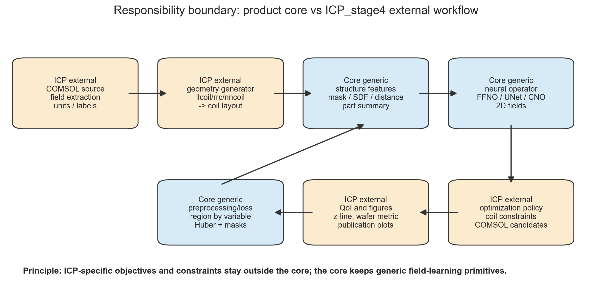

*Fig. 3: product core と ICP_stage4 external workflow の責務境界。これにより、今回の問題に過剰適合した実装を避けつつ、分布場学習に必要な汎用機能を維持できる。*

## 6. 学習結果

### 6.1 4-field plasma FFNO

| target | scope | R2 |
|---|---|---:|
| `ne` | plasma only | 0.9773 |
| `ni` | plasma only | 0.9778 |
| `Te` | plasma only | 0.9929 |
| `phi` | plasma only | 0.9823 |

平均 primary metric は **0.9826** であった。分布連続性の補助指標として、gradient ratio は 0.8651、Laplacian ratio は 1.0509 であった。

この結果から、plasma 4-field の大域的な場の再現性は高いと判断できる。`Te` は R2 = 0.9929 と最も高く、温度分布の主構造は比較的安定に捉えられている。`ne` と `ni` はほぼ同等の R2 を示しており、準中性に近い ICP plasma の密度場として妥当な傾向である。`phi` は R2 = 0.9823 であり、電位場も全体傾向は再現できている。

ただし、R2 は平均的な分散説明率であり、設計で重要な局所 peak、line profile、境界近傍 gradient の正確さを保証しない。したがって本結果は「field surrogate として十分な出発点にある」ことを示すが、「最適化候補を無条件に採用できる」ことは意味しない。特に密度均一性のような QoI は field から二次的に計算されるため、R2 と QoI 精度は分けて評価する必要がある。

| 結果項目 | 読み取れること | 注意点 |
|---|---|---|
| 平均 R2 = 0.9826 | 4-field plasma の大域構造は高精度 | 局所 profile と peak 位置は別評価が必要 |
| `ne`, `ni` が近い R2 | 密度場の整合性は概ね良い | wafer/line 上の均一性とは一致しない場合がある |
| `Te` が最も高い R2 | 温度主構造は安定 | 電離率や密度 peak への影響は連鎖的に確認が必要 |
| `phi` R2 = 0.9823 | 電位場も大域的に再現 | gradient や sheath 近傍の誤差は別途確認が必要 |
| gradient/Laplacian 指標 | 分布の滑らかさ評価を補助 | R2 では見えない振動や過平滑化を確認する |

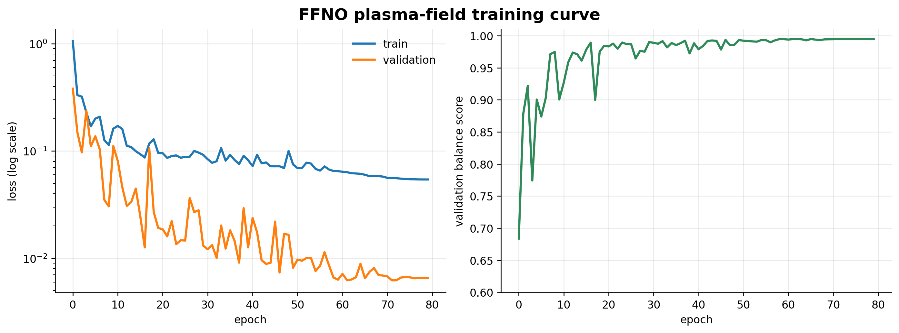

*Fig. 4: 80 epoch FFNO 学習曲線。縦軸は log scale。*

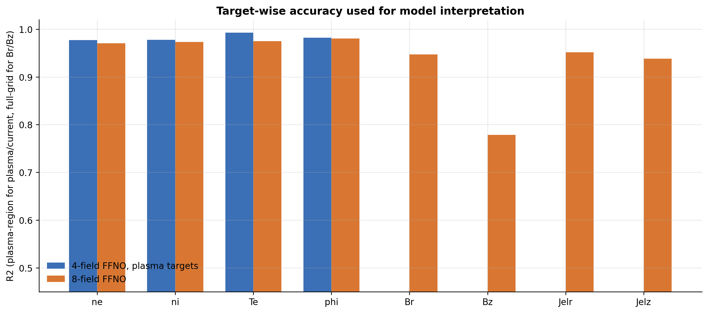

*Fig. 5: plasma 4-field および 8-field 参照モデルの target 別 R2。*

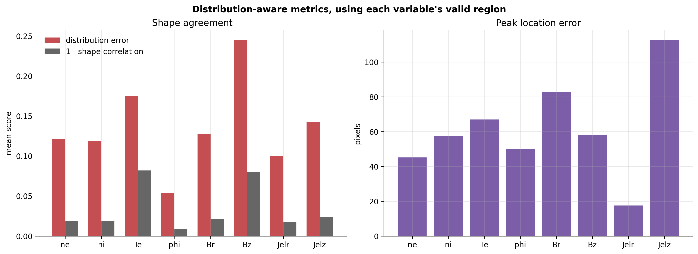

*Fig. 6: R2 だけでは見えにくい分布指標。ピーク、勾配、形状相関の確認が重要である。*

### 6.2 比較から見た重要設定

サロゲートモデルとは、COMSOL のような数値 solver を毎回実行する代わりに、既存計算結果から「入力条件と構造を入れると、場の分布をすばやく返す近似モデル」である。したがって、単にニューラルオペレータを大きくすればよいわけではない。入力の表し方、値のスケール合わせ、どの領域を学習・評価するかが悪いと、モデルは plasma の物理応答ではなく、数値スケールや mask の都合を覚えてしまう。

今回の結果を過去の run artifact と比較すると、重要だった設定は次のように整理できる。なお、以下は完全な 1 変数だけの controlled ablation ではなく、同じ ICP_stage4 系 dataset で得られた既存 run との比較である。したがって「この 1 項目だけが原因」とは断定せず、どの処理が有効だったかを読むための実験的根拠として扱う。

| 比較対象 | 主な違い | mean R2 | `ne` R2 | `ni` R2 | `Te` R2 | `phi` R2 | 分布誤差の傾向 |
|---|---|---:|---:|---:|---:|---:|---|
| 旧 part SDF FFNO | density transform が `identity`、同系統 part SDF feature | 0.9567 | 0.9557 | 0.9566 | 0.9432 | 0.9711 | `ne` distribution score 0.3438, `ni` 0.3189 |
| 今回の FFNO | `log10_floor` density transform、robust scaling、Huber/boundary/gradient 補助、modes24 | 0.9826 | 0.9773 | 0.9778 | 0.9929 | 0.9823 | `ne` distribution score 0.1359, `ni` 0.1023 |
| `struct_spatial_v1` FFNO 参照 | fixed geometry provider の field prediction baseline | 0.9878 | 0.9872 | 0.9762 | 0.9944 | 0.9934 | field prediction では強いが、今回の parametric candidate 最適化とは provider が異なる |
| part SDF UNet 参照 | 同系統 structure input の別 model family | 0.9010 | 0.8829 | 0.8822 | 0.9013 | 0.9376 | negative density/ion ratio が残り、今回の最適化主モデルには不採用 |

第一に重要だったのは、**密度の前処理**である。`ne`, `ni` はおよそ $10^8$ から $10^{18}$ m$^{-3}$ まで大きな桁差を持つ。これを物理値のまま `identity` で学習すると、loss は高密度領域の絶対誤差に支配されやすく、低密度から中密度の形状や profile が相対的に軽く扱われる。今回 `log10_floor` を使ったことで、モデルは「密度の桁」と「空間形状」を同時に学びやすくなった。結果として、旧 part SDF FFNO と比べて mean R2 は 0.9567 から 0.9826 へ上がり、`ne` の分布誤差 score は 0.3438 から 0.1359、`ni` は 0.3189 から 0.1023 へ下がった。これは R2 だけでなく、field の形状評価にも効いている。

第二に重要だったのは、**coil 構造を寸法ベクトルではなく構造特徴量として入れること**である。サロゲートが plasma field を予測するには、coil が何個あるかだけでなく、coil 境界が plasma にどれだけ近いか、coil 間の gap がどこにあるか、coil がどの R/Z 位置に分布するかが必要である。SDF、part SDF、proximity、boundary feature は、この情報を 2 次元場としてモデルへ渡す。`struct_spatial_v1` 参照 run が mean R2 0.9878 と高いことも、構造を field として与えること自体の有効性を支持している。ただし、今回の推論最適化では candidate geometry を逐次再生成する必要があるため、主 run では parametric parts と接続しやすい `icp_part_sdf_lite_v1` を用いた。

第三に重要だったのは、**前処理を train split のみに fit し、同じ TransformBundle を validation/test/inference で使うこと**である。これはサロゲートモデルに不慣れな読者には地味に見えるが、実際には重要である。test data の統計量を scaler に混ぜると、未見構造に対する評価が甘くなる。逆に、推論最適化で学習時と異なる scaler を使うと、同じ `pp`, `pp0` や field 値でもモデル入力の意味が変わる。今回の workflow では、train-only fit と保存済み transform を通すことで、学習、評価、最適化を同じ数値空間で接続している。

第四に重要だったのは、**target ごとの有効領域を意識すること**である。今回の主モデルは plasma 4-field なので `ne`, `ni`, `Te`, `phi` を plasma scope で学習・評価している。一方、8-field では `Br`, `Bz` は coil 近傍を含む full-domain field であり、密度や温度と同じ mask で扱うと誤評価になる。この点は、今後 8-field を本学習する際に特に重要である。密度や温度が存在しない領域を loss に入れると、モデルは非物理的な値を消すことに能力を使ってしまい、逆に磁場を plasma-only に切ると coil 近傍の本質的な情報を落としてしまう。

第五に、**loss は主役ではなく補助である**。Huber loss、target weight、boundary weight、gradient consistency は、外れ値や境界近傍の誤差、分布の粗さを抑えるために有効である。しかし、loss だけで構造情報やスケール問題は解けない。今回の改善は、前処理、構造特徴量、target region、loss が揃ったことで得られたものであり、どれか一つを足せば十分という性質ではない。

以上をまとめると、今回の学習で最も重要だった処理は、(1) 密度の log-scale 前処理、(2) coil geometry の構造特徴量化、(3) train-only transform によるリーク防止、(4) target ごとの有効領域、(5) Huber/boundary/gradient による安定化、の組み合わせである。特に第三者へ説明する際は、「ニューラルオペレータが賢いから当たった」のではなく、「物理場として解くべき形に入力と出力を整えたため、FFNO が場の写像を学習できた」と述べるのが正確である。

### 6.3 空間分布の確認

R2 が高い場合でも、場としての連続性、ピーク位置、境界近傍誤差は別途確認する必要がある。以下の図では true/pred/error を同一 target ごとに比較し、`phi` は jet colormap で視認性を高めた。

空間図では、次の観点で読む必要がある。

1. true と pred の peak 位置が一致しているか。
2. plasma 中央から壁面方向への radial gradient が連続的に再現されているか。
3. error が一様な小誤差なのか、特定の境界・peak・coil 近傍に集中しているのか。
4. `ne`, `ni`, `Te`, `phi` の誤差位置が物理的に関連しているか。
5. mid-height profile で、field 全体の R2 と設計 line 上の誤差が矛盾していないか。

この確認により、モデルが単に平均的な場の強度を当てているのか、それとも設計指標に効く空間分布を再現しているのかを区別できる。

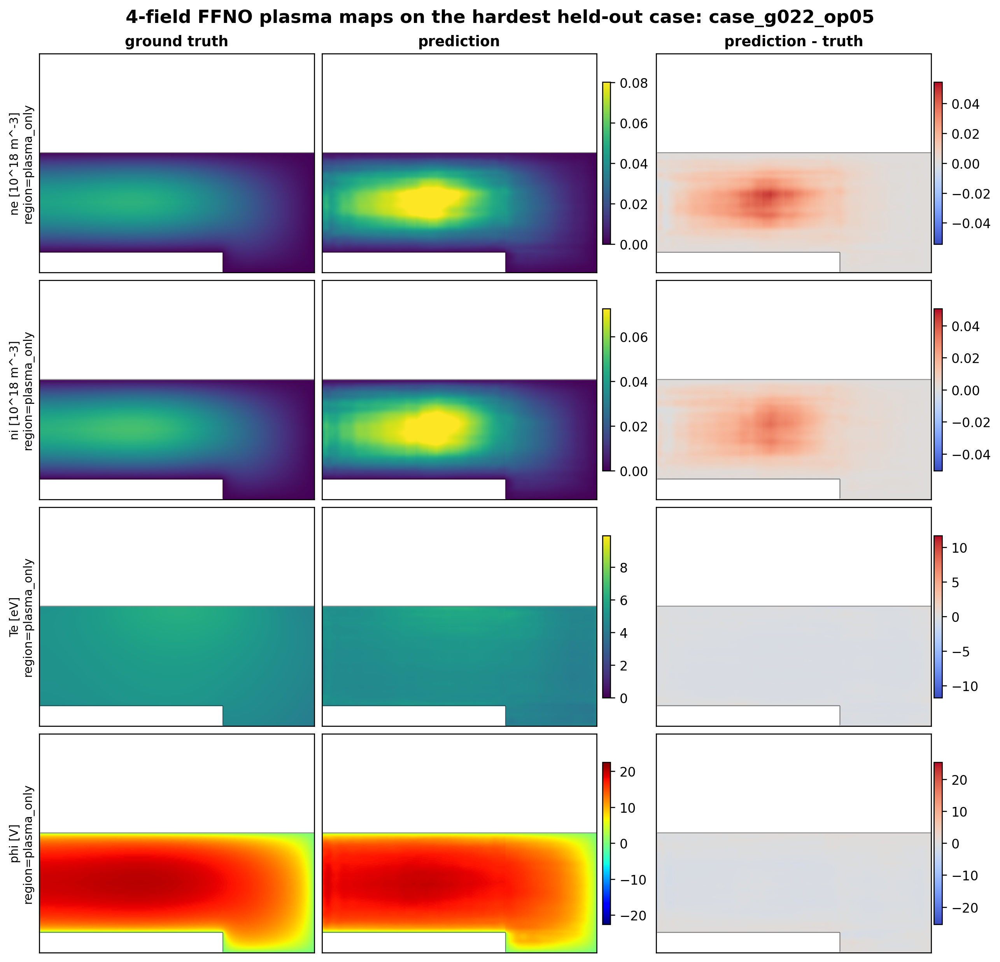

*Fig. 7: worst case の plasma field triplet。色だけでなく error panel で分布ずれを確認する。*

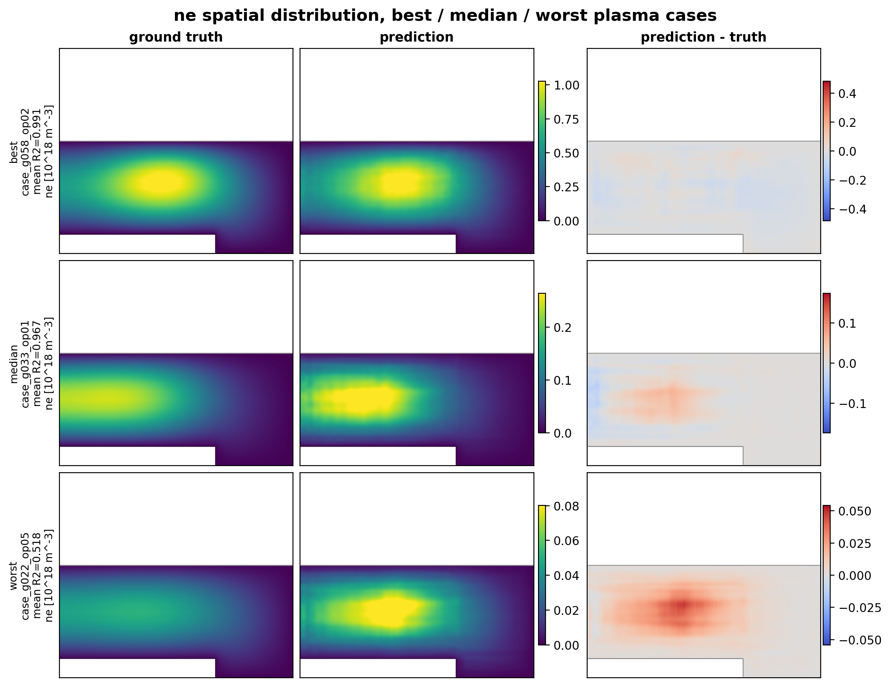

*Fig. 8: `ne` の best/median/worst case。密度分布の peak と radial profile の再現性を確認する。*

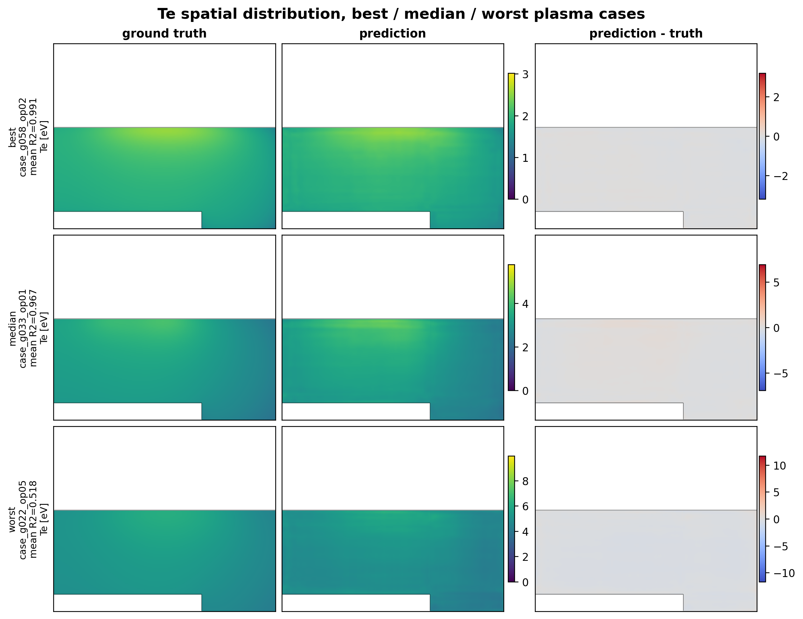

*Fig. 9: `Te` の best/median/worst case。温度分布は密度と異なる勾配構造を持つ。*

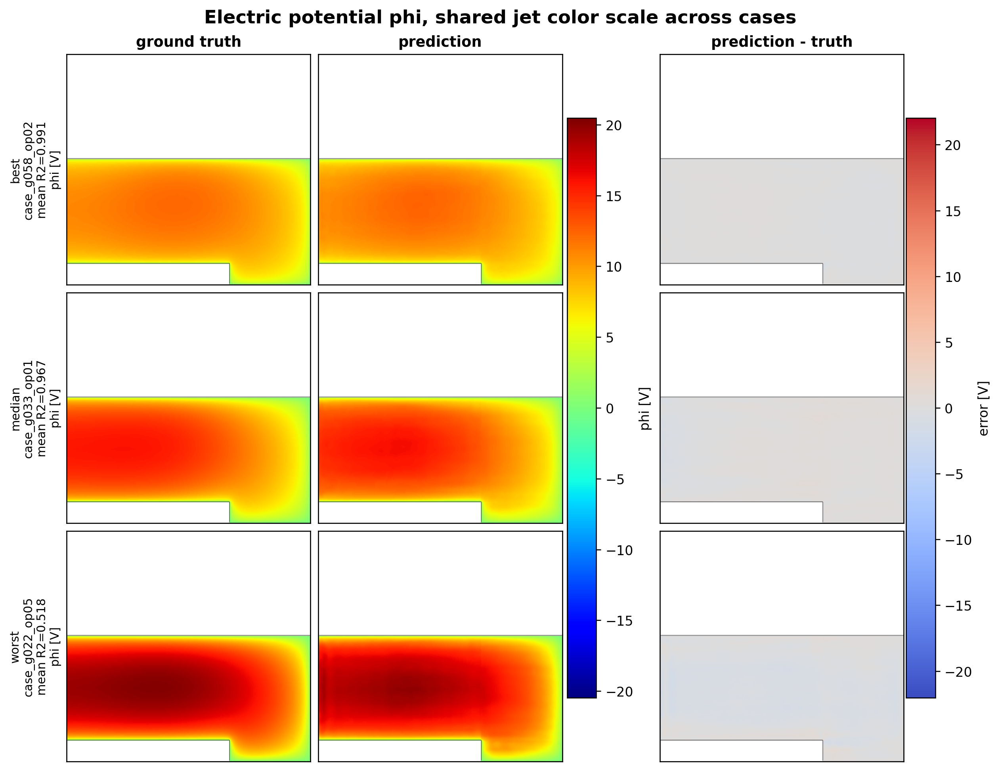

*Fig. 10: `phi` の shared jet scale 表示。電位の符号・勾配の視認性を重視した。*

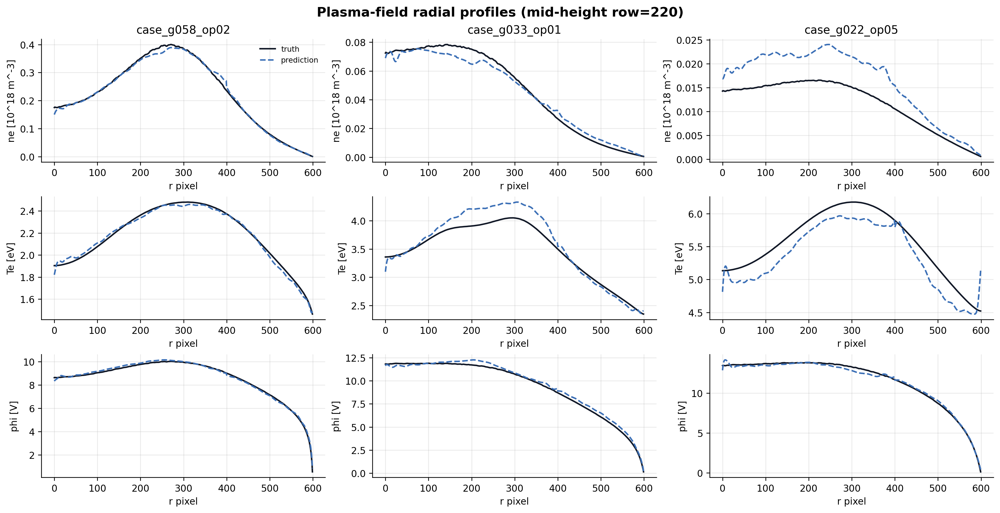

*Fig. 11: mid-height line profile。field 全体の R2 と line 上 QoI の整合を確認する。*

Fig. 11 は、最適化で用いる line QoI と学習評価を接続する図である。field 全体の R2 が高くても、line 上の peak が少しずれるだけで uniformity や density ratio は大きく変化する。したがって、学習モデルの採用判断では、target R2、空間図、line profile の 3 種類を同時に見る必要がある。

### 6.4 8-field 参照結果

8-field dataset は、plasma variables と electromagnetic/current variables の有効領域が異なる点が重要である。

| target | scope | R2 |
|---|---|---:|
| `ne` | plasma only | 0.9702 |
| `ni` | plasma only | 0.9733 |
| `Te` | plasma only | 0.9748 |
| `phi` | plasma only | 0.9806 |
| `Jelr` | plasma/current | 0.9515 |
| `Jelz` | plasma/current | 0.9385 |
| `Br` | full domain | 0.9469 |
| `Bz` | full domain | 0.7785 |

8-field 参照結果では、plasma 変数に比べて `Bz` の R2 が低い。これは、磁場が plasma 領域だけでなく coil 近傍を含む full-domain に分布し、かつ構造近傍の局所変化に強く依存するためと考えられる。また `Jelr`, `Jelz` は符号変化と局所勾配が強く、密度や温度よりも multi-task 学習の干渉を受けやすい。

この結果は、8-field を単純に一つの joint model にまとめればよい、ということを意味しない。物理的には、`ne/ni/Te/phi` は plasma transport と sheath/ambipolar field、`Br/Bz` は electromagnetic field、`Jelr/Jelz` は電流応答に近い group である。したがって、今後の本学習では、joint 8-field、plasma 4-field、EM/current group の複数構成を比較し、R2 だけでなく domain-aware profile と gradient metric を見るべきである。

| field group | 対象 | 解釈 | 次の評価観点 |
|---|---|---|---|
| plasma transport | `ne`, `ni`, `Te`, `phi` | plasma 領域での密度・温度・電位分布 | wafer/line uniformity、peak 位置、境界近傍誤差 |
| electromagnetic | `Br`, `Bz` | coil 周辺を含む full-domain field | coil 近傍の局所誤差、full-domain profile |
| current response | `Jelr`, `Jelz` | 符号変化と局所勾配を持つ電流密度 | gradient error、符号反転位置、物理整合性 |

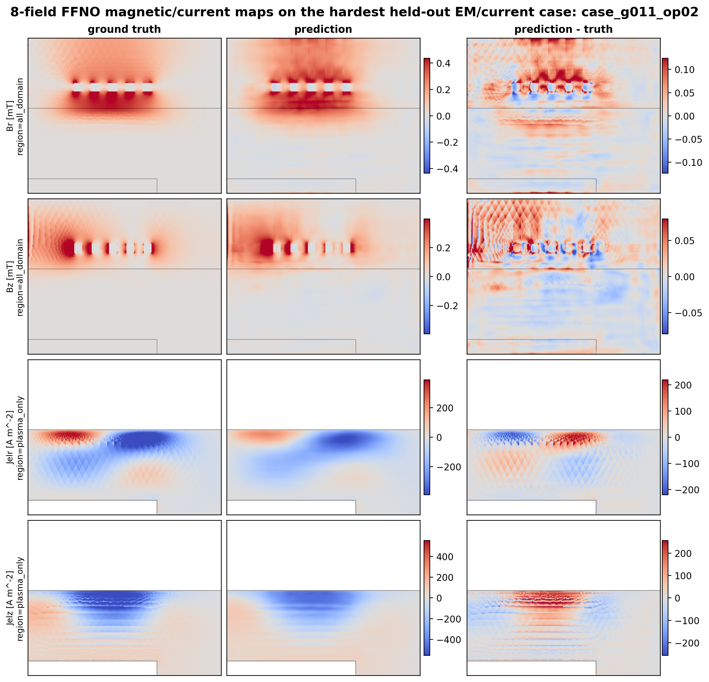

*Fig. 12: `Br`, `Bz`, `Jelr`, `Jelz` を含む 8-field 参照結果。磁場は full-domain、電流は主に plasma/current scope として読む必要がある。*

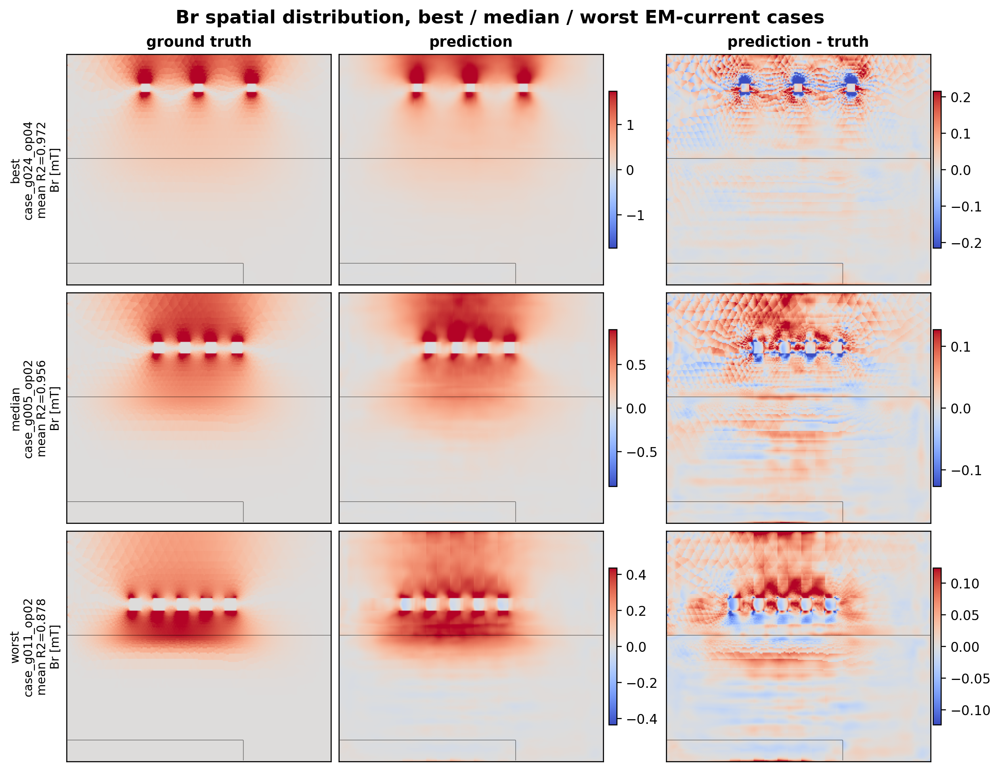

*Fig. 13: `Br` の空間分布。coil 近傍を含む full-domain 表示が必要である。*

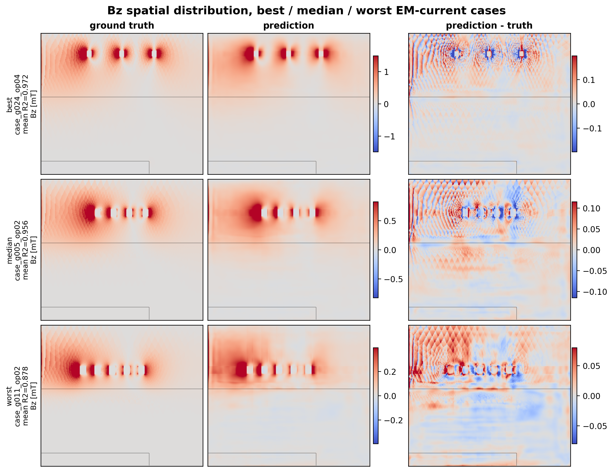

*Fig. 14: `Bz` の空間分布。plasma-only mask では磁場評価を誤る。*

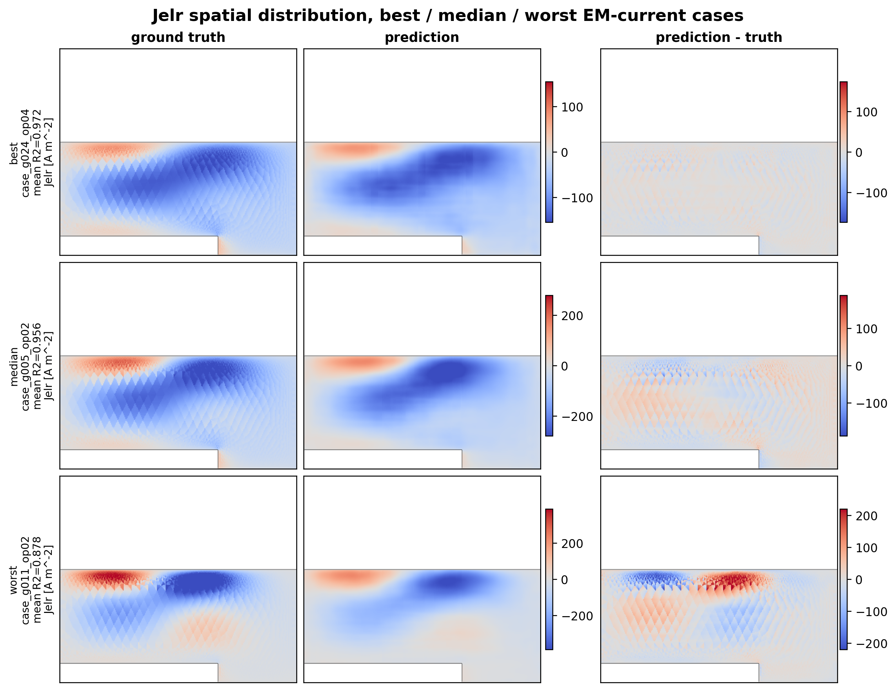

*Fig. 15: `Jelr`。電流密度は密度・温度より符号変化と局所勾配が強く、別 group model の検討余地がある。*

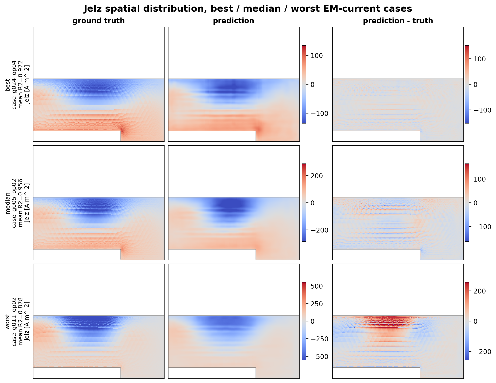

*Fig. 16: `Jelz`。分布誤差は R2 だけでは評価しきれない。*

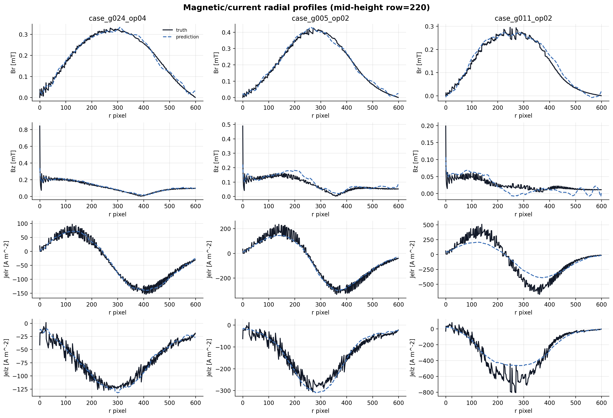

*Fig. 17: EM/current fields の mid-height profile。物性ごとの有効領域を分けて評価する必要がある。*

## 7. 構造特徴量化した推論最適化手法

### 7.1 目的関数

最適化では、学習済み FFNO を用いて候補 coil geometry と process 条件を推論し、指定 line 上の電子密度から目的関数を計算した。line は run summary 上で row index 119、column 0..400 であり、物理座標では $r \simeq 0.025$ から $20.025$ の範囲に対応する。

電子密度 line $n_e(r,z^*)$ に対して、均一性を coefficient of variation として

$$
U_\ell(n_e) = \frac{\sigma_\ell(n_e)}{\mu_\ell(n_e)}
$$

と定義する。密度がゼロに逃げる解を避けるため、base case の line max density で正規化した密度 gain

$$
D_\ell = \frac{\max_\ell n_e}{\max_\ell n_e^{base}}
$$

を用い、最小化目的を

$$
J = \frac{U_\ell(n_e)}{D_\ell}
$$

とした。負値や非有限 field は positive postprocess と penalty で扱う。

### 7.2 Parameter two-stage と feature archive

| sampler | 探索方法 | 特徴 |
|---|---|---|
| parameter two-stage | global random 後に上位候補の parameter 近傍を局所探索 | 連続パラメータ最適化として自然だが、構造特徴空間の多様性は保証しない |
| feature archive | 大きな候補 pool を geometry 生成し、構造 descriptor 空間で重複除外・farthest point 選択 | 構造特徴としてユニークな候補を優先できる |

feature archive では、候補 $G_i$ を descriptor $d_i = \Psi(\Phi(G_i))$ に変換し、descriptor 空間で距離が近すぎる候補を避ける。これにより、同じ parameter 近傍に収束するのではなく、異なる coil 数・配置・構造特徴を持つ候補を比較できる。

ここで比較しているのは、**学習済み surrogate や objective を変えた比較ではなく、候補をどの空間で選ぶかの比較**である。両者とも最終的には geometry を構造特徴量へ変換し、同じ FFNO surrogate で field を推論し、同じ line objective を評価する。違いは、parameter two-stage が `pp`, `pp0`, `series.nncoil`, `series.llcoil`, `series.rrc`, `series.rrce`, `series.zzc` の数値パラメータ空間で局所探索するのに対し、feature archive は候補を構造 descriptor 空間へ写像し、構造的に重複しにくい候補を選ぶ点である。

| 比較項目 | parameter two-stage | feature archive |
|---|---|---|
| surrogate | 同じ FFNO | 同じ FFNO |
| objective | 同じ $J = U_\ell/D_\ell$ | 同じ $J = U_\ell/D_\ell$ |
| 候補生成 | parameter 空間で global + local sampling | parameter pool 生成後、構造 descriptor 空間で選抜 |
| 最適化で重視する距離 | 数値 parameter の近さ | 構造特徴量 descriptor の近さ |
| 得意な探索 | 既に良い候補の局所改善 | 構造的に異なる候補の発見 |
| 主なリスク | 上位候補が似た geometry に集まりやすい | density 報酬に引っ張られ、CV 改善を保証しない |
| 本研究での役割 | 通常の parameter-space 最適化 baseline | 構造特徴量最適化の提案比較 |

### 7.3 推論最適化ワークフローと実行条件

推論最適化では、候補を直接 field として編集したり、raw mask / raw SDF を最適化したりしない。探索器が扱うのは process 条件と geometry source であり、各候補は必ず geometry generator を通して構造特徴量へ変換してから FFNO へ入力する。これにより、最適化中も学習時と同じ入力表現を保つ。

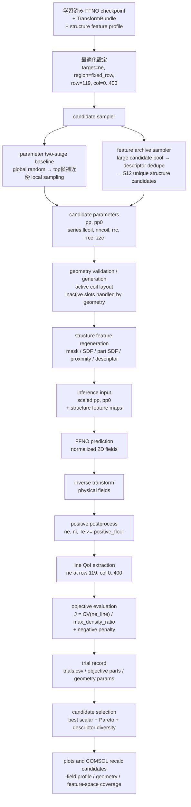
```mermaid
flowchart TD
  A["学習済み FFNO checkpoint<br/>+ TransformBundle<br/>+ structure feature profile"] --> B["最適化設定<br/>target=ne, region=fixed_row,<br/>row=119, col=0..400"]
  B --> C["candidate sampler"]
  C --> C1["parameter two-stage baseline<br/>global random → top候補近傍 local sampling"]
  C --> C2["feature archive sampler<br/>large candidate pool → descriptor dedupe<br/>→ 512 unique structure candidates"]
  C1 --> D["candidate parameters<br/>pp, pp0<br/>series.llcoil, nncoil, rrc, rrce, zzc"]
  C2 --> D
  D --> E["geometry validation / generation<br/>active coil layout<br/>inactive slots handled by geometry"]
  E --> F["structure feature regeneration<br/>mask / SDF / part SDF / proximity / descriptor"]
  F --> G["inference input<br/>scaled pp, pp0<br/>+ structure feature maps"]
  G --> H["FFNO prediction<br/>normalized 2D fields"]
  H --> I["inverse transform<br/>physical fields"]
  I --> J["positive postprocess<br/>ne, ni, Te >= positive_floor"]
  J --> K["line QoI extraction<br/>ne at row 119, col 0..400"]
  K --> L["objective evaluation<br/>J = CV(ne_line) / max_density_ratio<br/>+ negative penalty"]
  L --> M["trial record<br/>trials.csv / objective parts / geometry params"]
  M --> N["candidate selection<br/>best scalar + Pareto + descriptor diversity"]
  N --> O["plots and COMSOL recalc candidates<br/>field profile / geometry / feature-space coverage"]
```

実行条件は次のように整理できる。

| 項目 | 今回の設定 |
|---|---|
| surrogate | plasma 4-field FFNO, targets `ne`, `ni`, `Te`, `phi` |
| process scalar | `pp`, `pp0` |
| process search range | `pp`: 505.725-2999.798, `pp0`: 0.003005-0.099809 |
| geometry source | `series.llcoil`, `series.nncoil`, `series.rrc`, `series.rrce`, `series.zzc` |
| geometry range | `nncoil`: 2-6, `llcoil`: 0.5-1.5, `rrc`: 2-10, `rrce`: 20-30, `zzc`: 0-5 |
| structure handling | geometry source から coil layout と構造特徴量を再生成し、raw mask / raw SDF は直接最適化しない |
| main QoI | `ne` の fixed row profile, row index 119, columns 0-400 |
| objective | $J = U_\ell / D_\ell$, $U_\ell$ は line CV, $D_\ell$ は base に対する line max density ratio |
| postprocess | `ne`, `ni`, `Te` を `positive_floor=1e-30` で clamp |
| feature archive | pool size 4096 requested, valid pool 4100, descriptor dim 22, selected 512, unique signatures 512 |
| trial output | `trials.csv`, `best.json`, `best_qoi.json`, field/geometry plots |

この workflow では、parameter two-stage と feature archive のどちらも同じ FFNO と同じ objective を使う。違いは、候補を「数値 parameter の近傍」で選ぶか、「構造特徴 descriptor 空間で重複を避けて選ぶか」である。したがって、最終比較では objective value だけでなく、descriptor distance、coil count distribution、top layout overlay を併せて読む必要がある。

## 8. 推論最適化結果

### 8.1 Objective と field QoI

| sampler | trials | best J | line CV | max density ratio | best nncoil | top10 median J | top10 median density ratio |
|---|---:|---:|---:|---:|---:|---:|---:|
| feature archive | 512 | 0.1174 | 0.2676 | 2.2787 | 6 | 0.1631 | 1.6097 |
| parameter two-stage | 512 | 0.1324 | 0.2446 | 1.8475 | 2 | 0.1594 | 1.6559 |
| base case | - | 0.2312 | 0.2312 | 1.0000 | - | - | - |

feature archive は best objective を parameter two-stage より改善した。ただし line CV は base より悪化しており、改善は主に max density gain による。このため、設計採用には scalar objective だけでなく Pareto front と field plot の確認が必要である。

parameter two-stage に対する feature archive の差分を、比率として整理すると次の通りである。

| 指標 | feature archive / parameter two-stage | 解釈 |
|---|---:|---|
| best objective $J$ | 0.887 | 約 11.3% 改善 |
| best line CV | 1.094 | 約 9.4% 悪化 |
| max density ratio | 1.233 | 約 23.3% 増加 |
| all-trial median descriptor distance | 1.478 | 構造特徴空間の全体多様性が増加 |
| top10 median descriptor distance | 2.530 | 上位候補の構造的重複が大きく減少 |

したがって、feature archive の結果は「通常の parameter-space 最適化よりも、構造特徴として多様な候補から高密度化した低 objective 解を見つけた」と解釈できる。一方で、「純粋な均一性 CV も同時に改善した」とは言えない。この区別が、本比較の中心である。

この結果は、次のように解釈するのが妥当である。

1. **目的関数値 $J$ は改善した。** feature archive best は 0.1174 であり、parameter two-stage best の 0.1324 より小さい。密度最大値で正規化した均一性指標としては改善である。
2. **純粋な均一性 CV は改善していない。** feature archive best の line CV は 0.2676 で、base の 0.2312 より大きい。したがって、これは「均一性だけが良くなった設計」ではない。
3. **密度最大値は大きく増えた。** density ratio は 2.2787 であり、目的関数改善の主因は高密度化である。
4. **coil topology は大きく変わった。** feature archive best は effective `nncoil=6`、parameter two-stage best は `nncoil=2` であり、構造特徴空間探索により異なる topology の候補が選ばれている。
5. **採用候補は best scalar だけでは決めない。** Fig. 20 と Fig. 22 の Pareto を見て、CV と density gain の trade-off が許容できる候補を選ぶ必要がある。

つまり、この最適化結果は「均一性を単独で改善した結果」ではなく、「密度最大値を含む複合指標を改善し、かつ構造的に多様な候補を得た結果」である。学会発表では、この点を明確に述べないと、読者が best objective を純粋な均一性改善と誤解する可能性がある。

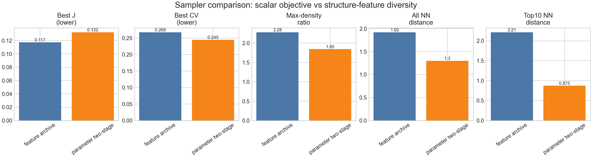

*Fig. 18: parameter two-stage と feature archive の主要指標比較。feature archive は scalar objective と max-density ratio を改善し、descriptor distance を大きく広げる。一方で CV は改善していないため、構造特徴空間探索の有用性と目的関数設計の限界を同時に読む必要がある。*

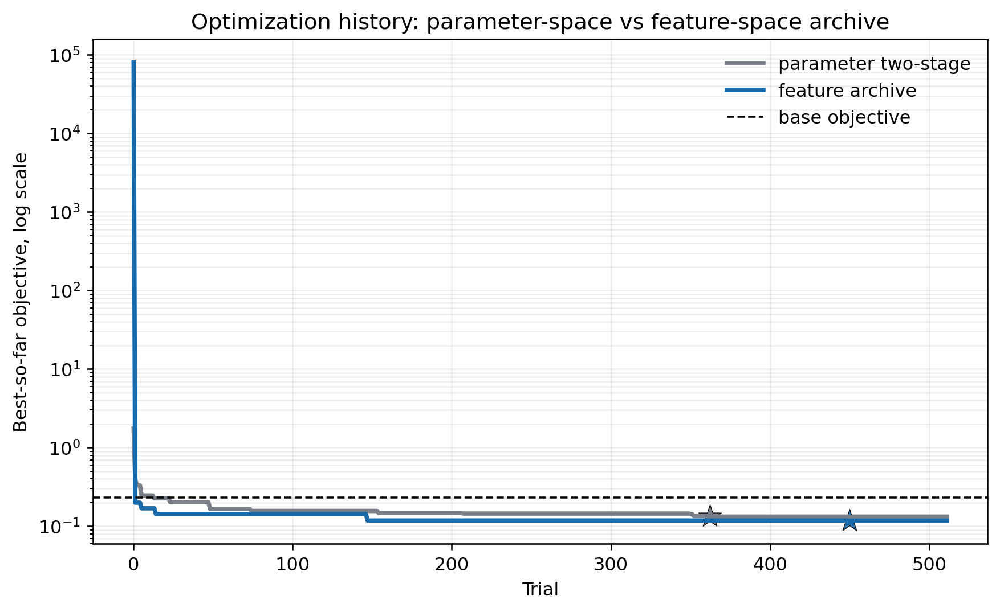

*Fig. 19: sampler 別 objective history。縦軸は log scale。feature archive は early collapse ではなく多様候補から best を得る。*

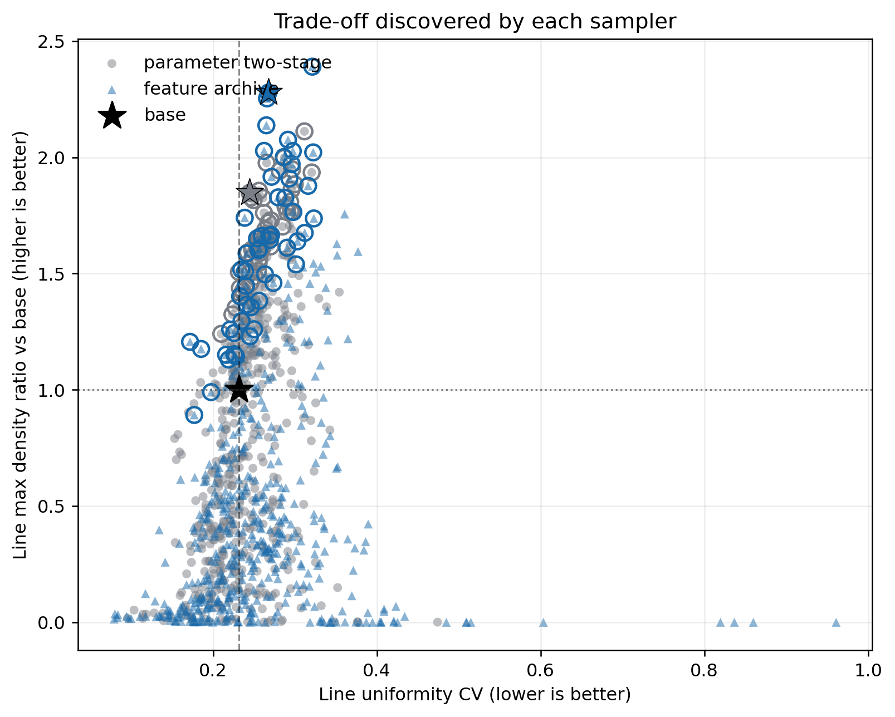

*Fig. 20: line CV と density ratio の trade-off。scalar objective だけでは均一性悪化を見逃す可能性がある。*

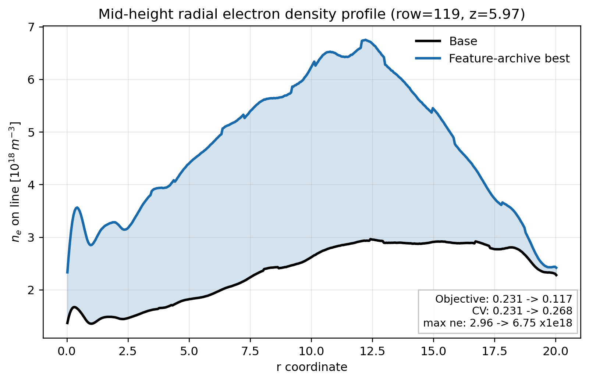

*Fig. 21: feature archive best の line profile。max density は大きく改善する一方で、profile 形状の変化を同時に読む必要がある。*

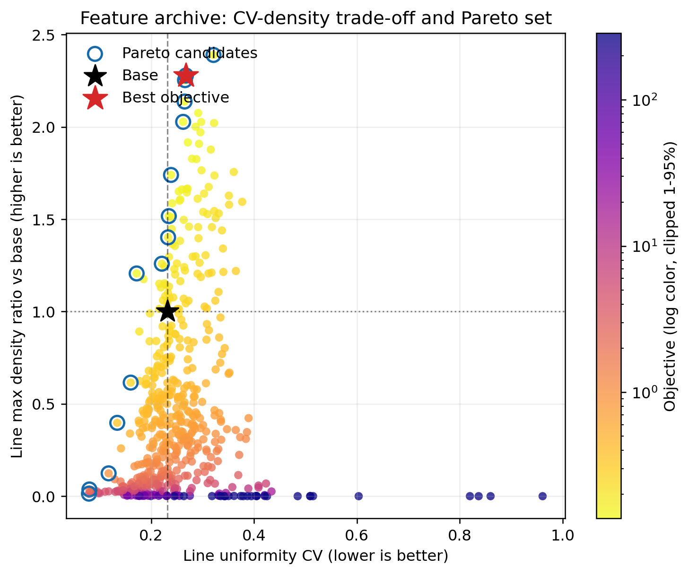

*Fig. 22: feature archive の Pareto 候補。最終設計は best scalar ではなく Pareto 上位から選ぶべきである。*

### 8.2 構造特徴空間での有用性

| 指標 | feature archive | parameter two-stage | 解釈 |
|---|---:|---:|---|
| all median nearest descriptor distance | 1.9196 | 1.2986 | 全 trial の構造特徴多様性が高い |
| top10 median nearest descriptor distance | 2.2128 | 0.8746 | 上位候補が同じ構造近傍に潰れにくい |
| best nncoil | 6 | 2 | coil 数 topology まで探索できている |

構造特徴空間の観点では、feature archive の意義は明確である。全 trial の median nearest descriptor distance は 1.9196 で、parameter two-stage の 1.2986 より大きい。さらに top10 候補では 2.2128 対 0.8746 と差が大きくなる。これは、良い候補が似た構造に集中しているのではなく、構造特徴として離れた候補群から選ばれていることを意味する。

設計探索では、この性質が重要である。parameter two-stage は一度良い候補を見つけると、その近傍を細かく探索するため、局所的な改善には向いている。一方で、COMSOL 再計算へ渡す候補を選ぶ段階では、似た構造を何件も送るより、物理的に異なる構造候補を複数送る方が設計情報量が大きい。feature archive はこの目的に合っている。

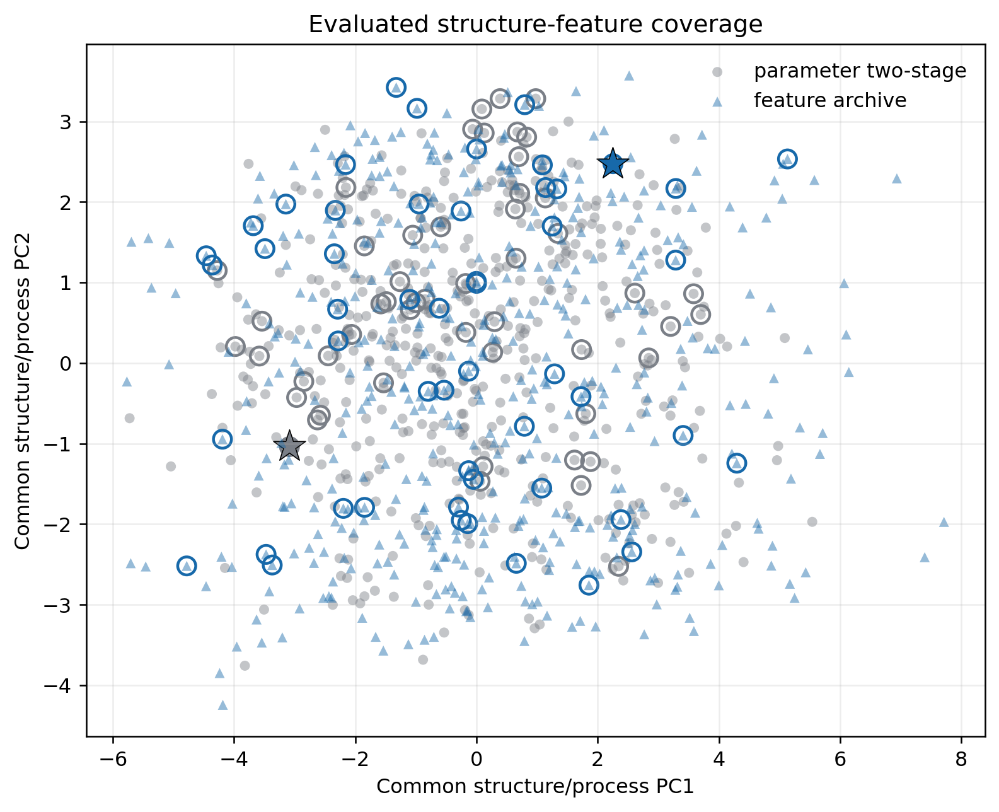

*Fig. 23: descriptor PCA 空間上の coverage。feature archive は構造特徴空間の広い領域を使う。*

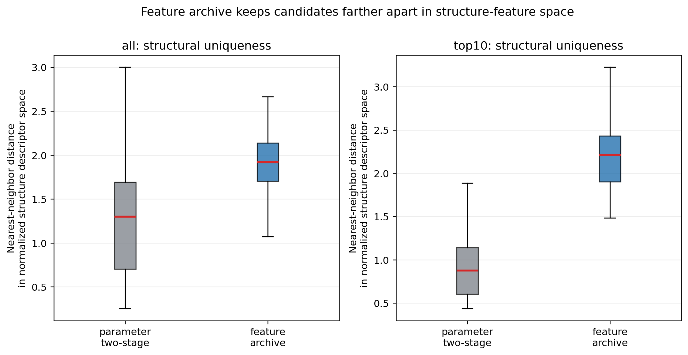

*Fig. 24: nearest descriptor distance。feature archive は特に上位候補の重複を抑制する。*

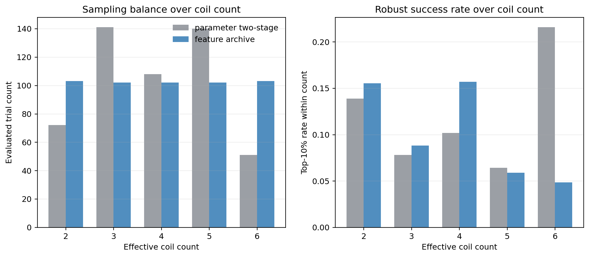

*Fig. 25: coil count 分布。coil 数を単なる scalar とせず、構造生成後の feature として比較する意義がある。*

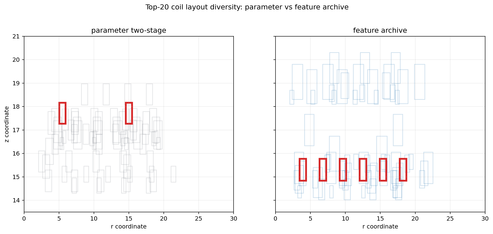

*Fig. 26: top20 coil layout overlay。parameter two-stage と feature archive で候補構造の広がりが異なる。*

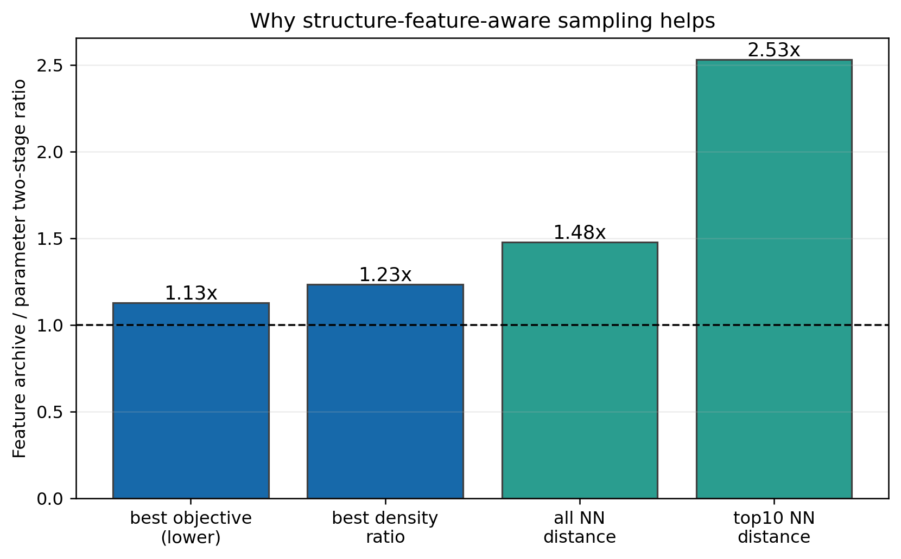

*Fig. 27: feature archive の有用性。objective 改善と構造特徴多様性の両方を確認する。*

### 8.3 Best geometry の比較

| 項目 | parameter two-stage best | feature archive best |
|---|---:|---:|
| `pp` | 2727.494 | 2777.059 |
| `pp0` | 0.09976 | 0.09940 |
| effective `nncoil` | 2 | 6 |
| `llcoil` | 0.8891 | 0.9322 |
| `rrc` | 5.0470 | 3.4557 |
| `rrce` | 24.0900 | 20.6735 |
| `zzc` | 3.2661 | 0.8308 |

best geometry の違いからも、両 sampler の性質が分かる。parameter two-stage は 2 coil の候補に収束し、feature archive は 6 coil の候補を選んだ。`rrc`, `rrce`, `zzc` も異なり、feature archive は coil 列をより内側かつ低い位置へ寄せる候補を見つけている。この違いは、単なる numerical parameter difference ではなく、coil 近傍 field、power deposition、plasma への結合位置が変わる構造的差である。

ただし、feature archive best がそのまま最終設計であるとは言えない。density ratio を大きく伸ばす一方で CV は悪化しているため、実設計では次の 3 種類を候補として残すべきである。

1. best objective candidate。
2. CV が base より悪化しない Pareto candidate。
3. density ratio と CV の balance がよく、構造特徴空間で他候補から離れた candidate。

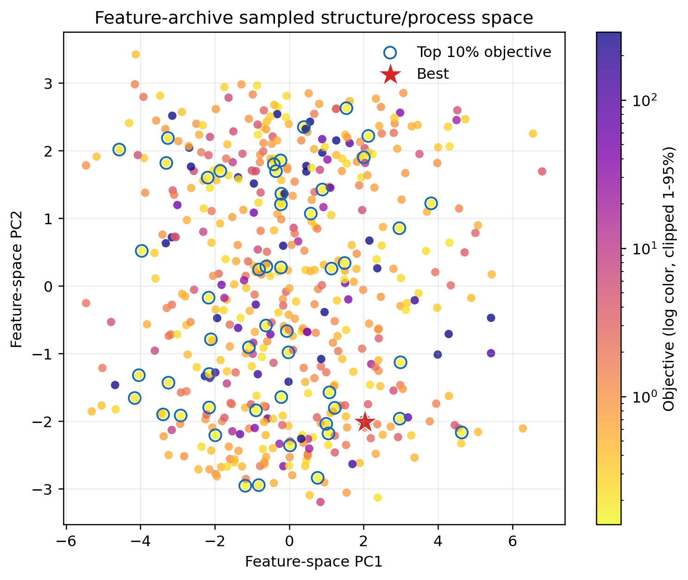

*Fig. 28: feature archive の PCA objective map。低 objective 候補が descriptor 空間のどこに現れるかを確認する。*

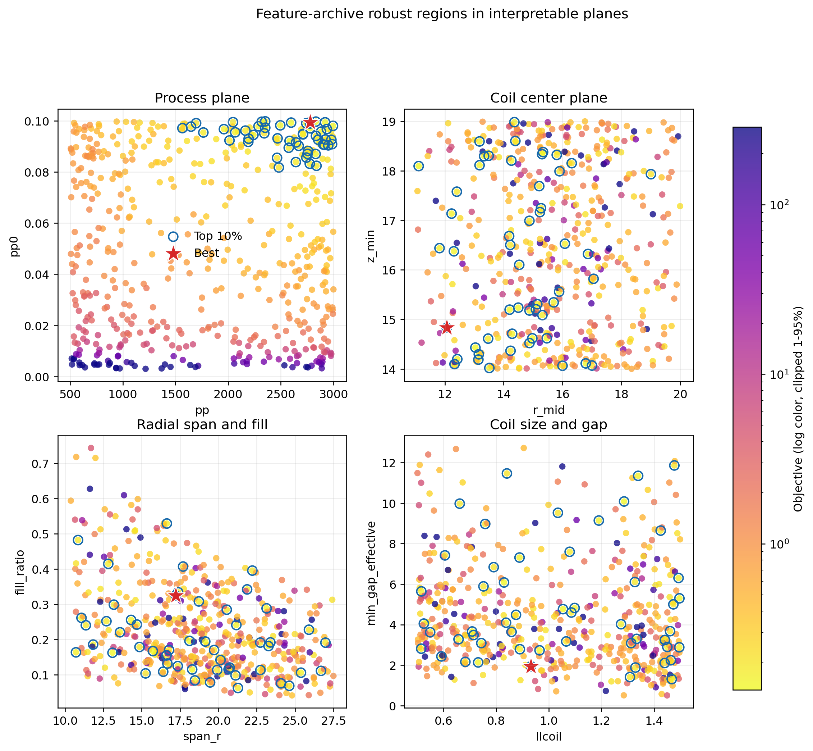

*Fig. 29: coil count、spacing、height など解釈可能特徴と objective の関係。*

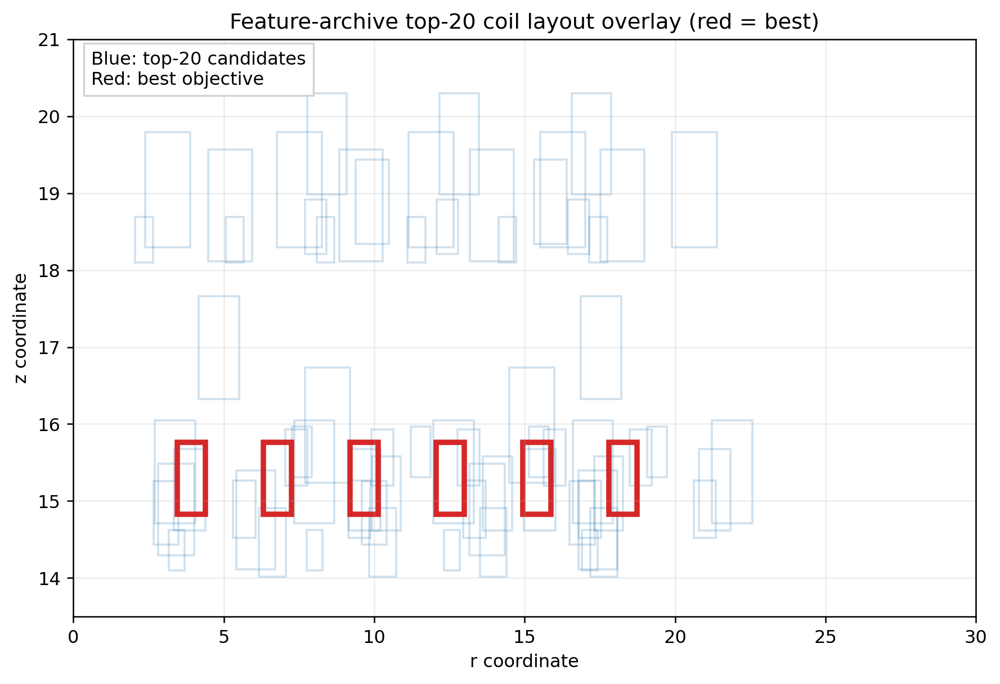

*Fig. 30: feature archive top20 layout。COMSOL 再計算候補は scalar best だけでなく、この候補群から選ぶ。*

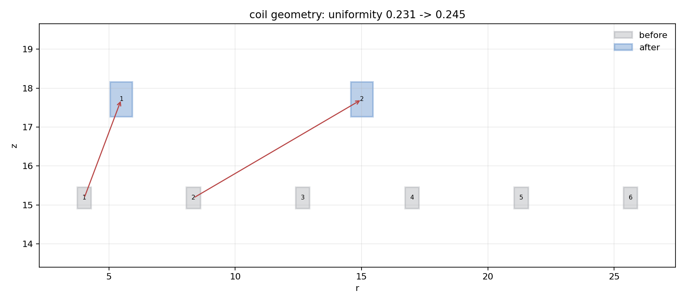

*Fig. 31: parameter two-stage の geometry before/after。局所的な parameter 変化と feature-space diversity は区別して評価する必要がある。*

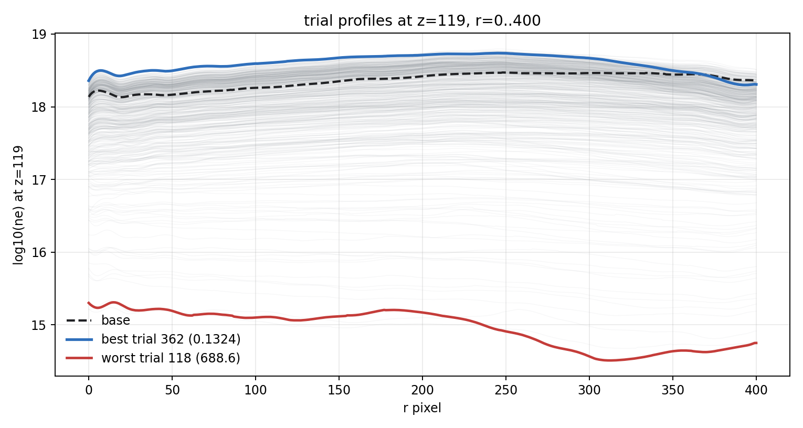

*Fig. 32: parameter two-stage の trial profile overlay。best/worst と全 trial の line 分布を確認する。*

## 9. 考察

### 9.1 構造特徴量化の有用性

学習側では、coil geometry を raw vector ではなく spatial feature として与えることで、FFNO は field operator として $\Phi(G)$ から $Y(r,z)$ を学習できる。これは ICP の境界・近接・part 配置に依存する局所物理と整合する。

最適化側では、feature archive が parameter two-stage より高い descriptor diversity を示した。これは「同じような寸法近傍を細かく探す」のではなく、「構造特徴として異なる coil layout を比較する」探索になっていることを意味する。特に top10 median nearest descriptor distance が 0.8746 から 2.2128 に増えたことは、上位候補の構造的重複を抑えられていることを示す。

この結果は、構造特徴量化の有用性を二つの側面から支持する。第一に、学習では coil 境界や近接度を field として与えることで、モデルが plasma field の空間応答を直接学習できる。第二に、最適化では同じ構造特徴空間を使うことで、候補の多様性を制御できる。つまり、構造特徴量は単なる入力 feature ではなく、学習と設計探索をつなぐ共通表現として機能している。

ただし、今回の結果だけで「構造特徴量入力が常に raw-parameter ベクトル入力モデルより精度が高い」とは結論できない。raw-parameter ベクトル入力モデルとの同一条件学習比較は未実施である。本レポートで示せる結論は、少なくとも ICP_stage4 のように topology と局所境界物理が重要な問題では、構造特徴量化が物理的に自然であり、feature-space optimization によって多様な設計候補を得られる、ということである。

### 9.2 目的関数の限界

今回の objective は $U/D$ であり、密度最大値を伸ばす candidate を有利にする。feature archive best は objective を改善したが、line CV 自体は悪化した。この結果は失敗ではなく、目的関数が設計意図をどう表現しているかを示す重要な知見である。純粋な均一化を重視するなら、例えば

$$
J_{pareto} = \left(U_\ell, -D_\ell, E_{boundary}, R_{negative}\right)
$$

のような multi-objective として扱い、Pareto front から設計候補を選ぶべきである。

ここで重要なのは、目的関数の良し悪しを最適化結果だけから判断しないことである。今回の $U/D$ は「密度がゼロに逃げる均一解」を避けるためには有効である。しかし、density gain を強く報酬化するため、高密度だが不均一な candidate も有利になり得る。したがって、設計目的を「高密度かつ均一」とするなら、次のように制約または多目的化を明示する必要がある。

| 設計意図 | 推奨する扱い |
|---|---|
| 密度崩壊を避けたい | mean/max density の下限制約を置く |
| 純粋な均一性を改善したい | CV を主目的にし、density は制約にする |
| 高密度と均一性を両立したい | CV と density gain の Pareto 評価にする |
| 物理的に安全な候補を選びたい | negative rate、boundary metric、COMSOL validation を追加する |

この整理により、今回の feature archive best は「目的関数 $U/D$ に対する best」であり、「全設計要件を満たす best」とは区別される。

### 9.3 物性ごとの有効領域

`ne`, `ni`, `Te`, `phi`, `Jelr`, `Jelz` は plasma/current 領域で評価する必要がある一方、`Br`, `Bz` は coil 近傍を含む full-domain field である。この違いを無視すると、存在しない領域の密度や温度を評価してしまう、または磁場を plasma-only に切り落としてしまう。したがって、今後の 8-field 本学習では target ごとの region-aware supervision と visualization が必須である。

今回の 4-field model では plasma variable に対象を絞ったため、高い R2 と比較的安定した空間分布が得られた。一方で 8-field 参照では、`Bz` や `Jelz` のような場で精度低下が見られる。これは、単純な target 数増加だけでなく、物性ごとの空間 support と変動構造の違いが効いている可能性が高い。

今後の学習では、すべての target を一つの joint model に入れるだけでなく、物理 group ごとの model 分割も比較するべきである。例えば、`ne/ni/Te/phi` の plasma group、`Br/Bz` の EM group、`Jelr/Jelz` の current group である。この分割は、モデルを問題特化に複雑化するためではなく、異なる有効領域とスケールを持つ分布場を適切に学習するための一般的な multi-physics strategy である。

### 9.4 学習結果と最適化結果の接続

学習結果だけを見ると、plasma 4-field FFNO は十分高い精度に見える。しかし、最適化では field prediction の小さな誤差が QoI に増幅される。特に line CV は、line 上の局所 peak、谷、境界近傍勾配に敏感である。そのため、学習評価と最適化評価をつなぐには、次の階層で結果を読む必要がある。

1. field 全体の R2/RMSE。
2. target ごとの有効領域内の空間分布。
3. mid-height や wafer line 上の profile。
4. QoI の Pareto trade-off。
5. COMSOL 再計算での最終確認。

今回の結果では、1 と 2 は概ね良好である。一方、4 の段階で objective 改善と CV 悪化が同時に起きており、設計目的の定義が結果を強く左右することが分かった。これは surrogate の失敗というより、field-derived objective をどう設計するかが最適化結果を決めるという重要な知見である。

### 9.5 実運用上の制約

現在の dataset で実際に scalar process condition として使えるのは `pp`, `pp0` である。coil power、gas pressure、flow、frequency、temperature などを設計変数として扱うには、source data column または新規 COMSOL run が必要である。また、surrogate 最適化結果は必ず COMSOL 再計算で確認する必要がある。特に学習範囲外に近い `pp` や極端な geometry は、surrogate extrapolation risk を持つ。

また、今回の最適化は surrogate 上の探索であり、物理的・製造的な制約を完全に含んでいるわけではない。coil 間距離、電流容量、熱、絶縁、機械配置、RF matching などは、最終設計では追加制約として扱う必要がある。したがって、レポートで示すべき結論は「この設計が最終解である」ではなく、「構造特徴量ベース surrogate により、COMSOL 再計算へ渡す有望かつ多様な候補を抽出できる」である。

## 10. 限界と妥当性への脅威

### 10.1 物理モデルとしての限界

本稿の surrogate は COMSOL 由来データから学習した統計モデルであり、Maxwell 方程式、粒子・エネルギー保存、境界条件を厳密に満たす物理 solver ではない。coil geometry が誘導電磁場を変え、skin layer 近傍の電子加熱、電子温度、電離率、密度分布、最終的な wafer/line 均一性へ伝播するという物理連鎖は surrogate が近似的に学習する対象である。したがって、最適化で得た候補は最終設計ではなく、COMSOL 再計算へ渡す候補である。

また、`ne`, `ni`, `Te`, `phi` と `Br/Bz` は存在すべき領域が異なる。密度や温度を chamber 外・coil 近傍で評価すると非物理的な誤差を作り、逆に磁場を plasma-only に切ると coil 近傍の重要な情報を捨てる。Fig. 2 はこの target-domain-aware evaluation の必要性を示す。

### 10.2 データセットと汎化の限界

ICP_stage4 は 60 構造 × 6 process 条件の 360 cases であり、deep learning dataset としては小さい。group split により構造漏洩は抑えているが、探索範囲外の geometry や process 条件では extrapolation risk がある。現行 dataset で scalar process condition として使えるのは `pp`, `pp0` であり、coil power、gas pressure、gas flow、RF frequency などは現行モデルの入力変数ではない。これらを最適化するには、追加データ列または新規 COMSOL run が必要である。

さらに、raw-parameter ベクトル入力モデルとの同一条件学習比較は本稿では行っていない。したがって、本稿の結論は「raw-parameter ベクトル入力モデルより常に高精度」とするものではない。主張は、構造特徴量化が ICP coil design の問題設定として自然であり、少なくとも feature-space optimization では parameter-space local search より多様な設計候補を得られる、という点である。

### 10.3 評価指標と目的関数の限界

R2 が高いだけでは、field surrogate として十分ではない。必要なのは、分布の連続性、ピーク位置、line profile、gradient、valid-domain metric、Pareto trade-off を組み合わせた評価である。Fig. 1 は dataset coverage と split の偏り確認、Fig. 18 は sampler の指標分解を示す。

特に feature archive best は objective を改善したが CV は悪化しており、密度最大値を重視する目的関数の性質が結果に反映されている。したがって発表では、best scalar だけを成功例として示すのではなく、Pareto 候補、top20 layout overlay、feature-space coverage、line profile を並べて、設計者がどの trade-off を選ぶかを議論する構成が望ましい。

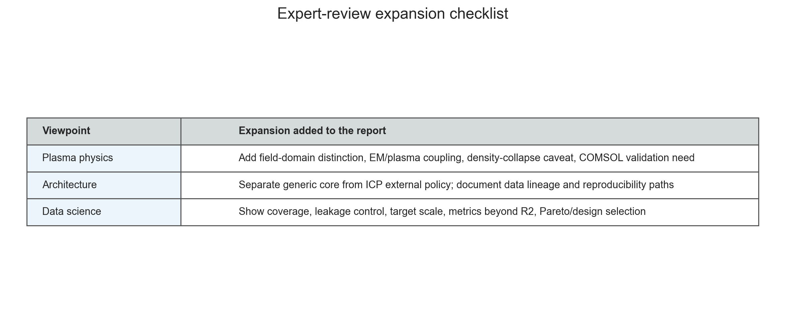

*Fig. 33: プラズマ物理、アーキテクチャ、データサイエンスの三視点から見た論文上の補強点。*

### 10.4 実装と再利用性の限界

本稿では ICP_stage4 固有の field label、line QoI、coil-series 制約、学会用 figure logic を外部 workflow 側に置く方針を採った。これは、製品基盤に特定問題の objective や制約を混入させないためである。Fig. 3 に示す通り、本体基盤に残すべきものは、任意 target に対する region-aware supervision、構造特徴量、scaler/loss、neural operator、generic objective parts である。

一方で、外部 workflow が増えるほど、実験再現性の管理が重要になる。本稿では path、summary JSON、figure outputs を付録に残したが、今後は config snapshot、model hash、COMSOL case ID、candidate geometry manifest を揃えることで、再計算候補の traceability を高める必要がある。

## 11. 今後の検証計画

1. 8-field 本学習では、`Br/Bz` を full-domain、`ne/ni/Te/phi/Jelr/Jelz` を plasma/current scope として、target group 別のモデルも比較する。
2. raw-parameter ベクトル入力モデルとの厳密な学習比較を行う場合は、同一 split、同一 target、同一モデル容量で、構造特徴量入力との差を測る。ただし今回の主張は、推論最適化で feature-space diversity が増えることにより既に一部支持されている。
3. 最適化結果は、best scalar ではなく Pareto front から top 3-5 を選び、COMSOL 再計算で field と QoI を検証する。
4. process 条件を `pp`, `pp0` 以外にも広げるには、追加 process column または新規 COMSOL run が必要である。
5. 最終的な coil design 評価では、電流容量、熱、絶縁、機械配置、RF matching、製造制約を追加し、surrogate objective と装置制約を分離して評価する。

## 12. 結論

1. 360 ケース、60 coil structure group の dataset に対し、process scalar `pp`, `pp0` と coil structure features から plasma 4-field を予測する FFNO は平均 R2 0.9826 を得た。
2. 8-field dataset では、plasma variables と EM/current variables の有効領域が異なり、region-aware learning/evaluation が必要である。
3. 推論最適化では、parameter two-stage に比べ feature archive が best objective を 0.1324 から 0.1174 に改善した。
4. feature archive は top10 descriptor distance を 0.8746 から 2.2128 に増やし、構造特徴としてユニークな上位候補を得やすいことを示した。
5. 一方で best objective は密度最大値を伸ばす方向に寄り、line CV は悪化した。したがって最終設計は scalar best ではなく Pareto 評価と COMSOL 再計算に基づくべきである。

以上より、coil 数・配置・寸法を raw parameter vector として学習・最適化するよりも、geometry から生成される構造特徴量として扱う方が、低圧 ICP の field surrogate と設計探索に対して物理的にも機械学習的にも妥当である。本稿で示した最も重要な点は、構造特徴量が学習入力として有効であるだけでなく、推論最適化における候補多様性の制御にも使えることである。

ただし、本稿の結果は surrogate 上の検証であり、最終的な装置設計の結論ではない。実設計に進むには、Pareto front から選んだ top candidates を COMSOL で再計算し、field 分布、wafer/line QoI、境界応答、装置制約を確認する必要がある。この位置づけを明確にすることで、本手法は「COMSOL を置き換えるもの」ではなく、「COMSOL 再計算候補を物理的に意味のある構造特徴空間から効率よく選ぶための surrogate workflow」として定義できる。

## 参考文献

[1] M. A. Lieberman and A. J. Lichtenberg, *Principles of Plasma Discharges and Materials Processing*, Wiley, 2nd ed., 2005.  
[2] P. Chabert and N. Braithwaite, *Physics of Radio-Frequency Plasmas*, Cambridge University Press, 2011.  
[3] Z. Li et al., “Fourier Neural Operator for Parametric Partial Differential Equations,” *International Conference on Learning Representations*, 2021.  
[4] N. Kovachki et al., “Neural Operator: Learning Maps Between Function Spaces,” *Journal of Machine Learning Research*, 2023.  
[5] K. Deb et al., “A Fast and Elitist Multiobjective Genetic Algorithm: NSGA-II,” *IEEE Transactions on Evolutionary Computation*, 2002.  
[6] N. Hansen, “The CMA Evolution Strategy: A Comparing Review,” in *Towards a New Evolutionary Computation*, Springer, 2006.  
[7] J.-B. Mouret and J. Clune, “Illuminating Search Spaces by Mapping Elites,” *arXiv:1504.04909*, 2015.  
[8] G. E. Karniadakis et al., “Physics-informed machine learning,” *Nature Reviews Physics*, 2021.

## 付録 A: 使用した主な成果物

| 種別 | パス |
|---|---|
| dataset | `data/outputs_icp_stage4_enriched_360_csv_npz_multifield_structure_v1` |
| plasma FFNO run | `runs/icp_stage4_multifield_plasma_ffno_modes24_e80/full/ffno_plasma_modes24_grad005_gpu80_20260528_211257` |
| publication figures | `reports/icp_stage4_ffno_publication_figures_20260529_v2` |
| parameter two-stage optimization | `reports/icp_stage4_opt_midline_density_over_peak_20260529_full512` |
| feature archive optimization | `reports/icp_stage4_opt_feature_archive_20260529_full512` |
| sampler comparison | `reports/icp_stage4_opt_sampler_comparison_20260529` |

## 付録 B: 図ファイル一覧

- `figures/fig01_learning_curve_plasma_ffno_log.png`
- `figures/fig02_target_r2_plasma_and_em.png`
- `figures/fig03_distribution_metrics_by_target.png`
- `figures/fig04_plasma_fields_worst_case_triplet_phi_jet.png`
- `figures/fig05_ne_best_median_worst.png`
- `figures/fig06_Te_best_median_worst.png`
- `figures/fig07_phi_shared_jet_scale_best_median_worst.png`
- `figures/fig08_plasma_midheight_profiles.png`
- `figures/fig09_em_current_fields_worst_case_triplet.png`
- `figures/fig10_Br_best_median_worst.png`
- `figures/fig11_Bz_best_median_worst.png`
- `figures/fig12_Jelr_best_median_worst.png`
- `figures/fig13_Jelz_best_median_worst.png`
- `figures/fig14_em_current_midheight_profiles.png`
- `figures/fig15_sampler_comparison_objective_history_log.png`
- `figures/fig16_sampler_comparison_cv_density_tradeoff.png`
- `figures/fig17_sampler_comparison_feature_space_coverage.png`
- `figures/fig18_sampler_comparison_nearest_descriptor_distance_box.png`
- `figures/fig19_sampler_comparison_coil_count_balance.png`
- `figures/fig20_sampler_comparison_top20_layout_overlay.png`
- `figures/fig21_sampler_comparison_feature_archive_benefit_ratios.png`
- `figures/fig22_feature_archive_line_profile_base_best_linear.png`
- `figures/fig23_feature_archive_pareto_cv_density.png`
- `figures/fig24_feature_archive_pca_objective.png`
- `figures/fig25_feature_archive_interpretable_planes.png`
- `figures/fig26_feature_archive_top20_coil_layout_overlay.png`
- `figures/fig27_parameter_two_stage_geometry_before_after.png`
- `figures/fig28_parameter_two_stage_trial_profiles.png`
- `figures/fig29_dataset_process_geometry_coverage.png`
- `figures/fig30_target_domain_and_scale.png`
- `figures/fig31_core_external_responsibility_boundary.png`
- `figures/fig32_sampler_metric_small_multiples.png`
- `figures/fig33_expert_review_expansion_matrix.png`
