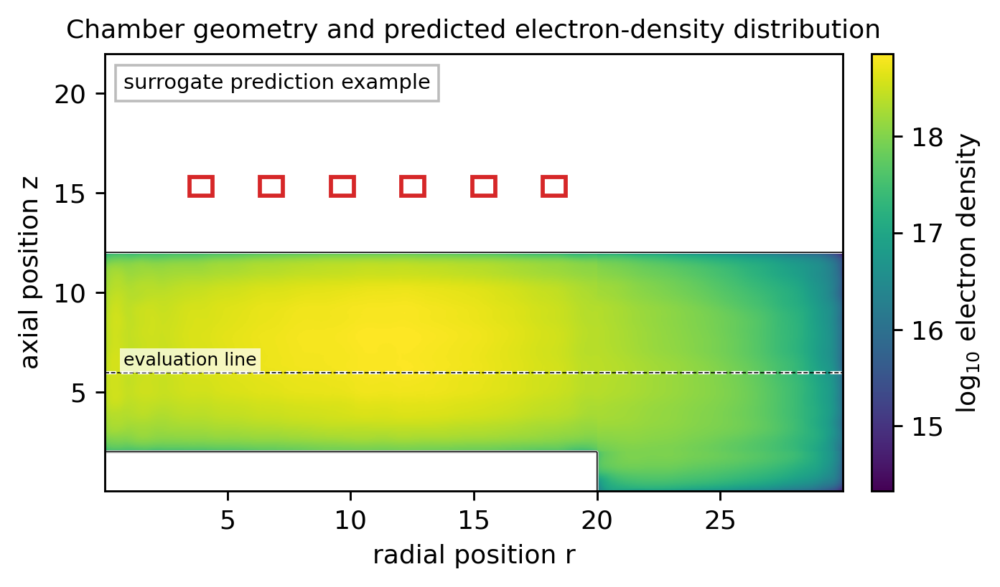

# 構造特徴量に基づく低圧ICPコイル設計のサロゲート解析

Structure-feature-based surrogate analysis for coil design in low-pressure ICP

○発表者氏名^1，共著者氏名^1,2（投稿前に差し替え）

^1 所属1，^2 所属2（投稿前に差し替え）

半導体プラズマプロセスに用いられる誘導結合プラズマ（ICP）では，RFコイルの形状や配置が誘導電磁場，電子加熱，電離分布を通じてプラズマ密度の空間分布を決める[1]。したがってコイル設計では，単一の代表値だけでなく，チャンバー内に形成される二次元場そのものを予測し，ウェハ近傍での均一性や密度維持を同時に評価する必要がある。従来の機械学習では，コイル幅，位置，本数などを数値パラメータとして入力することが多い。しかし，コイル本数や配置の違いは単なる数値の変化ではなく，電磁場とプラズマが解かれる幾何構造の変化である。この違いを無視すると，物理的には近い構造が別の入力として扱われたり，未知の配置に対する外挿を過信したりする問題が生じる。

本研究では，GEC reference cell 型ICPを基にした軸対称二次元数値データを用い[2,3]，コイルを寸法列としてではなく，チャンバー内の空間構造特徴として表現するサロゲート解析を行う。すなわち，コイル配置から境界や近接度を表す構造場を作り，運転条件と組み合わせて電子密度，イオン密度，電子温度，電位などの二次元プラズマ場を予測する。モデルにはニューラルオペレータ型のサロゲート[4]を用い，有限次元の設計変数から値を直接回帰するのではなく，構造場からプラズマ場への写像として学習する。密度の桁差や物理量ごとのスケール差は，学習データのみから決めた前処理で扱う。

予備的な学習評価では，構造特徴量を用いることで，コイル寸法を単なるパラメータとして扱う場合に比べて，密度ピークや勾配を含む空間分布を安定に再現できる傾向が得られた。特に，密度や温度のようにプラズマ領域で意味を持つ量と，磁場のようにコイル近傍まで広がる量では，評価すべき領域が異なる。この点を明示して学習・評価することも，サロゲートを物理的に解釈するうえで重要である。

さらに，学習済みサロゲートを用いて，電子密度の均一性を高めつつ密度低下を避けるコイル候補の探索を行う。ここでも最適化する対象は，寸法値そのものではなく，候補形状から作られる構造特徴を通じて評価されるプラズマ場である。これにより，数値上の最良点だけでなく，物理的に異なる複数の候補を比較できる。発表では，場分布の予測例と候補探索の結果を示し，サロゲートを最終解ではなく，物理制約を満たす再計算候補を効率よく絞り込む道具として位置づける。

**図1** チャンバー構造，コイル配置，およびサロゲートが予測した電子密度分布の例。赤枠はRFコイル，破線は均一性評価に用いた代表断面を示す。

**参考文献**  
[1] M. A. Lieberman and A. J. Lichtenberg, *Principles of Plasma Discharges and Materials Processing*, Wiley (2005).  
[2] P. J. Hargis Jr. et al., Rev. Sci. Instrum. **65**, 140-154 (1994), doi:10.1063/1.1144770.  
[3] P. A. Miller et al., J. Res. Natl. Inst. Stand. Technol. **100**, 427-439 (1995), doi:10.6028/jres.100.032.  
[4] Z. Li et al., Fourier Neural Operator for Parametric PDEs, ICLR (2021).

投稿前差し替え: 発表者氏名，共著者氏名，所属，E-mail，講演番号。
