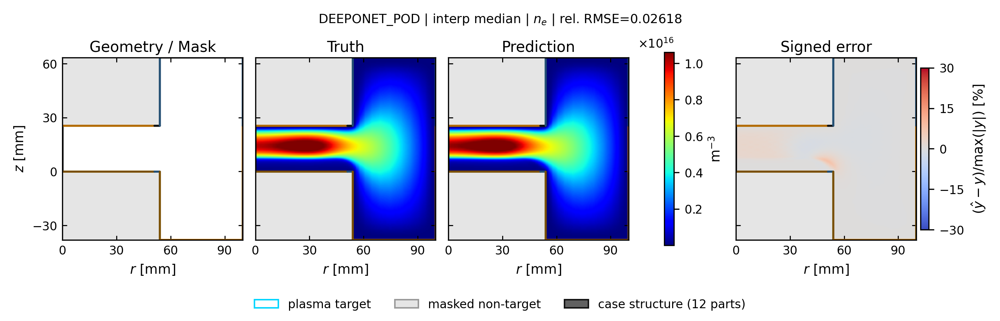
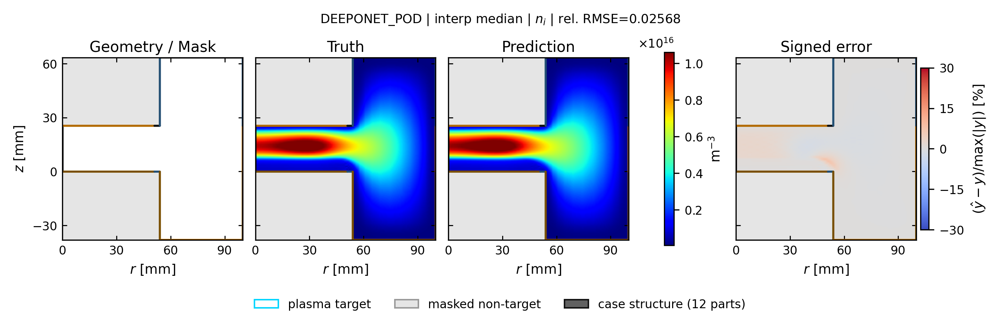
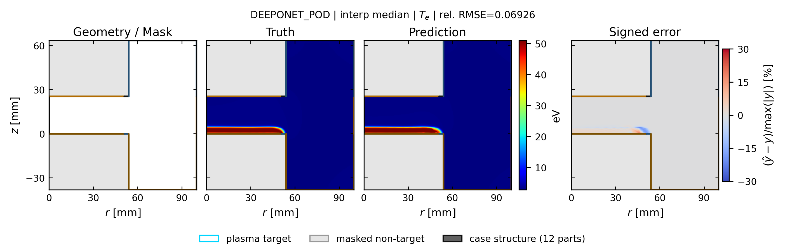
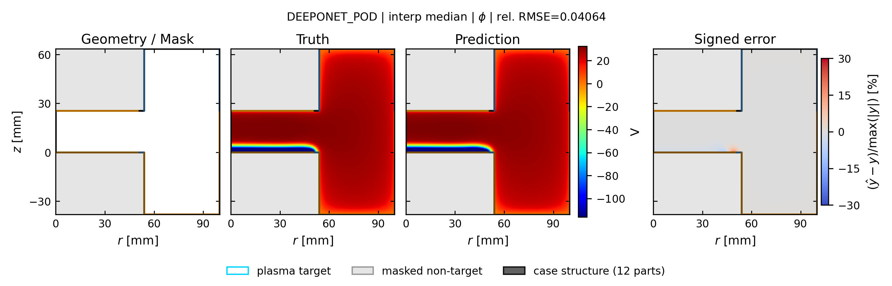

# deeponet_pod: spatial truth / prediction / error

[← 全モデルの集約へ](../index.md)

- validation-only representative seed: `411`
- run: `runs/gec_ccp_nn_operator_comparison_v1/seed_411/n78/deeponet_pod`
- 代表ケースは4物性の平均相対RMSEで best / p25 / median / p75 / worst を選択
- 各図は Structure / Mask、Truth、Prediction、Signed error の順
- Truth と Prediction は同じカラースケール

## interp: marginal補間

Signed error の表示範囲は `±30%`。飽和色はこの値以上の誤差を表します。

| 物性 | ケース数 | mean rel.RMSE | SD | median | min | max |
| --- | ---: | ---: | ---: | ---: | ---: | ---: |
| `ne` | 13 | 0.0440 | 0.0241 | 0.0344 | 0.0229 | 0.0953 |
| `ni` | 13 | 0.0423 | 0.0243 | 0.0343 | 0.0217 | 0.0952 |
| `Te` | 13 | 0.0661 | 0.0305 | 0.0523 | 0.0354 | 0.1172 |
| `phi` | 13 | 0.0283 | 0.0115 | 0.0264 | 0.0136 | 0.0480 |

### ne

| 代表位置 | case | rel.RMSE | 図 |
| --- | --- | ---: | --- |
| best | `case_td030_pa200_pp0_5_gamma_004__steady` | 0.0245 | [PNG](../publication_by_field/deeponet_pod/ne/interp/best_case_td030_pa200_pp0_5_gamma_004__steady_ne.png) / [PDF](../publication_by_field/deeponet_pod/ne/interp/best_case_td030_pa200_pp0_5_gamma_004__steady_ne.pdf) |
| p25 | `case_td030_pp0_1_gamma_004__steady` | 0.0415 | [PNG](../publication_by_field/deeponet_pod/ne/interp/p25_case_td030_pp0_1_gamma_004__steady_ne.png) / [PDF](../publication_by_field/deeponet_pod/ne/interp/p25_case_td030_pp0_1_gamma_004__steady_ne.pdf) |
| median | `case_td003_pa200_pp0_5_gamma_004__steady` | 0.0262 | [PNG](../publication_by_field/deeponet_pod/ne/interp/median_case_td003_pa200_pp0_5_gamma_004__steady_ne.png) / [PDF](../publication_by_field/deeponet_pod/ne/interp/median_case_td003_pa200_pp0_5_gamma_004__steady_ne.pdf) |
| p75 | `case_td016_pp0_1_gamma_007__steady` | 0.0282 | [PNG](../publication_by_field/deeponet_pod/ne/interp/p75_case_td016_pp0_1_gamma_007__steady_ne.png) / [PDF](../publication_by_field/deeponet_pod/ne/interp/p75_case_td016_pp0_1_gamma_007__steady_ne.pdf) |
| worst | `case_td030_pa200_pp0_1_gamma_004__steady` | 0.0882 | [PNG](../publication_by_field/deeponet_pod/ne/interp/worst_case_td030_pa200_pp0_1_gamma_004__steady_ne.png) / [PDF](../publication_by_field/deeponet_pod/ne/interp/worst_case_td030_pa200_pp0_1_gamma_004__steady_ne.pdf) |

### ni

| 代表位置 | case | rel.RMSE | 図 |
| --- | --- | ---: | --- |
| best | `case_td030_pa200_pp0_5_gamma_004__steady` | 0.0238 | [PNG](../publication_by_field/deeponet_pod/ni/interp/best_case_td030_pa200_pp0_5_gamma_004__steady_ni.png) / [PDF](../publication_by_field/deeponet_pod/ni/interp/best_case_td030_pa200_pp0_5_gamma_004__steady_ni.pdf) |
| p25 | `case_td030_pp0_1_gamma_004__steady` | 0.0353 | [PNG](../publication_by_field/deeponet_pod/ni/interp/p25_case_td030_pp0_1_gamma_004__steady_ni.png) / [PDF](../publication_by_field/deeponet_pod/ni/interp/p25_case_td030_pp0_1_gamma_004__steady_ni.pdf) |
| median | `case_td003_pa200_pp0_5_gamma_004__steady` | 0.0257 | [PNG](../publication_by_field/deeponet_pod/ni/interp/median_case_td003_pa200_pp0_5_gamma_004__steady_ni.png) / [PDF](../publication_by_field/deeponet_pod/ni/interp/median_case_td003_pa200_pp0_5_gamma_004__steady_ni.pdf) |
| p75 | `case_td016_pp0_1_gamma_007__steady` | 0.0270 | [PNG](../publication_by_field/deeponet_pod/ni/interp/p75_case_td016_pp0_1_gamma_007__steady_ni.png) / [PDF](../publication_by_field/deeponet_pod/ni/interp/p75_case_td016_pp0_1_gamma_007__steady_ni.pdf) |
| worst | `case_td030_pa200_pp0_1_gamma_004__steady` | 0.0866 | [PNG](../publication_by_field/deeponet_pod/ni/interp/worst_case_td030_pa200_pp0_1_gamma_004__steady_ni.png) / [PDF](../publication_by_field/deeponet_pod/ni/interp/worst_case_td030_pa200_pp0_1_gamma_004__steady_ni.pdf) |

### Te

| 代表位置 | case | rel.RMSE | 図 |
| --- | --- | ---: | --- |
| best | `case_td030_pa200_pp0_5_gamma_004__steady` | 0.0354 | [PNG](../publication_by_field/deeponet_pod/Te/interp/best_case_td030_pa200_pp0_5_gamma_004__steady_Te.png) / [PDF](../publication_by_field/deeponet_pod/Te/interp/best_case_td030_pa200_pp0_5_gamma_004__steady_Te.pdf) |
| p25 | `case_td030_pp0_1_gamma_004__steady` | 0.0492 | [PNG](../publication_by_field/deeponet_pod/Te/interp/p25_case_td030_pp0_1_gamma_004__steady_Te.png) / [PDF](../publication_by_field/deeponet_pod/Te/interp/p25_case_td030_pp0_1_gamma_004__steady_Te.pdf) |
| median | `case_td003_pa200_pp0_5_gamma_004__steady` | 0.0693 | [PNG](../publication_by_field/deeponet_pod/Te/interp/median_case_td003_pa200_pp0_5_gamma_004__steady_Te.png) / [PDF](../publication_by_field/deeponet_pod/Te/interp/median_case_td003_pa200_pp0_5_gamma_004__steady_Te.pdf) |
| p75 | `case_td016_pp0_1_gamma_007__steady` | 0.0987 | [PNG](../publication_by_field/deeponet_pod/Te/interp/p75_case_td016_pp0_1_gamma_007__steady_Te.png) / [PDF](../publication_by_field/deeponet_pod/Te/interp/p75_case_td016_pp0_1_gamma_007__steady_Te.pdf) |
| worst | `case_td030_pa200_pp0_1_gamma_004__steady` | 0.1172 | [PNG](../publication_by_field/deeponet_pod/Te/interp/worst_case_td030_pa200_pp0_1_gamma_004__steady_Te.png) / [PDF](../publication_by_field/deeponet_pod/Te/interp/worst_case_td030_pa200_pp0_1_gamma_004__steady_Te.pdf) |

### phi

| 代表位置 | case | rel.RMSE | 図 |
| --- | --- | ---: | --- |
| best | `case_td030_pa200_pp0_5_gamma_004__steady` | 0.0171 | [PNG](../publication_by_field/deeponet_pod/phi/interp/best_case_td030_pa200_pp0_5_gamma_004__steady_phi.png) / [PDF](../publication_by_field/deeponet_pod/phi/interp/best_case_td030_pa200_pp0_5_gamma_004__steady_phi.pdf) |
| p25 | `case_td030_pp0_1_gamma_004__steady` | 0.0215 | [PNG](../publication_by_field/deeponet_pod/phi/interp/p25_case_td030_pp0_1_gamma_004__steady_phi.png) / [PDF](../publication_by_field/deeponet_pod/phi/interp/p25_case_td030_pp0_1_gamma_004__steady_phi.pdf) |
| median | `case_td003_pa200_pp0_5_gamma_004__steady` | 0.0406 | [PNG](../publication_by_field/deeponet_pod/phi/interp/median_case_td003_pa200_pp0_5_gamma_004__steady_phi.png) / [PDF](../publication_by_field/deeponet_pod/phi/interp/median_case_td003_pa200_pp0_5_gamma_004__steady_phi.pdf) |
| p75 | `case_td016_pp0_1_gamma_007__steady` | 0.0396 | [PNG](../publication_by_field/deeponet_pod/phi/interp/p75_case_td016_pp0_1_gamma_007__steady_phi.png) / [PDF](../publication_by_field/deeponet_pod/phi/interp/p75_case_td016_pp0_1_gamma_007__steady_phi.pdf) |
| worst | `case_td030_pa200_pp0_1_gamma_004__steady` | 0.0378 | [PNG](../publication_by_field/deeponet_pod/phi/interp/worst_case_td030_pa200_pp0_1_gamma_004__steady_phi.png) / [PDF](../publication_by_field/deeponet_pod/phi/interp/worst_case_td030_pa200_pp0_1_gamma_004__steady_phi.pdf) |

