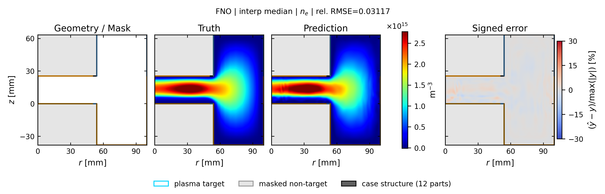
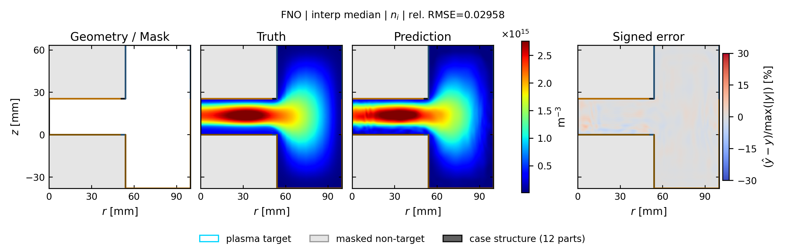
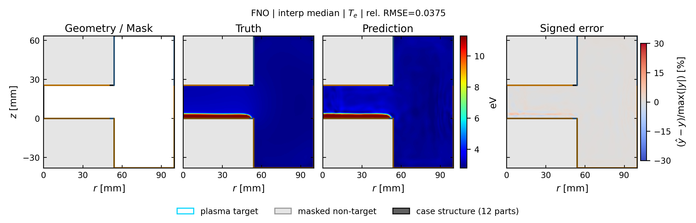
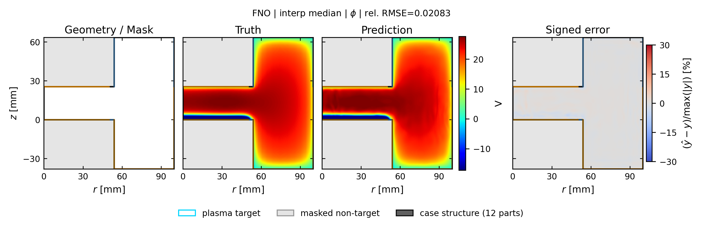

# fno: spatial truth / prediction / error

[← 全モデルの集約へ](../index.md)

- validation-only representative seed: `412`
- run: `runs/gec_ccp_nn_operator_comparison_v1/seed_412/n78/fno`
- 代表ケースは4物性の平均相対RMSEで best / p25 / median / p75 / worst を選択
- 各図は Structure / Mask、Truth、Prediction、Signed error の順
- Truth と Prediction は同じカラースケール

## interp: marginal補間

Signed error の表示範囲は `±30%`。飽和色はこの値以上の誤差を表します。

| 物性 | ケース数 | mean rel.RMSE | SD | median | min | max |
| --- | ---: | ---: | ---: | ---: | ---: | ---: |
| `ne` | 13 | 0.0266 | 0.0109 | 0.0224 | 0.0155 | 0.0493 |
| `ni` | 13 | 0.0261 | 0.0099 | 0.0228 | 0.0154 | 0.0453 |
| `Te` | 13 | 0.0395 | 0.0120 | 0.0375 | 0.0259 | 0.0671 |
| `phi` | 13 | 0.0187 | 0.0026 | 0.0190 | 0.0146 | 0.0218 |

### ne

| 代表位置 | case | rel.RMSE | 図 |
| --- | --- | ---: | --- |
| best | `case_td003_pp0_5_gamma_007__steady` | 0.0186 | [PNG](../publication_by_field/fno/ne/interp/best_case_td003_pp0_5_gamma_007__steady_ne.png) / [PDF](../publication_by_field/fno/ne/interp/best_case_td003_pp0_5_gamma_007__steady_ne.pdf) |
| p25 | `case_td003_pa050_pp0_3_gamma_010__steady` | 0.0224 | [PNG](../publication_by_field/fno/ne/interp/p25_case_td003_pa050_pp0_3_gamma_010__steady_ne.png) / [PDF](../publication_by_field/fno/ne/interp/p25_case_td003_pa050_pp0_3_gamma_010__steady_ne.pdf) |
| median | `case_td003_pa200_pp0_1_gamma_010__steady` | 0.0312 | [PNG](../publication_by_field/fno/ne/interp/median_case_td003_pa200_pp0_1_gamma_010__steady_ne.png) / [PDF](../publication_by_field/fno/ne/interp/median_case_td003_pa200_pp0_1_gamma_010__steady_ne.pdf) |
| p75 | `case_td016_pp0_1_gamma_007__steady` | 0.0353 | [PNG](../publication_by_field/fno/ne/interp/p75_case_td016_pp0_1_gamma_007__steady_ne.png) / [PDF](../publication_by_field/fno/ne/interp/p75_case_td016_pp0_1_gamma_007__steady_ne.pdf) |
| worst | `case_td030_pa200_pp0_1_gamma_004__steady` | 0.0374 | [PNG](../publication_by_field/fno/ne/interp/worst_case_td030_pa200_pp0_1_gamma_004__steady_ne.png) / [PDF](../publication_by_field/fno/ne/interp/worst_case_td030_pa200_pp0_1_gamma_004__steady_ne.pdf) |

### ni

| 代表位置 | case | rel.RMSE | 図 |
| --- | --- | ---: | --- |
| best | `case_td003_pp0_5_gamma_007__steady` | 0.0168 | [PNG](../publication_by_field/fno/ni/interp/best_case_td003_pp0_5_gamma_007__steady_ni.png) / [PDF](../publication_by_field/fno/ni/interp/best_case_td003_pp0_5_gamma_007__steady_ni.pdf) |
| p25 | `case_td003_pa050_pp0_3_gamma_010__steady` | 0.0228 | [PNG](../publication_by_field/fno/ni/interp/p25_case_td003_pa050_pp0_3_gamma_010__steady_ni.png) / [PDF](../publication_by_field/fno/ni/interp/p25_case_td003_pa050_pp0_3_gamma_010__steady_ni.pdf) |
| median | `case_td003_pa200_pp0_1_gamma_010__steady` | 0.0296 | [PNG](../publication_by_field/fno/ni/interp/median_case_td003_pa200_pp0_1_gamma_010__steady_ni.png) / [PDF](../publication_by_field/fno/ni/interp/median_case_td003_pa200_pp0_1_gamma_010__steady_ni.pdf) |
| p75 | `case_td016_pp0_1_gamma_007__steady` | 0.0347 | [PNG](../publication_by_field/fno/ni/interp/p75_case_td016_pp0_1_gamma_007__steady_ni.png) / [PDF](../publication_by_field/fno/ni/interp/p75_case_td016_pp0_1_gamma_007__steady_ni.pdf) |
| worst | `case_td030_pa200_pp0_1_gamma_004__steady` | 0.0343 | [PNG](../publication_by_field/fno/ni/interp/worst_case_td030_pa200_pp0_1_gamma_004__steady_ni.png) / [PDF](../publication_by_field/fno/ni/interp/worst_case_td030_pa200_pp0_1_gamma_004__steady_ni.pdf) |

### Te

| 代表位置 | case | rel.RMSE | 図 |
| --- | --- | ---: | --- |
| best | `case_td003_pp0_5_gamma_007__steady` | 0.0278 | [PNG](../publication_by_field/fno/Te/interp/best_case_td003_pp0_5_gamma_007__steady_Te.png) / [PDF](../publication_by_field/fno/Te/interp/best_case_td003_pp0_5_gamma_007__steady_Te.pdf) |
| p25 | `case_td003_pa050_pp0_3_gamma_010__steady` | 0.0278 | [PNG](../publication_by_field/fno/Te/interp/p25_case_td003_pa050_pp0_3_gamma_010__steady_Te.png) / [PDF](../publication_by_field/fno/Te/interp/p25_case_td003_pa050_pp0_3_gamma_010__steady_Te.pdf) |
| median | `case_td003_pa200_pp0_1_gamma_010__steady` | 0.0375 | [PNG](../publication_by_field/fno/Te/interp/median_case_td003_pa200_pp0_1_gamma_010__steady_Te.png) / [PDF](../publication_by_field/fno/Te/interp/median_case_td003_pa200_pp0_1_gamma_010__steady_Te.pdf) |
| p75 | `case_td016_pp0_1_gamma_007__steady` | 0.0338 | [PNG](../publication_by_field/fno/Te/interp/p75_case_td016_pp0_1_gamma_007__steady_Te.png) / [PDF](../publication_by_field/fno/Te/interp/p75_case_td016_pp0_1_gamma_007__steady_Te.pdf) |
| worst | `case_td030_pa200_pp0_1_gamma_004__steady` | 0.0556 | [PNG](../publication_by_field/fno/Te/interp/worst_case_td030_pa200_pp0_1_gamma_004__steady_Te.png) / [PDF](../publication_by_field/fno/Te/interp/worst_case_td030_pa200_pp0_1_gamma_004__steady_Te.pdf) |

### phi

| 代表位置 | case | rel.RMSE | 図 |
| --- | --- | ---: | --- |
| best | `case_td003_pp0_5_gamma_007__steady` | 0.0146 | [PNG](../publication_by_field/fno/phi/interp/best_case_td003_pp0_5_gamma_007__steady_phi.png) / [PDF](../publication_by_field/fno/phi/interp/best_case_td003_pp0_5_gamma_007__steady_phi.pdf) |
| p25 | `case_td003_pa050_pp0_3_gamma_010__steady` | 0.0170 | [PNG](../publication_by_field/fno/phi/interp/p25_case_td003_pa050_pp0_3_gamma_010__steady_phi.png) / [PDF](../publication_by_field/fno/phi/interp/p25_case_td003_pa050_pp0_3_gamma_010__steady_phi.pdf) |
| median | `case_td003_pa200_pp0_1_gamma_010__steady` | 0.0208 | [PNG](../publication_by_field/fno/phi/interp/median_case_td003_pa200_pp0_1_gamma_010__steady_phi.png) / [PDF](../publication_by_field/fno/phi/interp/median_case_td003_pa200_pp0_1_gamma_010__steady_phi.pdf) |
| p75 | `case_td016_pp0_1_gamma_007__steady` | 0.0216 | [PNG](../publication_by_field/fno/phi/interp/p75_case_td016_pp0_1_gamma_007__steady_phi.png) / [PDF](../publication_by_field/fno/phi/interp/p75_case_td016_pp0_1_gamma_007__steady_phi.pdf) |
| worst | `case_td030_pa200_pp0_1_gamma_004__steady` | 0.0207 | [PNG](../publication_by_field/fno/phi/interp/worst_case_td030_pa200_pp0_1_gamma_004__steady_phi.png) / [PDF](../publication_by_field/fno/phi/interp/worst_case_td030_pa200_pp0_1_gamma_004__steady_phi.pdf) |

