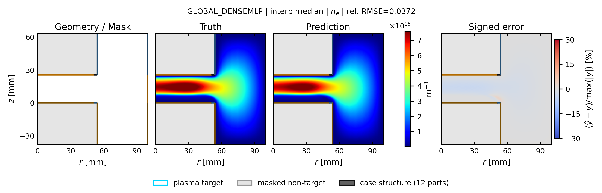
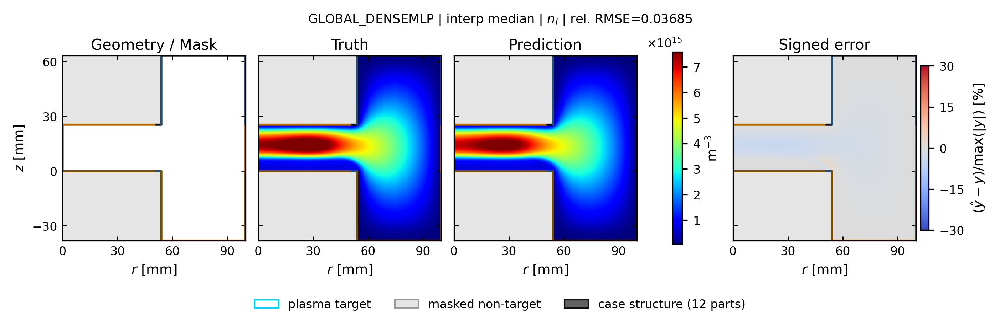
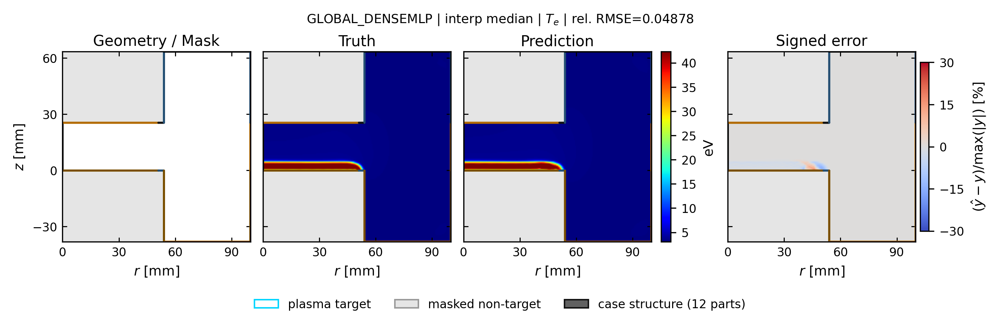
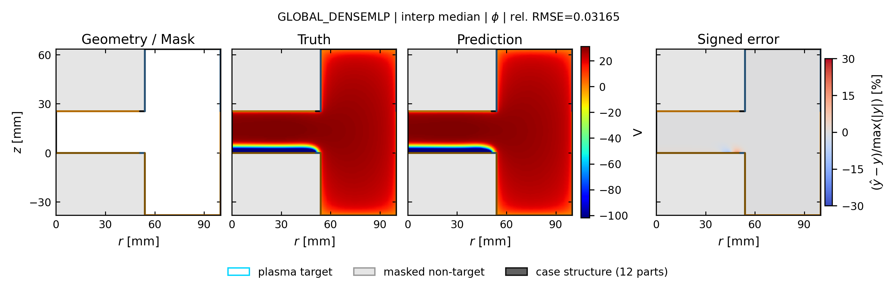

# global_densemlp: spatial truth / prediction / error

[← 全モデルの集約へ](../index.md)

- validation-only representative seed: `413`
- run: `runs/gec_ccp_nn_operator_comparison_v1/seed_413/n78/global_densemlp`
- 代表ケースは4物性の平均相対RMSEで best / p25 / median / p75 / worst を選択
- 各図は Structure / Mask、Truth、Prediction、Signed error の順
- Truth と Prediction は同じカラースケール

## interp: marginal補間

Signed error の表示範囲は `±30%`。飽和色はこの値以上の誤差を表します。

| 物性 | ケース数 | mean rel.RMSE | SD | median | min | max |
| --- | ---: | ---: | ---: | ---: | ---: | ---: |
| `ne` | 13 | 0.0414 | 0.0233 | 0.0391 | 0.0094 | 0.0754 |
| `ni` | 13 | 0.0409 | 0.0230 | 0.0383 | 0.0091 | 0.0745 |
| `Te` | 13 | 0.0430 | 0.0167 | 0.0458 | 0.0213 | 0.0690 |
| `phi` | 13 | 0.0249 | 0.0102 | 0.0274 | 0.0084 | 0.0389 |

### ne

| 代表位置 | case | rel.RMSE | 図 |
| --- | --- | ---: | --- |
| best | `case_td003_pp0_3_gamma_004__steady` | 0.0168 | [PNG](../publication_by_field/global_densemlp/ne/interp/best_case_td003_pp0_3_gamma_004__steady_ne.png) / [PDF](../publication_by_field/global_densemlp/ne/interp/best_case_td003_pp0_3_gamma_004__steady_ne.pdf) |
| p25 | `case_td016_pa200_pp0_5_gamma_010__steady` | 0.0207 | [PNG](../publication_by_field/global_densemlp/ne/interp/p25_case_td016_pa200_pp0_5_gamma_010__steady_ne.png) / [PDF](../publication_by_field/global_densemlp/ne/interp/p25_case_td016_pa200_pp0_5_gamma_010__steady_ne.pdf) |
| median | `case_td003_pp0_5_gamma_007__steady` | 0.0372 | [PNG](../publication_by_field/global_densemlp/ne/interp/median_case_td003_pp0_5_gamma_007__steady_ne.png) / [PDF](../publication_by_field/global_densemlp/ne/interp/median_case_td003_pp0_5_gamma_007__steady_ne.pdf) |
| p75 | `case_td030_pp0_1_gamma_004__steady` | 0.0754 | [PNG](../publication_by_field/global_densemlp/ne/interp/p75_case_td030_pp0_1_gamma_004__steady_ne.png) / [PDF](../publication_by_field/global_densemlp/ne/interp/p75_case_td030_pp0_1_gamma_004__steady_ne.pdf) |
| worst | `case_td003_pa200_pp0_1_gamma_010__steady` | 0.0745 | [PNG](../publication_by_field/global_densemlp/ne/interp/worst_case_td003_pa200_pp0_1_gamma_010__steady_ne.png) / [PDF](../publication_by_field/global_densemlp/ne/interp/worst_case_td003_pa200_pp0_1_gamma_010__steady_ne.pdf) |

### ni

| 代表位置 | case | rel.RMSE | 図 |
| --- | --- | ---: | --- |
| best | `case_td003_pp0_3_gamma_004__steady` | 0.0168 | [PNG](../publication_by_field/global_densemlp/ni/interp/best_case_td003_pp0_3_gamma_004__steady_ni.png) / [PDF](../publication_by_field/global_densemlp/ni/interp/best_case_td003_pp0_3_gamma_004__steady_ni.pdf) |
| p25 | `case_td016_pa200_pp0_5_gamma_010__steady` | 0.0205 | [PNG](../publication_by_field/global_densemlp/ni/interp/p25_case_td016_pa200_pp0_5_gamma_010__steady_ni.png) / [PDF](../publication_by_field/global_densemlp/ni/interp/p25_case_td016_pa200_pp0_5_gamma_010__steady_ni.pdf) |
| median | `case_td003_pp0_5_gamma_007__steady` | 0.0369 | [PNG](../publication_by_field/global_densemlp/ni/interp/median_case_td003_pp0_5_gamma_007__steady_ni.png) / [PDF](../publication_by_field/global_densemlp/ni/interp/median_case_td003_pp0_5_gamma_007__steady_ni.pdf) |
| p75 | `case_td030_pp0_1_gamma_004__steady` | 0.0745 | [PNG](../publication_by_field/global_densemlp/ni/interp/p75_case_td030_pp0_1_gamma_004__steady_ni.png) / [PDF](../publication_by_field/global_densemlp/ni/interp/p75_case_td030_pp0_1_gamma_004__steady_ni.pdf) |
| worst | `case_td003_pa200_pp0_1_gamma_010__steady` | 0.0737 | [PNG](../publication_by_field/global_densemlp/ni/interp/worst_case_td003_pa200_pp0_1_gamma_010__steady_ni.png) / [PDF](../publication_by_field/global_densemlp/ni/interp/worst_case_td003_pa200_pp0_1_gamma_010__steady_ni.pdf) |

### Te

| 代表位置 | case | rel.RMSE | 図 |
| --- | --- | ---: | --- |
| best | `case_td003_pp0_3_gamma_004__steady` | 0.0249 | [PNG](../publication_by_field/global_densemlp/Te/interp/best_case_td003_pp0_3_gamma_004__steady_Te.png) / [PDF](../publication_by_field/global_densemlp/Te/interp/best_case_td003_pp0_3_gamma_004__steady_Te.pdf) |
| p25 | `case_td016_pa200_pp0_5_gamma_010__steady` | 0.0458 | [PNG](../publication_by_field/global_densemlp/Te/interp/p25_case_td016_pa200_pp0_5_gamma_010__steady_Te.png) / [PDF](../publication_by_field/global_densemlp/Te/interp/p25_case_td016_pa200_pp0_5_gamma_010__steady_Te.pdf) |
| median | `case_td003_pp0_5_gamma_007__steady` | 0.0488 | [PNG](../publication_by_field/global_densemlp/Te/interp/median_case_td003_pp0_5_gamma_007__steady_Te.png) / [PDF](../publication_by_field/global_densemlp/Te/interp/median_case_td003_pp0_5_gamma_007__steady_Te.pdf) |
| p75 | `case_td030_pp0_1_gamma_004__steady` | 0.0238 | [PNG](../publication_by_field/global_densemlp/Te/interp/p75_case_td030_pp0_1_gamma_004__steady_Te.png) / [PDF](../publication_by_field/global_densemlp/Te/interp/p75_case_td030_pp0_1_gamma_004__steady_Te.pdf) |
| worst | `case_td003_pa200_pp0_1_gamma_010__steady` | 0.0620 | [PNG](../publication_by_field/global_densemlp/Te/interp/worst_case_td003_pa200_pp0_1_gamma_010__steady_Te.png) / [PDF](../publication_by_field/global_densemlp/Te/interp/worst_case_td003_pa200_pp0_1_gamma_010__steady_Te.pdf) |

### phi

| 代表位置 | case | rel.RMSE | 図 |
| --- | --- | ---: | --- |
| best | `case_td003_pp0_3_gamma_004__steady` | 0.0142 | [PNG](../publication_by_field/global_densemlp/phi/interp/best_case_td003_pp0_3_gamma_004__steady_phi.png) / [PDF](../publication_by_field/global_densemlp/phi/interp/best_case_td003_pp0_3_gamma_004__steady_phi.pdf) |
| p25 | `case_td016_pa200_pp0_5_gamma_010__steady` | 0.0308 | [PNG](../publication_by_field/global_densemlp/phi/interp/p25_case_td016_pa200_pp0_5_gamma_010__steady_phi.png) / [PDF](../publication_by_field/global_densemlp/phi/interp/p25_case_td016_pa200_pp0_5_gamma_010__steady_phi.pdf) |
| median | `case_td003_pp0_5_gamma_007__steady` | 0.0317 | [PNG](../publication_by_field/global_densemlp/phi/interp/median_case_td003_pp0_5_gamma_007__steady_phi.png) / [PDF](../publication_by_field/global_densemlp/phi/interp/median_case_td003_pp0_5_gamma_007__steady_phi.pdf) |
| p75 | `case_td030_pp0_1_gamma_004__steady` | 0.0136 | [PNG](../publication_by_field/global_densemlp/phi/interp/p75_case_td030_pp0_1_gamma_004__steady_phi.png) / [PDF](../publication_by_field/global_densemlp/phi/interp/p75_case_td030_pp0_1_gamma_004__steady_phi.pdf) |
| worst | `case_td003_pa200_pp0_1_gamma_010__steady` | 0.0318 | [PNG](../publication_by_field/global_densemlp/phi/interp/worst_case_td003_pa200_pp0_1_gamma_010__steady_phi.png) / [PDF](../publication_by_field/global_densemlp/phi/interp/worst_case_td003_pa200_pp0_1_gamma_010__steady_phi.pdf) |

