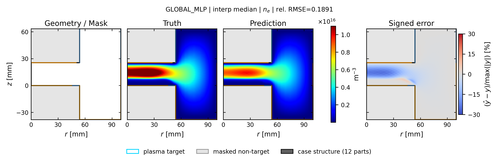
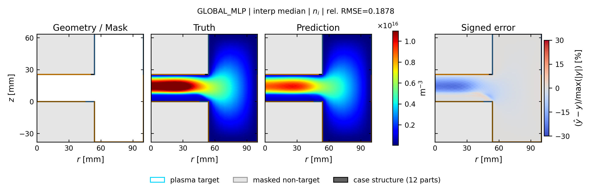
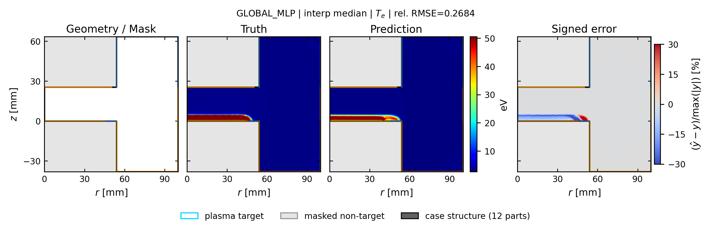
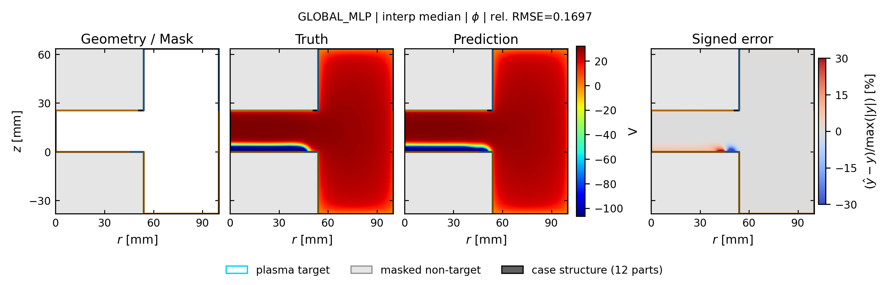

# global_mlp: spatial truth / prediction / error

[← 全モデルの集約へ](../index.md)

- validation-only representative seed: `413`
- run: `runs/gec_ccp_nn_operator_comparison_v1/seed_413/n78/global_mlp`
- 代表ケースは4物性の平均相対RMSEで best / p25 / median / p75 / worst を選択
- 各図は Structure / Mask、Truth、Prediction、Signed error の順
- Truth と Prediction は同じカラースケール

## interp: marginal補間

Signed error の表示範囲は `±30%`。飽和色はこの値以上の誤差を表します。

| 物性 | ケース数 | mean rel.RMSE | SD | median | min | max |
| --- | ---: | ---: | ---: | ---: | ---: | ---: |
| `ne` | 13 | 0.3161 | 0.2826 | 0.1921 | 0.0452 | 0.9423 |
| `ni` | 13 | 0.3115 | 0.2794 | 0.1878 | 0.0448 | 0.9325 |
| `Te` | 13 | 0.3408 | 0.2696 | 0.2684 | 0.0681 | 0.8993 |
| `phi` | 13 | 0.1764 | 0.1229 | 0.1697 | 0.0469 | 0.4783 |

### ne

| 代表位置 | case | rel.RMSE | 図 |
| --- | --- | ---: | --- |
| best | `case_td003_pa200_pp0_5_gamma_004__steady` | 0.0452 | [PNG](../publication_by_field/global_mlp/ne/interp/best_case_td003_pa200_pp0_5_gamma_004__steady_ne.png) / [PDF](../publication_by_field/global_mlp/ne/interp/best_case_td003_pa200_pp0_5_gamma_004__steady_ne.pdf) |
| p25 | `case_td003_pp0_3_gamma_004__steady` | 0.1502 | [PNG](../publication_by_field/global_mlp/ne/interp/p25_case_td003_pp0_3_gamma_004__steady_ne.png) / [PDF](../publication_by_field/global_mlp/ne/interp/p25_case_td003_pp0_3_gamma_004__steady_ne.pdf) |
| median | `case_td016_pa200_pp0_5_gamma_010__steady` | 0.1891 | [PNG](../publication_by_field/global_mlp/ne/interp/median_case_td016_pa200_pp0_5_gamma_010__steady_ne.png) / [PDF](../publication_by_field/global_mlp/ne/interp/median_case_td016_pa200_pp0_5_gamma_010__steady_ne.pdf) |
| p75 | `case_td016_pp0_1_gamma_007__steady` | 0.5844 | [PNG](../publication_by_field/global_mlp/ne/interp/p75_case_td016_pp0_1_gamma_007__steady_ne.png) / [PDF](../publication_by_field/global_mlp/ne/interp/p75_case_td016_pp0_1_gamma_007__steady_ne.pdf) |
| worst | `case_td003_pa200_pp0_1_gamma_010__steady` | 0.9423 | [PNG](../publication_by_field/global_mlp/ne/interp/worst_case_td003_pa200_pp0_1_gamma_010__steady_ne.png) / [PDF](../publication_by_field/global_mlp/ne/interp/worst_case_td003_pa200_pp0_1_gamma_010__steady_ne.pdf) |

### ni

| 代表位置 | case | rel.RMSE | 図 |
| --- | --- | ---: | --- |
| best | `case_td003_pa200_pp0_5_gamma_004__steady` | 0.0448 | [PNG](../publication_by_field/global_mlp/ni/interp/best_case_td003_pa200_pp0_5_gamma_004__steady_ni.png) / [PDF](../publication_by_field/global_mlp/ni/interp/best_case_td003_pa200_pp0_5_gamma_004__steady_ni.pdf) |
| p25 | `case_td003_pp0_3_gamma_004__steady` | 0.1495 | [PNG](../publication_by_field/global_mlp/ni/interp/p25_case_td003_pp0_3_gamma_004__steady_ni.png) / [PDF](../publication_by_field/global_mlp/ni/interp/p25_case_td003_pp0_3_gamma_004__steady_ni.pdf) |
| median | `case_td016_pa200_pp0_5_gamma_010__steady` | 0.1878 | [PNG](../publication_by_field/global_mlp/ni/interp/median_case_td016_pa200_pp0_5_gamma_010__steady_ni.png) / [PDF](../publication_by_field/global_mlp/ni/interp/median_case_td016_pa200_pp0_5_gamma_010__steady_ni.pdf) |
| p75 | `case_td016_pp0_1_gamma_007__steady` | 0.5762 | [PNG](../publication_by_field/global_mlp/ni/interp/p75_case_td016_pp0_1_gamma_007__steady_ni.png) / [PDF](../publication_by_field/global_mlp/ni/interp/p75_case_td016_pp0_1_gamma_007__steady_ni.pdf) |
| worst | `case_td003_pa200_pp0_1_gamma_010__steady` | 0.9325 | [PNG](../publication_by_field/global_mlp/ni/interp/worst_case_td003_pa200_pp0_1_gamma_010__steady_ni.png) / [PDF](../publication_by_field/global_mlp/ni/interp/worst_case_td003_pa200_pp0_1_gamma_010__steady_ni.pdf) |

### Te

| 代表位置 | case | rel.RMSE | 図 |
| --- | --- | ---: | --- |
| best | `case_td003_pa200_pp0_5_gamma_004__steady` | 0.0681 | [PNG](../publication_by_field/global_mlp/Te/interp/best_case_td003_pa200_pp0_5_gamma_004__steady_Te.png) / [PDF](../publication_by_field/global_mlp/Te/interp/best_case_td003_pa200_pp0_5_gamma_004__steady_Te.pdf) |
| p25 | `case_td003_pp0_3_gamma_004__steady` | 0.1276 | [PNG](../publication_by_field/global_mlp/Te/interp/p25_case_td003_pp0_3_gamma_004__steady_Te.png) / [PDF](../publication_by_field/global_mlp/Te/interp/p25_case_td003_pp0_3_gamma_004__steady_Te.pdf) |
| median | `case_td016_pa200_pp0_5_gamma_010__steady` | 0.2684 | [PNG](../publication_by_field/global_mlp/Te/interp/median_case_td016_pa200_pp0_5_gamma_010__steady_Te.png) / [PDF](../publication_by_field/global_mlp/Te/interp/median_case_td016_pa200_pp0_5_gamma_010__steady_Te.pdf) |
| p75 | `case_td016_pp0_1_gamma_007__steady` | 0.4973 | [PNG](../publication_by_field/global_mlp/Te/interp/p75_case_td016_pp0_1_gamma_007__steady_Te.png) / [PDF](../publication_by_field/global_mlp/Te/interp/p75_case_td016_pp0_1_gamma_007__steady_Te.pdf) |
| worst | `case_td003_pa200_pp0_1_gamma_010__steady` | 0.5774 | [PNG](../publication_by_field/global_mlp/Te/interp/worst_case_td003_pa200_pp0_1_gamma_010__steady_Te.png) / [PDF](../publication_by_field/global_mlp/Te/interp/worst_case_td003_pa200_pp0_1_gamma_010__steady_Te.pdf) |

### phi

| 代表位置 | case | rel.RMSE | 図 |
| --- | --- | ---: | --- |
| best | `case_td003_pa200_pp0_5_gamma_004__steady` | 0.0469 | [PNG](../publication_by_field/global_mlp/phi/interp/best_case_td003_pa200_pp0_5_gamma_004__steady_phi.png) / [PDF](../publication_by_field/global_mlp/phi/interp/best_case_td003_pa200_pp0_5_gamma_004__steady_phi.pdf) |
| p25 | `case_td003_pp0_3_gamma_004__steady` | 0.0804 | [PNG](../publication_by_field/global_mlp/phi/interp/p25_case_td003_pp0_3_gamma_004__steady_phi.png) / [PDF](../publication_by_field/global_mlp/phi/interp/p25_case_td003_pp0_3_gamma_004__steady_phi.pdf) |
| median | `case_td016_pa200_pp0_5_gamma_010__steady` | 0.1697 | [PNG](../publication_by_field/global_mlp/phi/interp/median_case_td016_pa200_pp0_5_gamma_010__steady_phi.png) / [PDF](../publication_by_field/global_mlp/phi/interp/median_case_td016_pa200_pp0_5_gamma_010__steady_phi.pdf) |
| p75 | `case_td016_pp0_1_gamma_007__steady` | 0.2000 | [PNG](../publication_by_field/global_mlp/phi/interp/p75_case_td016_pp0_1_gamma_007__steady_phi.png) / [PDF](../publication_by_field/global_mlp/phi/interp/p75_case_td016_pp0_1_gamma_007__steady_phi.pdf) |
| worst | `case_td003_pa200_pp0_1_gamma_010__steady` | 0.2317 | [PNG](../publication_by_field/global_mlp/phi/interp/worst_case_td003_pa200_pp0_1_gamma_010__steady_phi.png) / [PDF](../publication_by_field/global_mlp/phi/interp/worst_case_td003_pa200_pp0_1_gamma_010__steady_phi.pdf) |

