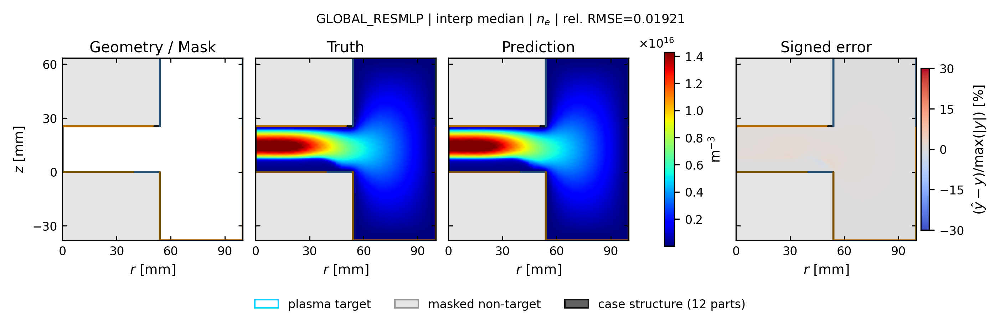
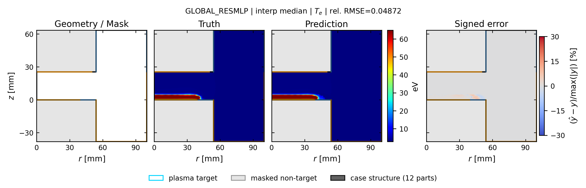
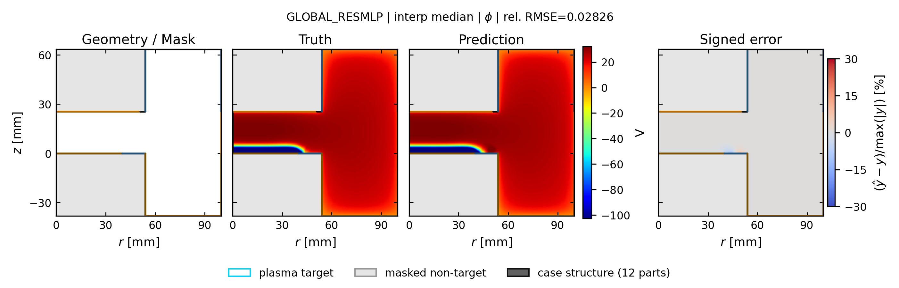

# global_resmlp: spatial truth / prediction / error

[← 全モデルの集約へ](../index.md)

- validation-only representative seed: `413`
- run: `runs/gec_ccp_nn_operator_comparison_v1/seed_413/n78/global_resmlp`
- 代表ケースは4物性の平均相対RMSEで best / p25 / median / p75 / worst を選択
- 各図は Structure / Mask、Truth、Prediction、Signed error の順
- Truth と Prediction は同じカラースケール

## interp: marginal補間

Signed error の表示範囲は `±30%`。飽和色はこの値以上の誤差を表します。

| 物性 | ケース数 | mean rel.RMSE | SD | median | min | max |
| --- | ---: | ---: | ---: | ---: | ---: | ---: |
| `ne` | 13 | 0.0275 | 0.0197 | 0.0192 | 0.0050 | 0.0562 |
| `ni` | 13 | 0.0274 | 0.0192 | 0.0190 | 0.0048 | 0.0550 |
| `Te` | 13 | 0.0448 | 0.0167 | 0.0447 | 0.0227 | 0.0809 |
| `phi` | 13 | 0.0188 | 0.0077 | 0.0183 | 0.0040 | 0.0332 |

### ne

| 代表位置 | case | rel.RMSE | 図 |
| --- | --- | ---: | --- |
| best | `case_td003_pa050_pp0_3_gamma_010__steady` | 0.0080 | [PNG](../publication_by_field/global_resmlp/ne/interp/best_case_td003_pa050_pp0_3_gamma_010__steady_ne.png) / [PDF](../publication_by_field/global_resmlp/ne/interp/best_case_td003_pa050_pp0_3_gamma_010__steady_ne.pdf) |
| p25 | `case_td030_pp0_1_gamma_004__steady` | 0.0141 | [PNG](../publication_by_field/global_resmlp/ne/interp/p25_case_td030_pp0_1_gamma_004__steady_ne.png) / [PDF](../publication_by_field/global_resmlp/ne/interp/p25_case_td030_pp0_1_gamma_004__steady_ne.pdf) |
| median | `case_td030_pa200_pp0_5_gamma_004__steady` | 0.0192 | [PNG](../publication_by_field/global_resmlp/ne/interp/median_case_td030_pa200_pp0_5_gamma_004__steady_ne.png) / [PDF](../publication_by_field/global_resmlp/ne/interp/median_case_td030_pa200_pp0_5_gamma_004__steady_ne.pdf) |
| p75 | `case_td003_pa200_pp0_1_gamma_010__steady` | 0.0322 | [PNG](../publication_by_field/global_resmlp/ne/interp/p75_case_td003_pa200_pp0_1_gamma_010__steady_ne.png) / [PDF](../publication_by_field/global_resmlp/ne/interp/p75_case_td003_pa200_pp0_1_gamma_010__steady_ne.pdf) |
| worst | `case_td030_pa200_pp0_1_gamma_004__steady` | 0.0562 | [PNG](../publication_by_field/global_resmlp/ne/interp/worst_case_td030_pa200_pp0_1_gamma_004__steady_ne.png) / [PDF](../publication_by_field/global_resmlp/ne/interp/worst_case_td030_pa200_pp0_1_gamma_004__steady_ne.pdf) |

### ni

| 代表位置 | case | rel.RMSE | 図 |
| --- | --- | ---: | --- |
| best | `case_td003_pa050_pp0_3_gamma_010__steady` | 0.0083 | [PNG](../publication_by_field/global_resmlp/ni/interp/best_case_td003_pa050_pp0_3_gamma_010__steady_ni.png) / [PDF](../publication_by_field/global_resmlp/ni/interp/best_case_td003_pa050_pp0_3_gamma_010__steady_ni.pdf) |
| p25 | `case_td030_pp0_1_gamma_004__steady` | 0.0150 | [PNG](../publication_by_field/global_resmlp/ni/interp/p25_case_td030_pp0_1_gamma_004__steady_ni.png) / [PDF](../publication_by_field/global_resmlp/ni/interp/p25_case_td030_pp0_1_gamma_004__steady_ni.pdf) |
| median | `case_td030_pa200_pp0_5_gamma_004__steady` | 0.0190 | [PNG](../publication_by_field/global_resmlp/ni/interp/median_case_td030_pa200_pp0_5_gamma_004__steady_ni.png) / [PDF](../publication_by_field/global_resmlp/ni/interp/median_case_td030_pa200_pp0_5_gamma_004__steady_ni.pdf) |
| p75 | `case_td003_pa200_pp0_1_gamma_010__steady` | 0.0326 | [PNG](../publication_by_field/global_resmlp/ni/interp/p75_case_td003_pa200_pp0_1_gamma_010__steady_ni.png) / [PDF](../publication_by_field/global_resmlp/ni/interp/p75_case_td003_pa200_pp0_1_gamma_010__steady_ni.pdf) |
| worst | `case_td030_pa200_pp0_1_gamma_004__steady` | 0.0550 | [PNG](../publication_by_field/global_resmlp/ni/interp/worst_case_td030_pa200_pp0_1_gamma_004__steady_ni.png) / [PDF](../publication_by_field/global_resmlp/ni/interp/worst_case_td030_pa200_pp0_1_gamma_004__steady_ni.pdf) |

### Te

| 代表位置 | case | rel.RMSE | 図 |
| --- | --- | ---: | --- |
| best | `case_td003_pa050_pp0_3_gamma_010__steady` | 0.0237 | [PNG](../publication_by_field/global_resmlp/Te/interp/best_case_td003_pa050_pp0_3_gamma_010__steady_Te.png) / [PDF](../publication_by_field/global_resmlp/Te/interp/best_case_td003_pa050_pp0_3_gamma_010__steady_Te.pdf) |
| p25 | `case_td030_pp0_1_gamma_004__steady` | 0.0336 | [PNG](../publication_by_field/global_resmlp/Te/interp/p25_case_td030_pp0_1_gamma_004__steady_Te.png) / [PDF](../publication_by_field/global_resmlp/Te/interp/p25_case_td030_pp0_1_gamma_004__steady_Te.pdf) |
| median | `case_td030_pa200_pp0_5_gamma_004__steady` | 0.0487 | [PNG](../publication_by_field/global_resmlp/Te/interp/median_case_td030_pa200_pp0_5_gamma_004__steady_Te.png) / [PDF](../publication_by_field/global_resmlp/Te/interp/median_case_td030_pa200_pp0_5_gamma_004__steady_Te.pdf) |
| p75 | `case_td003_pa200_pp0_1_gamma_010__steady` | 0.0809 | [PNG](../publication_by_field/global_resmlp/Te/interp/p75_case_td003_pa200_pp0_1_gamma_010__steady_Te.png) / [PDF](../publication_by_field/global_resmlp/Te/interp/p75_case_td003_pa200_pp0_1_gamma_010__steady_Te.pdf) |
| worst | `case_td030_pa200_pp0_1_gamma_004__steady` | 0.0709 | [PNG](../publication_by_field/global_resmlp/Te/interp/worst_case_td030_pa200_pp0_1_gamma_004__steady_Te.png) / [PDF](../publication_by_field/global_resmlp/Te/interp/worst_case_td030_pa200_pp0_1_gamma_004__steady_Te.pdf) |

### phi

| 代表位置 | case | rel.RMSE | 図 |
| --- | --- | ---: | --- |
| best | `case_td003_pa050_pp0_3_gamma_010__steady` | 0.0040 | [PNG](../publication_by_field/global_resmlp/phi/interp/best_case_td003_pa050_pp0_3_gamma_010__steady_phi.png) / [PDF](../publication_by_field/global_resmlp/phi/interp/best_case_td003_pa050_pp0_3_gamma_010__steady_phi.pdf) |
| p25 | `case_td030_pp0_1_gamma_004__steady` | 0.0126 | [PNG](../publication_by_field/global_resmlp/phi/interp/p25_case_td030_pp0_1_gamma_004__steady_phi.png) / [PDF](../publication_by_field/global_resmlp/phi/interp/p25_case_td030_pp0_1_gamma_004__steady_phi.pdf) |
| median | `case_td030_pa200_pp0_5_gamma_004__steady` | 0.0283 | [PNG](../publication_by_field/global_resmlp/phi/interp/median_case_td030_pa200_pp0_5_gamma_004__steady_phi.png) / [PDF](../publication_by_field/global_resmlp/phi/interp/median_case_td030_pa200_pp0_5_gamma_004__steady_phi.pdf) |
| p75 | `case_td003_pa200_pp0_1_gamma_010__steady` | 0.0151 | [PNG](../publication_by_field/global_resmlp/phi/interp/p75_case_td003_pa200_pp0_1_gamma_010__steady_phi.png) / [PDF](../publication_by_field/global_resmlp/phi/interp/p75_case_td003_pa200_pp0_1_gamma_010__steady_phi.pdf) |
| worst | `case_td030_pa200_pp0_1_gamma_004__steady` | 0.0332 | [PNG](../publication_by_field/global_resmlp/phi/interp/worst_case_td030_pa200_pp0_1_gamma_004__steady_phi.png) / [PDF](../publication_by_field/global_resmlp/phi/interp/worst_case_td030_pa200_pp0_1_gamma_004__steady_phi.pdf) |

