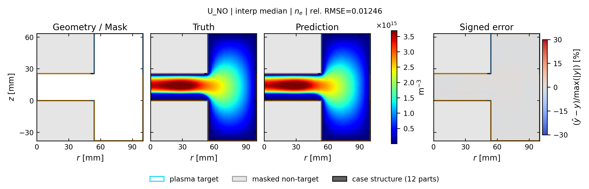
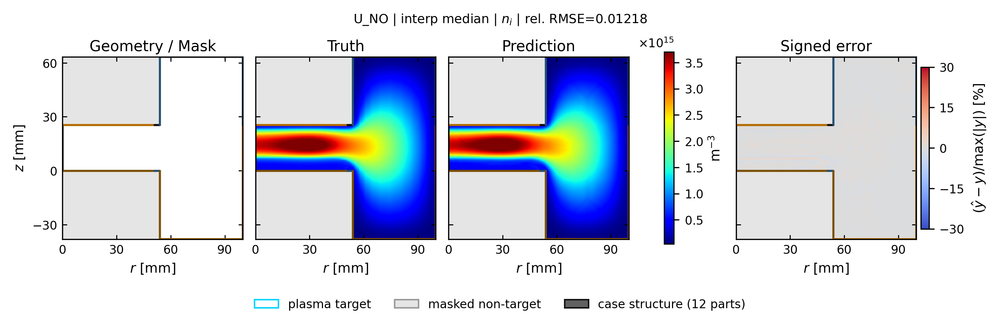
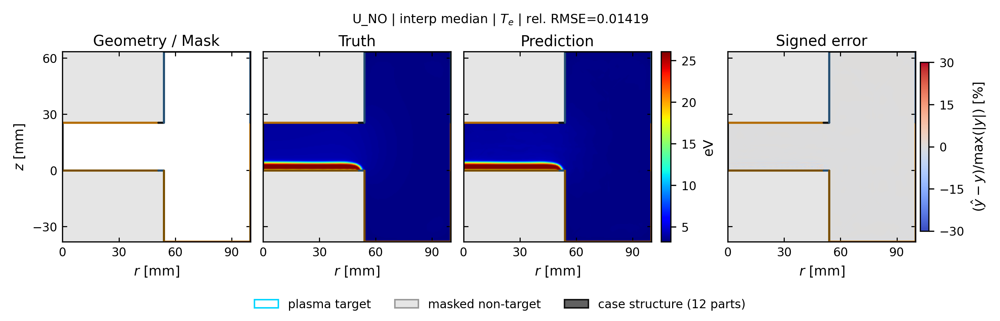
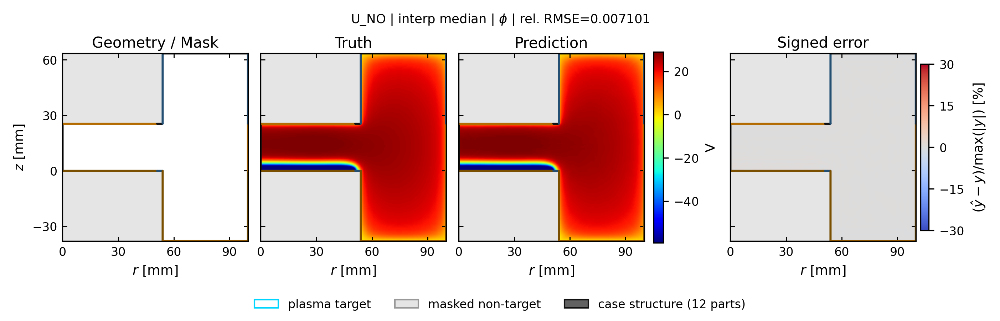

# u_no: spatial truth / prediction / error

[← 全モデルの集約へ](../index.md)

- validation-only representative seed: `413`
- run: `runs/gec_ccp_nn_operator_comparison_v1/seed_413/n78/u_no`
- 代表ケースは4物性の平均相対RMSEで best / p25 / median / p75 / worst を選択
- 各図は Structure / Mask、Truth、Prediction、Signed error の順
- Truth と Prediction は同じカラースケール

## interp: marginal補間

Signed error の表示範囲は `±30%`。飽和色はこの値以上の誤差を表します。

| 物性 | ケース数 | mean rel.RMSE | SD | median | min | max |
| --- | ---: | ---: | ---: | ---: | ---: | ---: |
| `ne` | 13 | 0.0115 | 0.0038 | 0.0125 | 0.0072 | 0.0185 |
| `ni` | 13 | 0.0111 | 0.0035 | 0.0122 | 0.0066 | 0.0160 |
| `Te` | 13 | 0.0161 | 0.0037 | 0.0152 | 0.0111 | 0.0227 |
| `phi` | 13 | 0.0068 | 0.0014 | 0.0071 | 0.0049 | 0.0093 |

### ne

| 代表位置 | case | rel.RMSE | 図 |
| --- | --- | ---: | --- |
| best | `case_td003_pp0_5_gamma_007__steady` | 0.0075 | [PNG](../publication_by_field/u_no/ne/interp/best_case_td003_pp0_5_gamma_007__steady_ne.png) / [PDF](../publication_by_field/u_no/ne/interp/best_case_td003_pp0_5_gamma_007__steady_ne.pdf) |
| p25 | `case_td003_pp0_3_gamma_004__steady` | 0.0080 | [PNG](../publication_by_field/u_no/ne/interp/p25_case_td003_pp0_3_gamma_004__steady_ne.png) / [PDF](../publication_by_field/u_no/ne/interp/p25_case_td003_pp0_3_gamma_004__steady_ne.pdf) |
| median | `case_td003_pa050_pp0_3_gamma_010__steady` | 0.0125 | [PNG](../publication_by_field/u_no/ne/interp/median_case_td003_pa050_pp0_3_gamma_010__steady_ne.png) / [PDF](../publication_by_field/u_no/ne/interp/median_case_td003_pa050_pp0_3_gamma_010__steady_ne.pdf) |
| p75 | `case_td030_pa050_pp0_1_gamma_007__steady` | 0.0185 | [PNG](../publication_by_field/u_no/ne/interp/p75_case_td030_pa050_pp0_1_gamma_007__steady_ne.png) / [PDF](../publication_by_field/u_no/ne/interp/p75_case_td030_pa050_pp0_1_gamma_007__steady_ne.pdf) |
| worst | `case_td030_pa200_pp0_1_gamma_004__steady` | 0.0157 | [PNG](../publication_by_field/u_no/ne/interp/worst_case_td030_pa200_pp0_1_gamma_004__steady_ne.png) / [PDF](../publication_by_field/u_no/ne/interp/worst_case_td030_pa200_pp0_1_gamma_004__steady_ne.pdf) |

### ni

| 代表位置 | case | rel.RMSE | 図 |
| --- | --- | ---: | --- |
| best | `case_td003_pp0_5_gamma_007__steady` | 0.0066 | [PNG](../publication_by_field/u_no/ni/interp/best_case_td003_pp0_5_gamma_007__steady_ni.png) / [PDF](../publication_by_field/u_no/ni/interp/best_case_td003_pp0_5_gamma_007__steady_ni.pdf) |
| p25 | `case_td003_pp0_3_gamma_004__steady` | 0.0083 | [PNG](../publication_by_field/u_no/ni/interp/p25_case_td003_pp0_3_gamma_004__steady_ni.png) / [PDF](../publication_by_field/u_no/ni/interp/p25_case_td003_pp0_3_gamma_004__steady_ni.pdf) |
| median | `case_td003_pa050_pp0_3_gamma_010__steady` | 0.0122 | [PNG](../publication_by_field/u_no/ni/interp/median_case_td003_pa050_pp0_3_gamma_010__steady_ni.png) / [PDF](../publication_by_field/u_no/ni/interp/median_case_td003_pa050_pp0_3_gamma_010__steady_ni.pdf) |
| p75 | `case_td030_pa050_pp0_1_gamma_007__steady` | 0.0156 | [PNG](../publication_by_field/u_no/ni/interp/p75_case_td030_pa050_pp0_1_gamma_007__steady_ni.png) / [PDF](../publication_by_field/u_no/ni/interp/p75_case_td030_pa050_pp0_1_gamma_007__steady_ni.pdf) |
| worst | `case_td030_pa200_pp0_1_gamma_004__steady` | 0.0152 | [PNG](../publication_by_field/u_no/ni/interp/worst_case_td030_pa200_pp0_1_gamma_004__steady_ni.png) / [PDF](../publication_by_field/u_no/ni/interp/worst_case_td030_pa200_pp0_1_gamma_004__steady_ni.pdf) |

### Te

| 代表位置 | case | rel.RMSE | 図 |
| --- | --- | ---: | --- |
| best | `case_td003_pp0_5_gamma_007__steady` | 0.0113 | [PNG](../publication_by_field/u_no/Te/interp/best_case_td003_pp0_5_gamma_007__steady_Te.png) / [PDF](../publication_by_field/u_no/Te/interp/best_case_td003_pp0_5_gamma_007__steady_Te.pdf) |
| p25 | `case_td003_pp0_3_gamma_004__steady` | 0.0152 | [PNG](../publication_by_field/u_no/Te/interp/p25_case_td003_pp0_3_gamma_004__steady_Te.png) / [PDF](../publication_by_field/u_no/Te/interp/p25_case_td003_pp0_3_gamma_004__steady_Te.pdf) |
| median | `case_td003_pa050_pp0_3_gamma_010__steady` | 0.0142 | [PNG](../publication_by_field/u_no/Te/interp/median_case_td003_pa050_pp0_3_gamma_010__steady_Te.png) / [PDF](../publication_by_field/u_no/Te/interp/median_case_td003_pa050_pp0_3_gamma_010__steady_Te.pdf) |
| p75 | `case_td030_pa050_pp0_1_gamma_007__steady` | 0.0111 | [PNG](../publication_by_field/u_no/Te/interp/p75_case_td030_pa050_pp0_1_gamma_007__steady_Te.png) / [PDF](../publication_by_field/u_no/Te/interp/p75_case_td030_pa050_pp0_1_gamma_007__steady_Te.pdf) |
| worst | `case_td030_pa200_pp0_1_gamma_004__steady` | 0.0196 | [PNG](../publication_by_field/u_no/Te/interp/worst_case_td030_pa200_pp0_1_gamma_004__steady_Te.png) / [PDF](../publication_by_field/u_no/Te/interp/worst_case_td030_pa200_pp0_1_gamma_004__steady_Te.pdf) |

### phi

| 代表位置 | case | rel.RMSE | 図 |
| --- | --- | ---: | --- |
| best | `case_td003_pp0_5_gamma_007__steady` | 0.0049 | [PNG](../publication_by_field/u_no/phi/interp/best_case_td003_pp0_5_gamma_007__steady_phi.png) / [PDF](../publication_by_field/u_no/phi/interp/best_case_td003_pp0_5_gamma_007__steady_phi.pdf) |
| p25 | `case_td003_pp0_3_gamma_004__steady` | 0.0058 | [PNG](../publication_by_field/u_no/phi/interp/p25_case_td003_pp0_3_gamma_004__steady_phi.png) / [PDF](../publication_by_field/u_no/phi/interp/p25_case_td003_pp0_3_gamma_004__steady_phi.pdf) |
| median | `case_td003_pa050_pp0_3_gamma_010__steady` | 0.0071 | [PNG](../publication_by_field/u_no/phi/interp/median_case_td003_pa050_pp0_3_gamma_010__steady_phi.png) / [PDF](../publication_by_field/u_no/phi/interp/median_case_td003_pa050_pp0_3_gamma_010__steady_phi.pdf) |
| p75 | `case_td030_pa050_pp0_1_gamma_007__steady` | 0.0074 | [PNG](../publication_by_field/u_no/phi/interp/p75_case_td030_pa050_pp0_1_gamma_007__steady_phi.png) / [PDF](../publication_by_field/u_no/phi/interp/p75_case_td030_pa050_pp0_1_gamma_007__steady_phi.pdf) |
| worst | `case_td030_pa200_pp0_1_gamma_004__steady` | 0.0088 | [PNG](../publication_by_field/u_no/phi/interp/worst_case_td030_pa200_pp0_1_gamma_004__steady_phi.png) / [PDF](../publication_by_field/u_no/phi/interp/worst_case_td030_pa200_pp0_1_gamma_004__steady_phi.pdf) |

