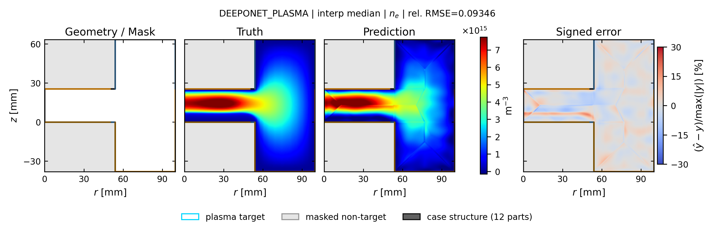
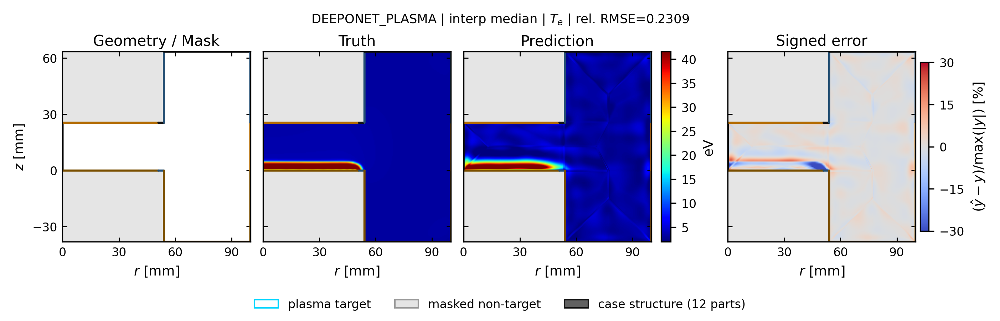
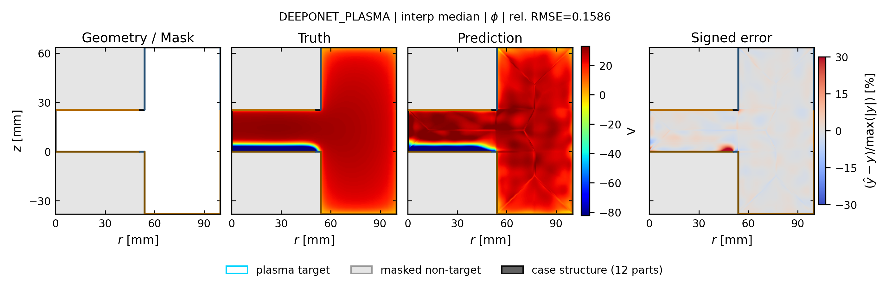

# deeponet_plasma: spatial truth / prediction / error

[← 全モデルの集約へ](../index.md)

- validation-only representative seed: `412`
- run: `runs/gec_ccp_nn_operator_comparison_v2_single_run_additions/seed_412/n78/deeponet_plasma`
- 代表ケースは4物性の平均相対RMSEで best / p25 / median / p75 / worst を選択
- 各図は Structure / Mask、Truth、Prediction、Signed error の順
- Truth と Prediction は同じカラースケール

## interp: marginal補間

Signed error の表示範囲は `±30%`。飽和色はこの値以上の誤差を表します。

| 物性 | ケース数 | mean rel.RMSE | SD | median | min | max |
| --- | ---: | ---: | ---: | ---: | ---: | ---: |
| `ne` | 13 | 0.1399 | 0.0561 | 0.1293 | 0.0872 | 0.2587 |
| `ni` | 13 | 0.1266 | 0.0478 | 0.1259 | 0.0789 | 0.2129 |
| `Te` | 13 | 0.2109 | 0.0454 | 0.2089 | 0.1476 | 0.2971 |
| `phi` | 13 | 0.1302 | 0.0230 | 0.1239 | 0.1013 | 0.1743 |

### ne

| 代表位置 | case | rel.RMSE | 図 |
| --- | --- | ---: | --- |
| best | `case_td003_pa050_pp0_3_gamma_010__steady` | 0.1042 | [PNG](../publication_by_field/deeponet_plasma/ne/interp/best_case_td003_pa050_pp0_3_gamma_010__steady_ne.png) / [PDF](../publication_by_field/deeponet_plasma/ne/interp/best_case_td003_pa050_pp0_3_gamma_010__steady_ne.pdf) |
| p25 | `case_td016_pp0_1_gamma_007__steady` | 0.1293 | [PNG](../publication_by_field/deeponet_plasma/ne/interp/p25_case_td016_pp0_1_gamma_007__steady_ne.png) / [PDF](../publication_by_field/deeponet_plasma/ne/interp/p25_case_td016_pp0_1_gamma_007__steady_ne.pdf) |
| median | `case_td003_pp0_5_gamma_007__steady` | 0.0935 | [PNG](../publication_by_field/deeponet_plasma/ne/interp/median_case_td003_pp0_5_gamma_007__steady_ne.png) / [PDF](../publication_by_field/deeponet_plasma/ne/interp/median_case_td003_pp0_5_gamma_007__steady_ne.pdf) |
| p75 | `case_td003_pa200_pp0_5_gamma_004__steady` | 0.1040 | [PNG](../publication_by_field/deeponet_plasma/ne/interp/p75_case_td003_pa200_pp0_5_gamma_004__steady_ne.png) / [PDF](../publication_by_field/deeponet_plasma/ne/interp/p75_case_td003_pa200_pp0_5_gamma_004__steady_ne.pdf) |
| worst | `case_td030_pa200_pp0_1_gamma_004__steady` | 0.2587 | [PNG](../publication_by_field/deeponet_plasma/ne/interp/worst_case_td030_pa200_pp0_1_gamma_004__steady_ne.png) / [PDF](../publication_by_field/deeponet_plasma/ne/interp/worst_case_td030_pa200_pp0_1_gamma_004__steady_ne.pdf) |

### ni

| 代表位置 | case | rel.RMSE | 図 |
| --- | --- | ---: | --- |
| best | `case_td003_pa050_pp0_3_gamma_010__steady` | 0.0932 | [PNG](../publication_by_field/deeponet_plasma/ni/interp/best_case_td003_pa050_pp0_3_gamma_010__steady_ni.png) / [PDF](../publication_by_field/deeponet_plasma/ni/interp/best_case_td003_pa050_pp0_3_gamma_010__steady_ni.pdf) |
| p25 | `case_td016_pp0_1_gamma_007__steady` | 0.1310 | [PNG](../publication_by_field/deeponet_plasma/ni/interp/p25_case_td016_pp0_1_gamma_007__steady_ni.png) / [PDF](../publication_by_field/deeponet_plasma/ni/interp/p25_case_td016_pp0_1_gamma_007__steady_ni.pdf) |
| median | `case_td003_pp0_5_gamma_007__steady` | 0.0825 | [PNG](../publication_by_field/deeponet_plasma/ni/interp/median_case_td003_pp0_5_gamma_007__steady_ni.png) / [PDF](../publication_by_field/deeponet_plasma/ni/interp/median_case_td003_pp0_5_gamma_007__steady_ni.pdf) |
| p75 | `case_td003_pa200_pp0_5_gamma_004__steady` | 0.0944 | [PNG](../publication_by_field/deeponet_plasma/ni/interp/p75_case_td003_pa200_pp0_5_gamma_004__steady_ni.png) / [PDF](../publication_by_field/deeponet_plasma/ni/interp/p75_case_td003_pa200_pp0_5_gamma_004__steady_ni.pdf) |
| worst | `case_td030_pa200_pp0_1_gamma_004__steady` | 0.2129 | [PNG](../publication_by_field/deeponet_plasma/ni/interp/worst_case_td030_pa200_pp0_1_gamma_004__steady_ni.png) / [PDF](../publication_by_field/deeponet_plasma/ni/interp/worst_case_td030_pa200_pp0_1_gamma_004__steady_ni.pdf) |

### Te

| 代表位置 | case | rel.RMSE | 図 |
| --- | --- | ---: | --- |
| best | `case_td003_pa050_pp0_3_gamma_010__steady` | 0.1744 | [PNG](../publication_by_field/deeponet_plasma/Te/interp/best_case_td003_pa050_pp0_3_gamma_010__steady_Te.png) / [PDF](../publication_by_field/deeponet_plasma/Te/interp/best_case_td003_pa050_pp0_3_gamma_010__steady_Te.pdf) |
| p25 | `case_td016_pp0_1_gamma_007__steady` | 0.1476 | [PNG](../publication_by_field/deeponet_plasma/Te/interp/p25_case_td016_pp0_1_gamma_007__steady_Te.png) / [PDF](../publication_by_field/deeponet_plasma/Te/interp/p25_case_td016_pp0_1_gamma_007__steady_Te.pdf) |
| median | `case_td003_pp0_5_gamma_007__steady` | 0.2309 | [PNG](../publication_by_field/deeponet_plasma/Te/interp/median_case_td003_pp0_5_gamma_007__steady_Te.png) / [PDF](../publication_by_field/deeponet_plasma/Te/interp/median_case_td003_pp0_5_gamma_007__steady_Te.pdf) |
| p75 | `case_td003_pa200_pp0_5_gamma_004__steady` | 0.2686 | [PNG](../publication_by_field/deeponet_plasma/Te/interp/p75_case_td003_pa200_pp0_5_gamma_004__steady_Te.png) / [PDF](../publication_by_field/deeponet_plasma/Te/interp/p75_case_td003_pa200_pp0_5_gamma_004__steady_Te.pdf) |
| worst | `case_td030_pa200_pp0_1_gamma_004__steady` | 0.2418 | [PNG](../publication_by_field/deeponet_plasma/Te/interp/worst_case_td030_pa200_pp0_1_gamma_004__steady_Te.png) / [PDF](../publication_by_field/deeponet_plasma/Te/interp/worst_case_td030_pa200_pp0_1_gamma_004__steady_Te.pdf) |

### phi

| 代表位置 | case | rel.RMSE | 図 |
| --- | --- | ---: | --- |
| best | `case_td003_pa050_pp0_3_gamma_010__steady` | 0.1239 | [PNG](../publication_by_field/deeponet_plasma/phi/interp/best_case_td003_pa050_pp0_3_gamma_010__steady_phi.png) / [PDF](../publication_by_field/deeponet_plasma/phi/interp/best_case_td003_pa050_pp0_3_gamma_010__steady_phi.pdf) |
| p25 | `case_td016_pp0_1_gamma_007__steady` | 0.1013 | [PNG](../publication_by_field/deeponet_plasma/phi/interp/p25_case_td016_pp0_1_gamma_007__steady_phi.png) / [PDF](../publication_by_field/deeponet_plasma/phi/interp/p25_case_td016_pp0_1_gamma_007__steady_phi.pdf) |
| median | `case_td003_pp0_5_gamma_007__steady` | 0.1586 | [PNG](../publication_by_field/deeponet_plasma/phi/interp/median_case_td003_pp0_5_gamma_007__steady_phi.png) / [PDF](../publication_by_field/deeponet_plasma/phi/interp/median_case_td003_pp0_5_gamma_007__steady_phi.pdf) |
| p75 | `case_td003_pa200_pp0_5_gamma_004__steady` | 0.1743 | [PNG](../publication_by_field/deeponet_plasma/phi/interp/p75_case_td003_pa200_pp0_5_gamma_004__steady_phi.png) / [PDF](../publication_by_field/deeponet_plasma/phi/interp/p75_case_td003_pa200_pp0_5_gamma_004__steady_phi.pdf) |
| worst | `case_td030_pa200_pp0_1_gamma_004__steady` | 0.1323 | [PNG](../publication_by_field/deeponet_plasma/phi/interp/worst_case_td030_pa200_pp0_1_gamma_004__steady_phi.png) / [PDF](../publication_by_field/deeponet_plasma/phi/interp/worst_case_td030_pa200_pp0_1_gamma_004__steady_phi.pdf) |

