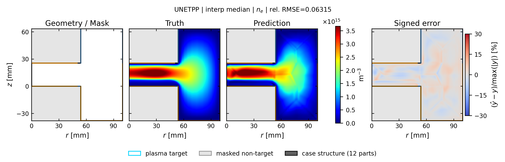
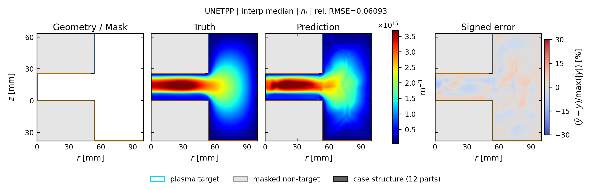
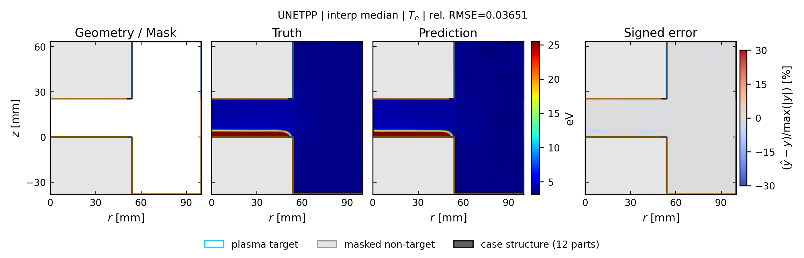
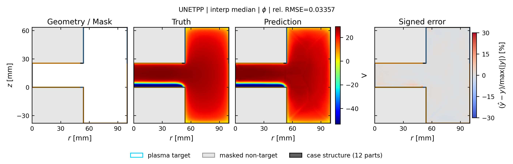

# unetpp: spatial truth / prediction / error

[← 全モデルの集約へ](../index.md)

- validation-only representative seed: `412`
- run: `runs/gec_ccp_nn_operator_comparison_v2_single_run_additions/seed_412/n78/unetpp`
- 代表ケースは4物性の平均相対RMSEで best / p25 / median / p75 / worst を選択
- 各図は Structure / Mask、Truth、Prediction、Signed error の順
- Truth と Prediction は同じカラースケール

## interp: marginal補間

Signed error の表示範囲は `±30%`。飽和色はこの値以上の誤差を表します。

| 物性 | ケース数 | mean rel.RMSE | SD | median | min | max |
| --- | ---: | ---: | ---: | ---: | ---: | ---: |
| `ne` | 13 | 0.0650 | 0.0244 | 0.0631 | 0.0361 | 0.1038 |
| `ni` | 13 | 0.0679 | 0.0279 | 0.0609 | 0.0356 | 0.1115 |
| `Te` | 13 | 0.0489 | 0.0123 | 0.0457 | 0.0362 | 0.0806 |
| `phi` | 13 | 0.0351 | 0.0065 | 0.0336 | 0.0258 | 0.0481 |

### ne

| 代表位置 | case | rel.RMSE | 図 |
| --- | --- | ---: | --- |
| best | `case_td003_pp0_5_gamma_007__steady` | 0.0405 | [PNG](../publication_by_field/unetpp/ne/interp/best_case_td003_pp0_5_gamma_007__steady_ne.png) / [PDF](../publication_by_field/unetpp/ne/interp/best_case_td003_pp0_5_gamma_007__steady_ne.pdf) |
| p25 | `case_td003_pp0_3_gamma_004__steady` | 0.0481 | [PNG](../publication_by_field/unetpp/ne/interp/p25_case_td003_pp0_3_gamma_004__steady_ne.png) / [PDF](../publication_by_field/unetpp/ne/interp/p25_case_td003_pp0_3_gamma_004__steady_ne.pdf) |
| median | `case_td003_pa050_pp0_3_gamma_010__steady` | 0.0631 | [PNG](../publication_by_field/unetpp/ne/interp/median_case_td003_pa050_pp0_3_gamma_010__steady_ne.png) / [PDF](../publication_by_field/unetpp/ne/interp/median_case_td003_pa050_pp0_3_gamma_010__steady_ne.pdf) |
| p75 | `case_td030_pp0_1_gamma_004__steady` | 0.0889 | [PNG](../publication_by_field/unetpp/ne/interp/p75_case_td030_pp0_1_gamma_004__steady_ne.png) / [PDF](../publication_by_field/unetpp/ne/interp/p75_case_td030_pp0_1_gamma_004__steady_ne.pdf) |
| worst | `case_td030_pa050_pp0_1_gamma_007__steady` | 0.1038 | [PNG](../publication_by_field/unetpp/ne/interp/worst_case_td030_pa050_pp0_1_gamma_007__steady_ne.png) / [PDF](../publication_by_field/unetpp/ne/interp/worst_case_td030_pa050_pp0_1_gamma_007__steady_ne.pdf) |

### ni

| 代表位置 | case | rel.RMSE | 図 |
| --- | --- | ---: | --- |
| best | `case_td003_pp0_5_gamma_007__steady` | 0.0395 | [PNG](../publication_by_field/unetpp/ni/interp/best_case_td003_pp0_5_gamma_007__steady_ni.png) / [PDF](../publication_by_field/unetpp/ni/interp/best_case_td003_pp0_5_gamma_007__steady_ni.pdf) |
| p25 | `case_td003_pp0_3_gamma_004__steady` | 0.0508 | [PNG](../publication_by_field/unetpp/ni/interp/p25_case_td003_pp0_3_gamma_004__steady_ni.png) / [PDF](../publication_by_field/unetpp/ni/interp/p25_case_td003_pp0_3_gamma_004__steady_ni.pdf) |
| median | `case_td003_pa050_pp0_3_gamma_010__steady` | 0.0609 | [PNG](../publication_by_field/unetpp/ni/interp/median_case_td003_pa050_pp0_3_gamma_010__steady_ni.png) / [PDF](../publication_by_field/unetpp/ni/interp/median_case_td003_pa050_pp0_3_gamma_010__steady_ni.pdf) |
| p75 | `case_td030_pp0_1_gamma_004__steady` | 0.0968 | [PNG](../publication_by_field/unetpp/ni/interp/p75_case_td030_pp0_1_gamma_004__steady_ni.png) / [PDF](../publication_by_field/unetpp/ni/interp/p75_case_td030_pp0_1_gamma_004__steady_ni.pdf) |
| worst | `case_td030_pa050_pp0_1_gamma_007__steady` | 0.1115 | [PNG](../publication_by_field/unetpp/ni/interp/worst_case_td030_pa050_pp0_1_gamma_007__steady_ni.png) / [PDF](../publication_by_field/unetpp/ni/interp/worst_case_td030_pa050_pp0_1_gamma_007__steady_ni.pdf) |

### Te

| 代表位置 | case | rel.RMSE | 図 |
| --- | --- | ---: | --- |
| best | `case_td003_pp0_5_gamma_007__steady` | 0.0362 | [PNG](../publication_by_field/unetpp/Te/interp/best_case_td003_pp0_5_gamma_007__steady_Te.png) / [PDF](../publication_by_field/unetpp/Te/interp/best_case_td003_pp0_5_gamma_007__steady_Te.pdf) |
| p25 | `case_td003_pp0_3_gamma_004__steady` | 0.0440 | [PNG](../publication_by_field/unetpp/Te/interp/p25_case_td003_pp0_3_gamma_004__steady_Te.png) / [PDF](../publication_by_field/unetpp/Te/interp/p25_case_td003_pp0_3_gamma_004__steady_Te.pdf) |
| median | `case_td003_pa050_pp0_3_gamma_010__steady` | 0.0365 | [PNG](../publication_by_field/unetpp/Te/interp/median_case_td003_pa050_pp0_3_gamma_010__steady_Te.png) / [PDF](../publication_by_field/unetpp/Te/interp/median_case_td003_pa050_pp0_3_gamma_010__steady_Te.pdf) |
| p75 | `case_td030_pp0_1_gamma_004__steady` | 0.0510 | [PNG](../publication_by_field/unetpp/Te/interp/p75_case_td030_pp0_1_gamma_004__steady_Te.png) / [PDF](../publication_by_field/unetpp/Te/interp/p75_case_td030_pp0_1_gamma_004__steady_Te.pdf) |
| worst | `case_td030_pa050_pp0_1_gamma_007__steady` | 0.0426 | [PNG](../publication_by_field/unetpp/Te/interp/worst_case_td030_pa050_pp0_1_gamma_007__steady_Te.png) / [PDF](../publication_by_field/unetpp/Te/interp/worst_case_td030_pa050_pp0_1_gamma_007__steady_Te.pdf) |

### phi

| 代表位置 | case | rel.RMSE | 図 |
| --- | --- | ---: | --- |
| best | `case_td003_pp0_5_gamma_007__steady` | 0.0299 | [PNG](../publication_by_field/unetpp/phi/interp/best_case_td003_pp0_5_gamma_007__steady_phi.png) / [PDF](../publication_by_field/unetpp/phi/interp/best_case_td003_pp0_5_gamma_007__steady_phi.pdf) |
| p25 | `case_td003_pp0_3_gamma_004__steady` | 0.0313 | [PNG](../publication_by_field/unetpp/phi/interp/p25_case_td003_pp0_3_gamma_004__steady_phi.png) / [PDF](../publication_by_field/unetpp/phi/interp/p25_case_td003_pp0_3_gamma_004__steady_phi.pdf) |
| median | `case_td003_pa050_pp0_3_gamma_010__steady` | 0.0336 | [PNG](../publication_by_field/unetpp/phi/interp/median_case_td003_pa050_pp0_3_gamma_010__steady_phi.png) / [PDF](../publication_by_field/unetpp/phi/interp/median_case_td003_pa050_pp0_3_gamma_010__steady_phi.pdf) |
| p75 | `case_td030_pp0_1_gamma_004__steady` | 0.0360 | [PNG](../publication_by_field/unetpp/phi/interp/p75_case_td030_pp0_1_gamma_004__steady_phi.png) / [PDF](../publication_by_field/unetpp/phi/interp/p75_case_td030_pp0_1_gamma_004__steady_phi.pdf) |
| worst | `case_td030_pa050_pp0_1_gamma_007__steady` | 0.0381 | [PNG](../publication_by_field/unetpp/phi/interp/worst_case_td030_pa050_pp0_1_gamma_007__steady_phi.png) / [PDF](../publication_by_field/unetpp/phi/interp/worst_case_td030_pa050_pp0_1_gamma_007__steady_phi.pdf) |

