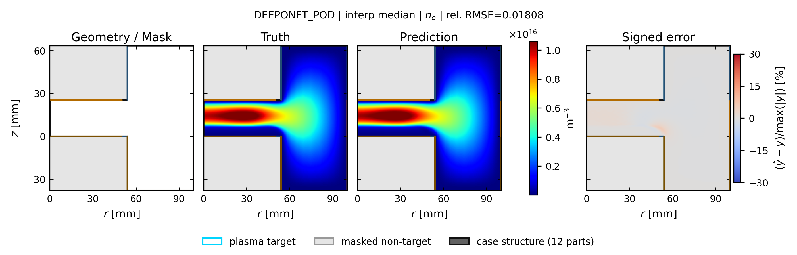
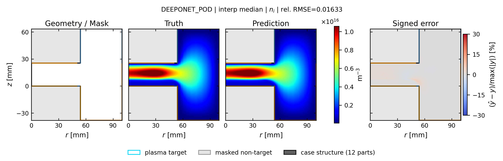
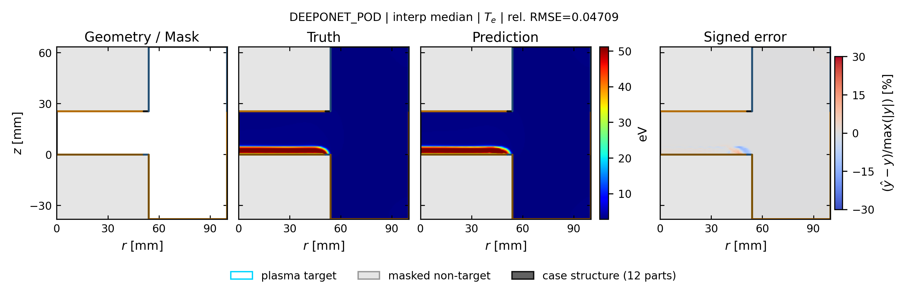
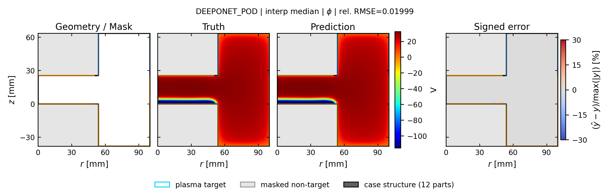

# deeponet_pod: spatial truth / prediction / error

[← 全モデルの集約へ](../index.md)

- validation-only representative seed: `412`
- run: `runs/gec_ccp_pod_branch_tuned_v2/final/seed_412/n78/deeponet_pod`
- 代表ケースは4物性の平均相対RMSEで best / p25 / median / p75 / worst を選択
- 各図は Structure / Mask、Truth、Prediction、Signed error の順
- Truth と Prediction は同じカラースケール

## interp: marginal補間

Signed error の表示範囲は `±30%`。飽和色はこの値以上の誤差を表します。

| 物性 | ケース数 | mean rel.RMSE | SD | median | min | max |
| --- | ---: | ---: | ---: | ---: | ---: | ---: |
| `ne` | 13 | 0.0294 | 0.0167 | 0.0211 | 0.0098 | 0.0628 |
| `ni` | 13 | 0.0260 | 0.0148 | 0.0211 | 0.0097 | 0.0538 |
| `Te` | 13 | 0.0437 | 0.0207 | 0.0364 | 0.0199 | 0.0898 |
| `phi` | 13 | 0.0152 | 0.0066 | 0.0143 | 0.0081 | 0.0321 |

### ne

| 代表位置 | case | rel.RMSE | 図 |
| --- | --- | ---: | --- |
| best | `case_td030_pa200_pp0_5_gamma_004__steady` | 0.0174 | [PNG](../publication_by_field/deeponet_pod/ne/interp/best_case_td030_pa200_pp0_5_gamma_004__steady_ne.png) / [PDF](../publication_by_field/deeponet_pod/ne/interp/best_case_td030_pa200_pp0_5_gamma_004__steady_ne.pdf) |
| p25 | `case_td016_pa200_pp0_3_gamma_010__steady` | 0.0210 | [PNG](../publication_by_field/deeponet_pod/ne/interp/p25_case_td016_pa200_pp0_3_gamma_010__steady_ne.png) / [PDF](../publication_by_field/deeponet_pod/ne/interp/p25_case_td016_pa200_pp0_3_gamma_010__steady_ne.pdf) |
| median | `case_td003_pa200_pp0_5_gamma_004__steady` | 0.0181 | [PNG](../publication_by_field/deeponet_pod/ne/interp/median_case_td003_pa200_pp0_5_gamma_004__steady_ne.png) / [PDF](../publication_by_field/deeponet_pod/ne/interp/median_case_td003_pa200_pp0_5_gamma_004__steady_ne.pdf) |
| p75 | `case_td030_pa050_pp0_1_gamma_007__steady` | 0.0628 | [PNG](../publication_by_field/deeponet_pod/ne/interp/p75_case_td030_pa050_pp0_1_gamma_007__steady_ne.png) / [PDF](../publication_by_field/deeponet_pod/ne/interp/p75_case_td030_pa050_pp0_1_gamma_007__steady_ne.pdf) |
| worst | `case_td003_pa200_pp0_1_gamma_010__steady` | 0.0495 | [PNG](../publication_by_field/deeponet_pod/ne/interp/worst_case_td003_pa200_pp0_1_gamma_010__steady_ne.png) / [PDF](../publication_by_field/deeponet_pod/ne/interp/worst_case_td003_pa200_pp0_1_gamma_010__steady_ne.pdf) |

### ni

| 代表位置 | case | rel.RMSE | 図 |
| --- | --- | ---: | --- |
| best | `case_td030_pa200_pp0_5_gamma_004__steady` | 0.0097 | [PNG](../publication_by_field/deeponet_pod/ni/interp/best_case_td030_pa200_pp0_5_gamma_004__steady_ni.png) / [PDF](../publication_by_field/deeponet_pod/ni/interp/best_case_td030_pa200_pp0_5_gamma_004__steady_ni.pdf) |
| p25 | `case_td016_pa200_pp0_3_gamma_010__steady` | 0.0172 | [PNG](../publication_by_field/deeponet_pod/ni/interp/p25_case_td016_pa200_pp0_3_gamma_010__steady_ni.png) / [PDF](../publication_by_field/deeponet_pod/ni/interp/p25_case_td016_pa200_pp0_3_gamma_010__steady_ni.pdf) |
| median | `case_td003_pa200_pp0_5_gamma_004__steady` | 0.0163 | [PNG](../publication_by_field/deeponet_pod/ni/interp/median_case_td003_pa200_pp0_5_gamma_004__steady_ni.png) / [PDF](../publication_by_field/deeponet_pod/ni/interp/median_case_td003_pa200_pp0_5_gamma_004__steady_ni.pdf) |
| p75 | `case_td030_pa050_pp0_1_gamma_007__steady` | 0.0256 | [PNG](../publication_by_field/deeponet_pod/ni/interp/p75_case_td030_pa050_pp0_1_gamma_007__steady_ni.png) / [PDF](../publication_by_field/deeponet_pod/ni/interp/p75_case_td030_pa050_pp0_1_gamma_007__steady_ni.pdf) |
| worst | `case_td003_pa200_pp0_1_gamma_010__steady` | 0.0538 | [PNG](../publication_by_field/deeponet_pod/ni/interp/worst_case_td003_pa200_pp0_1_gamma_010__steady_ni.png) / [PDF](../publication_by_field/deeponet_pod/ni/interp/worst_case_td003_pa200_pp0_1_gamma_010__steady_ni.pdf) |

### Te

| 代表位置 | case | rel.RMSE | 図 |
| --- | --- | ---: | --- |
| best | `case_td030_pa200_pp0_5_gamma_004__steady` | 0.0199 | [PNG](../publication_by_field/deeponet_pod/Te/interp/best_case_td030_pa200_pp0_5_gamma_004__steady_Te.png) / [PDF](../publication_by_field/deeponet_pod/Te/interp/best_case_td030_pa200_pp0_5_gamma_004__steady_Te.pdf) |
| p25 | `case_td016_pa200_pp0_3_gamma_010__steady` | 0.0242 | [PNG](../publication_by_field/deeponet_pod/Te/interp/p25_case_td016_pa200_pp0_3_gamma_010__steady_Te.png) / [PDF](../publication_by_field/deeponet_pod/Te/interp/p25_case_td016_pa200_pp0_3_gamma_010__steady_Te.pdf) |
| median | `case_td003_pa200_pp0_5_gamma_004__steady` | 0.0471 | [PNG](../publication_by_field/deeponet_pod/Te/interp/median_case_td003_pa200_pp0_5_gamma_004__steady_Te.png) / [PDF](../publication_by_field/deeponet_pod/Te/interp/median_case_td003_pa200_pp0_5_gamma_004__steady_Te.pdf) |
| p75 | `case_td030_pa050_pp0_1_gamma_007__steady` | 0.0364 | [PNG](../publication_by_field/deeponet_pod/Te/interp/p75_case_td030_pa050_pp0_1_gamma_007__steady_Te.png) / [PDF](../publication_by_field/deeponet_pod/Te/interp/p75_case_td030_pa050_pp0_1_gamma_007__steady_Te.pdf) |
| worst | `case_td003_pa200_pp0_1_gamma_010__steady` | 0.0898 | [PNG](../publication_by_field/deeponet_pod/Te/interp/worst_case_td003_pa200_pp0_1_gamma_010__steady_Te.png) / [PDF](../publication_by_field/deeponet_pod/Te/interp/worst_case_td003_pa200_pp0_1_gamma_010__steady_Te.pdf) |

### phi

| 代表位置 | case | rel.RMSE | 図 |
| --- | --- | ---: | --- |
| best | `case_td030_pa200_pp0_5_gamma_004__steady` | 0.0081 | [PNG](../publication_by_field/deeponet_pod/phi/interp/best_case_td030_pa200_pp0_5_gamma_004__steady_phi.png) / [PDF](../publication_by_field/deeponet_pod/phi/interp/best_case_td030_pa200_pp0_5_gamma_004__steady_phi.pdf) |
| p25 | `case_td016_pa200_pp0_3_gamma_010__steady` | 0.0081 | [PNG](../publication_by_field/deeponet_pod/phi/interp/p25_case_td016_pa200_pp0_3_gamma_010__steady_phi.png) / [PDF](../publication_by_field/deeponet_pod/phi/interp/p25_case_td016_pa200_pp0_3_gamma_010__steady_phi.pdf) |
| median | `case_td003_pa200_pp0_5_gamma_004__steady` | 0.0200 | [PNG](../publication_by_field/deeponet_pod/phi/interp/median_case_td003_pa200_pp0_5_gamma_004__steady_phi.png) / [PDF](../publication_by_field/deeponet_pod/phi/interp/median_case_td003_pa200_pp0_5_gamma_004__steady_phi.pdf) |
| p75 | `case_td030_pa050_pp0_1_gamma_007__steady` | 0.0151 | [PNG](../publication_by_field/deeponet_pod/phi/interp/p75_case_td030_pa050_pp0_1_gamma_007__steady_phi.png) / [PDF](../publication_by_field/deeponet_pod/phi/interp/p75_case_td030_pa050_pp0_1_gamma_007__steady_phi.pdf) |
| worst | `case_td003_pa200_pp0_1_gamma_010__steady` | 0.0321 | [PNG](../publication_by_field/deeponet_pod/phi/interp/worst_case_td003_pa200_pp0_1_gamma_010__steady_phi.png) / [PDF](../publication_by_field/deeponet_pod/phi/interp/worst_case_td003_pa200_pp0_1_gamma_010__steady_phi.pdf) |

